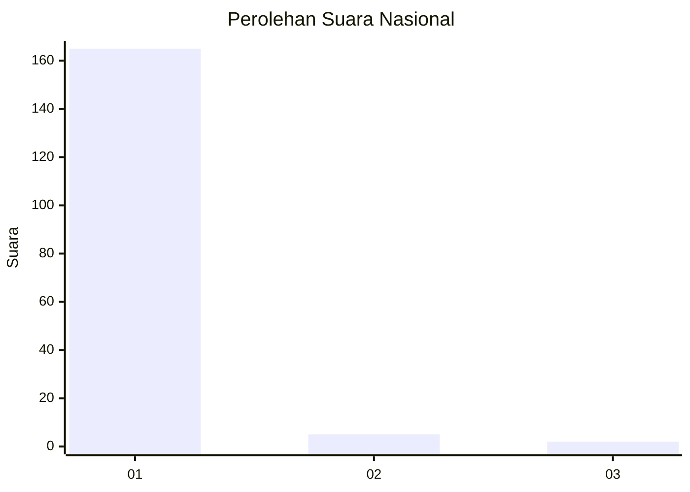
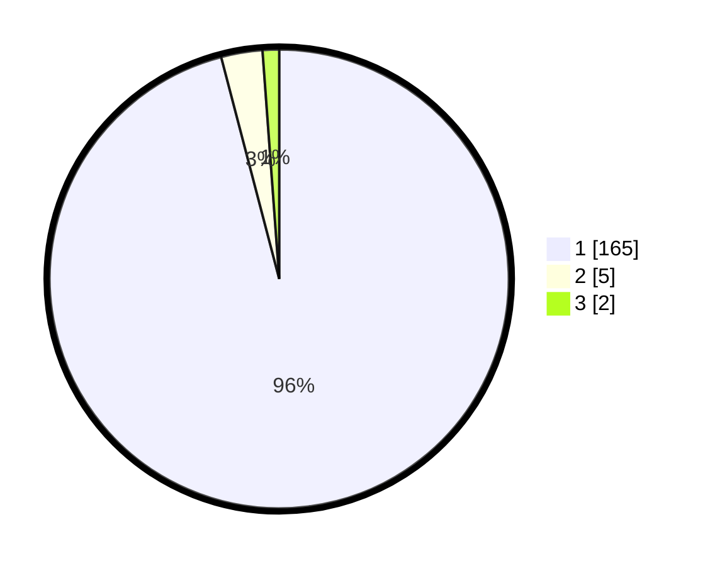

# Hasil

## Grafik

## Tabel

| No. | Nama Paslon    | Suara | Suara (raw) | Persentase |
|:--- |:-------------- | -----:| -----------:| ----------:|
| 1   | ANIES MUHAIMIN | 165   | [165][p-1]  | 95,93      |
| 2   | PRABOWO GIBRAN | 5     | [5][p-2]    | 2,91       |
| 3   | GANJAR MAHFUD  | 2     | [2][p-3]    | 1,16       |

[p-1]: https://github.com/gigit-pemilu/pemilu-2024/blob/main/pilpres/hitung-suara/sub/11-aceh/sub/07-pidie/sub/14-padang-tiji/sub/2023-buni-reulieng-peudaya/sub/001-tps/sub/paslon-1.txt
[p-2]: https://github.com/gigit-pemilu/pemilu-2024/blob/main/pilpres/hitung-suara/sub/11-aceh/sub/07-pidie/sub/14-padang-tiji/sub/2023-buni-reulieng-peudaya/sub/001-tps/sub/paslon-2.txt
[p-3]: https://github.com/gigit-pemilu/pemilu-2024/blob/main/pilpres/hitung-suara/sub/11-aceh/sub/07-pidie/sub/14-padang-tiji/sub/2023-buni-reulieng-peudaya/sub/001-tps/sub/paslon-3.txt

## Foto C Plano

https://sirekap-obj-formc.kpu.go.id/c88d/pemilu/ppwp/11/07/14/20/23/1107142023001-20240215-133053--b91d606d-5055-4b79-bf0d-35673ccf28f1.jpg

https://sirekap-obj-formc.kpu.go.id/c88d/pemilu/ppwp/11/07/14/20/23/1107142023001-20240215-114612--3362423b-2254-461f-833f-b95f9a71377e.jpg

https://sirekap-obj-formc.kpu.go.id/c88d/pemilu/ppwp/11/07/14/20/23/1107142023001-20240215-114715--d2199f3b-37f0-41c6-96cc-5e283737e6b3.jpg

## Metadata

| Key        | Value               |
| ---------- | ------------------- |
| Time Stamp | 2024-02-24 22:31:28 |

