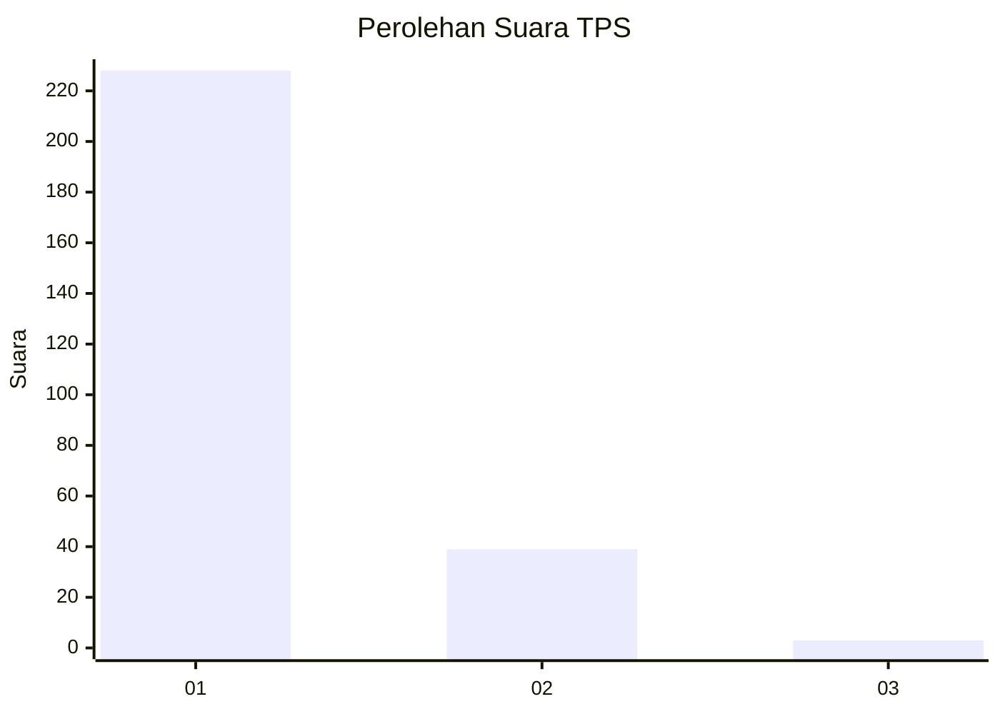
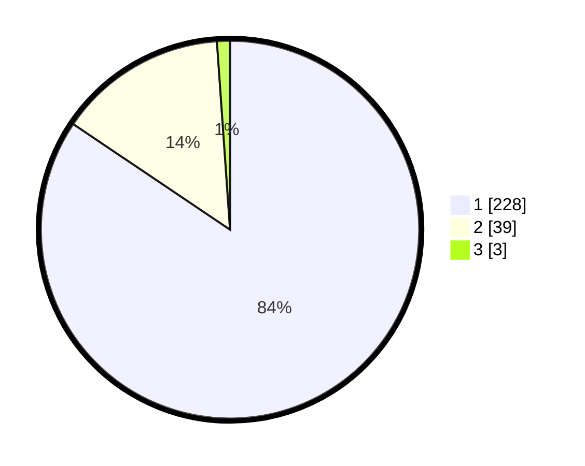

# Hasil

## Grafik

## Tabel

| No. | Nama Paslon    | Suara | Suara (raw) | Persentase |
|:--- |:-------------- | -----:| -----------:| ----------:|
| 1   | ANIES MUHAIMIN | 228   | [228][p-1]  | 84,44      |
| 2   | PRABOWO GIBRAN | 39    | [39][p-2]   | 14,44      |
| 3   | GANJAR MAHFUD  | 3     | [3][p-3]    | 1,11       |

[p-1]: https://github.com/gigit-pemilu/pemilu-2024-11-aceh/blob/main/pilpres/hitung-suara/sub/11-aceh/sub/07-pidie/sub/14-padang-tiji/sub/2030-jurong-anoe-paloh/sub/001-tps/sub/paslon-1.txt
[p-2]: https://github.com/gigit-pemilu/pemilu-2024-11-aceh/blob/main/pilpres/hitung-suara/sub/11-aceh/sub/07-pidie/sub/14-padang-tiji/sub/2030-jurong-anoe-paloh/sub/001-tps/sub/paslon-2.txt
[p-3]: https://github.com/gigit-pemilu/pemilu-2024-11-aceh/blob/main/pilpres/hitung-suara/sub/11-aceh/sub/07-pidie/sub/14-padang-tiji/sub/2030-jurong-anoe-paloh/sub/001-tps/sub/paslon-3.txt

## Foto C Plano

https://sirekap-obj-formc.kpu.go.id/c52e/pemilu/ppwp/11/07/14/20/30/1107142030001-20240215-110442--d9a5556b-5aa5-4bf8-8a65-ffc3fc7d37ad.jpg

https://sirekap-obj-formc.kpu.go.id/c52e/pemilu/ppwp/11/07/14/20/30/1107142030001-20240215-111451--4abbc4e1-27de-42fb-8759-066a949c0d65.jpg

https://sirekap-obj-formc.kpu.go.id/c52e/pemilu/ppwp/11/07/14/20/30/1107142030001-20240215-112204--661be023-f943-4d81-b3b6-3e0ab47e029e.jpg

## Metadata

| Key        | Value               |
| ---------- | ------------------- |
| Time Stamp | 2024-02-15 17:30:25 |

