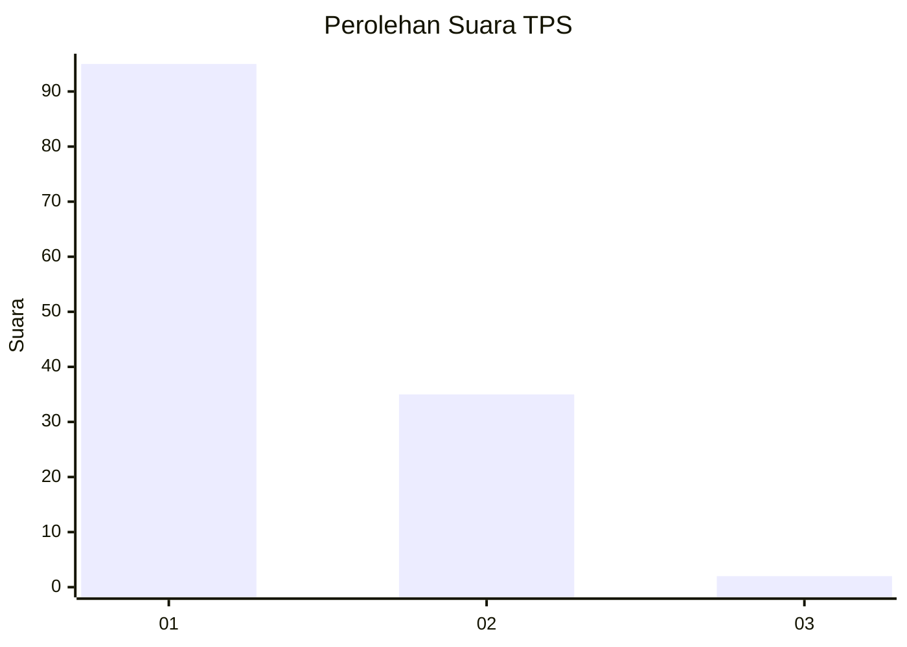
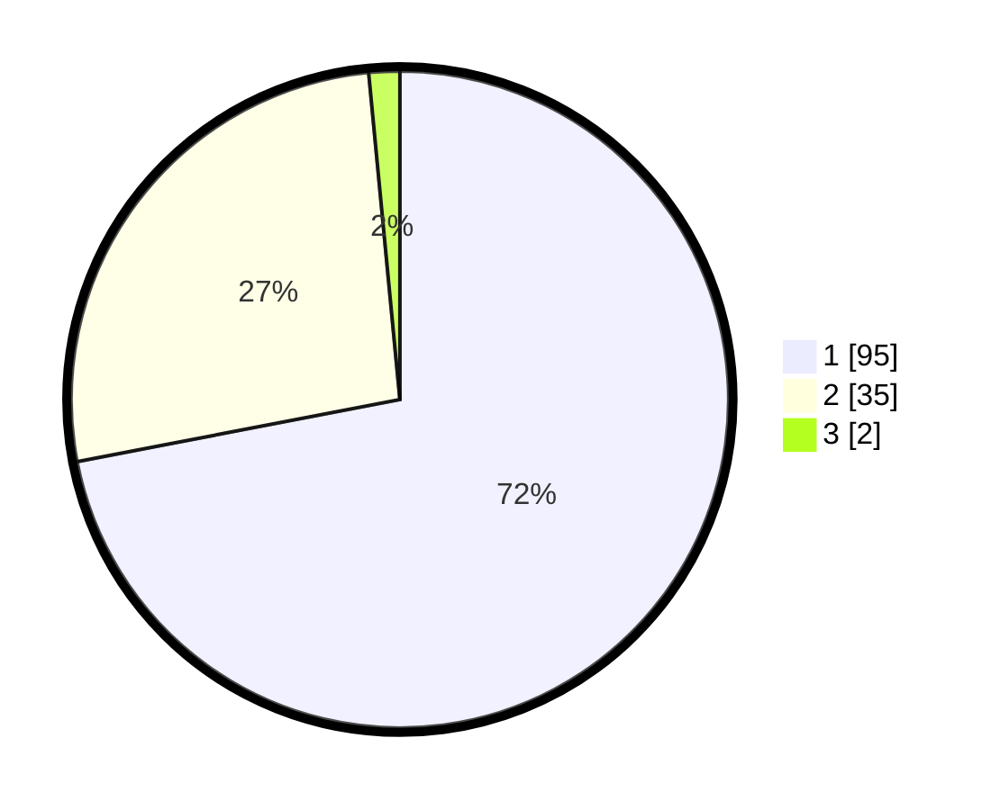

# Hasil

## Grafik

## Tabel

| No. | Nama Paslon    | Suara | Suara (raw) | Persentase |
|:--- |:-------------- | -----:| -----------:| ----------:|
| 1   | ANIES MUHAIMIN | 95    | [95][p-1]   | 71,97      |
| 2   | PRABOWO GIBRAN | 35    | [35][p-2]   | 26,52      |
| 3   | GANJAR MAHFUD  | 2     | [2][p-3]    | 1,52       |

[p-1]: https://github.com/gigit-pemilu/pemilu-2024-11-aceh/blob/main/pilpres/hitung-suara/sub/11-aceh/sub/07-pidie/sub/14-padang-tiji/sub/2031-balee-paloh/sub/001-tps/sub/paslon-1.txt
[p-2]: https://github.com/gigit-pemilu/pemilu-2024-11-aceh/blob/main/pilpres/hitung-suara/sub/11-aceh/sub/07-pidie/sub/14-padang-tiji/sub/2031-balee-paloh/sub/001-tps/sub/paslon-2.txt
[p-3]: https://github.com/gigit-pemilu/pemilu-2024-11-aceh/blob/main/pilpres/hitung-suara/sub/11-aceh/sub/07-pidie/sub/14-padang-tiji/sub/2031-balee-paloh/sub/001-tps/sub/paslon-3.txt

## Foto C Plano

https://sirekap-obj-formc.kpu.go.id/4ad7/pemilu/ppwp/11/07/14/20/31/1107142031001-20240215-004308--172af477-390c-4121-99a8-0627bd577306.jpg

https://sirekap-obj-formc.kpu.go.id/4ad7/pemilu/ppwp/11/07/14/20/31/1107142031001-20240215-112628--f5b19680-475d-4b8e-b2b5-b0c43cc2cb51.jpg

https://sirekap-obj-formc.kpu.go.id/4ad7/pemilu/ppwp/11/07/14/20/31/1107142031001-20240215-112835--797fedfc-4f6e-4942-a657-a14f5ea84106.jpg

## Metadata

| Key        | Value               |
| ---------- | ------------------- |
| Time Stamp | 2024-02-19 06:16:00 |

