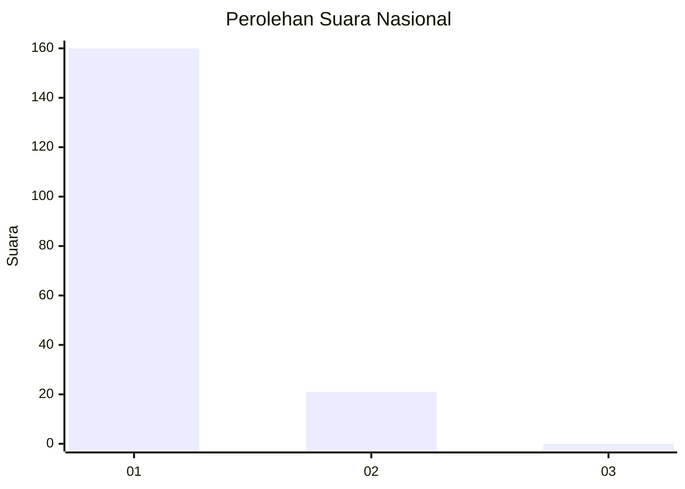
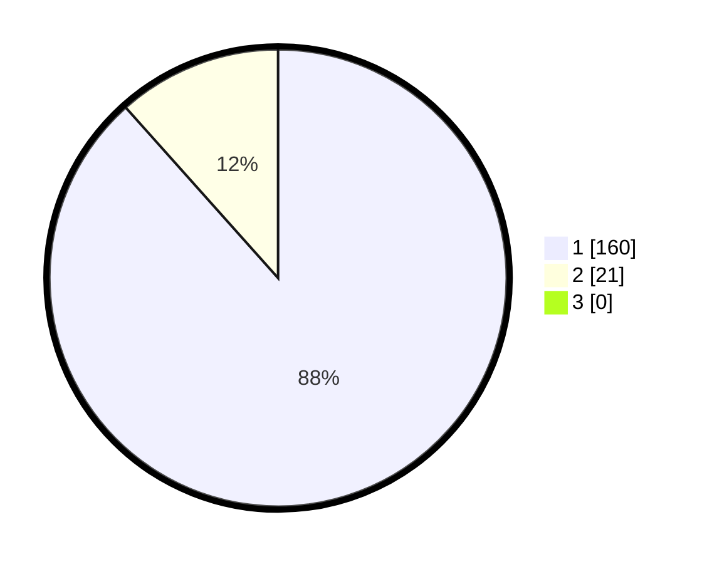

# Hasil

## Grafik

## Tabel

| No. | Nama Paslon    | Suara | Suara (raw) | Persentase |
|:--- |:-------------- | -----:| -----------:| ----------:|
| 1   | ANIES MUHAIMIN | 160   | [160][p-1]  | 88,40      |
| 2   | PRABOWO GIBRAN | 21    | [21][p-2]   | 11,60      |
| 3   | GANJAR MAHFUD  | 0     | [0][p-3]    | 0,00       |

[p-1]: https://github.com/gigit-pemilu/pemilu-2024/blob/main/pilpres/hitung-suara/sub/11-aceh/sub/07-pidie/sub/14-padang-tiji/sub/2032-siron-paloh/sub/001-tps/sub/paslon-1.txt
[p-2]: https://github.com/gigit-pemilu/pemilu-2024/blob/main/pilpres/hitung-suara/sub/11-aceh/sub/07-pidie/sub/14-padang-tiji/sub/2032-siron-paloh/sub/001-tps/sub/paslon-2.txt
[p-3]: https://github.com/gigit-pemilu/pemilu-2024/blob/main/pilpres/hitung-suara/sub/11-aceh/sub/07-pidie/sub/14-padang-tiji/sub/2032-siron-paloh/sub/001-tps/sub/paslon-3.txt

## Foto C Plano

https://sirekap-obj-formc.kpu.go.id/1392/pemilu/ppwp/11/07/14/20/32/1107142032001-20240215-094120--ad3cb352-52eb-48db-bbb7-8770a8270127.jpg

https://sirekap-obj-formc.kpu.go.id/1392/pemilu/ppwp/11/07/14/20/32/1107142032001-20240215-094438--70860ef9-a2fc-4be2-9bdd-a0bfbc4c614b.jpg

https://sirekap-obj-formc.kpu.go.id/1392/pemilu/ppwp/11/07/14/20/32/1107142032001-20240215-094755--2e73be49-40ad-442a-ba2a-0e22c7c22266.jpg

## Metadata

| Key        | Value               |
| ---------- | ------------------- |
| Time Stamp | 2024-02-19 06:16:00 |

