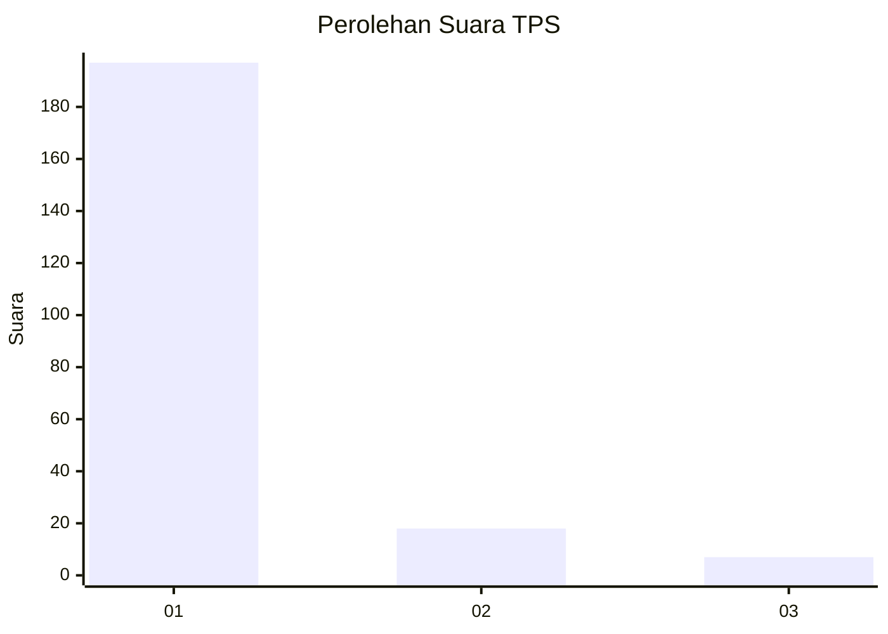
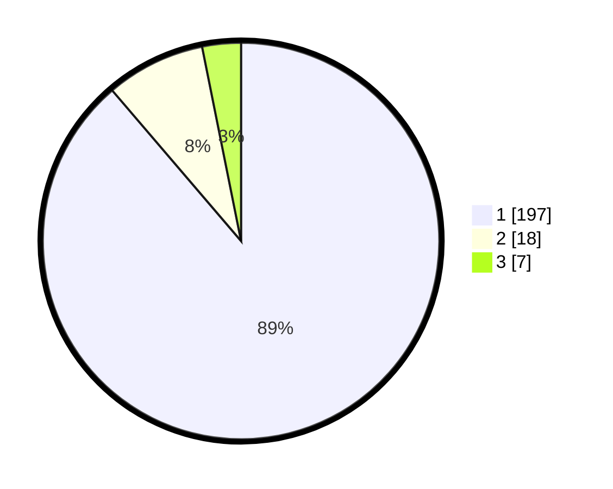

# Hasil

## Grafik

## Tabel

| No. | Nama Paslon    | Suara | Suara (raw) | Persentase |
|:--- |:-------------- | -----:| -----------:| ----------:|
| 1   | ANIES MUHAIMIN | 197   | [197][p-1]  | 88,74      |
| 2   | PRABOWO GIBRAN | 18    | [18][p-2]   | 8,11       |
| 3   | GANJAR MAHFUD  | 7     | [7][p-3]    | 3,15       |

[p-1]: https://github.com/gigit-pemilu/pemilu-2024-11-aceh/blob/main/pilpres/hitung-suara/sub/11-aceh/sub/07-pidie/sub/14-padang-tiji/sub/2033-gampong-cut-paloh/sub/001-tps/sub/paslon-1.txt
[p-2]: https://github.com/gigit-pemilu/pemilu-2024-11-aceh/blob/main/pilpres/hitung-suara/sub/11-aceh/sub/07-pidie/sub/14-padang-tiji/sub/2033-gampong-cut-paloh/sub/001-tps/sub/paslon-2.txt
[p-3]: https://github.com/gigit-pemilu/pemilu-2024-11-aceh/blob/main/pilpres/hitung-suara/sub/11-aceh/sub/07-pidie/sub/14-padang-tiji/sub/2033-gampong-cut-paloh/sub/001-tps/sub/paslon-3.txt

## Foto C Plano

https://sirekap-obj-formc.kpu.go.id/78e6/pemilu/ppwp/11/07/14/20/33/1107142033001-20240215-051717--85cdd1dd-cca5-4295-b04c-66df7ce0f522.jpg

https://sirekap-obj-formc.kpu.go.id/78e6/pemilu/ppwp/11/07/14/20/33/1107142033001-20240215-051915--4a703fd0-fd74-4dcd-a9da-9f115e033128.jpg

https://sirekap-obj-formc.kpu.go.id/78e6/pemilu/ppwp/11/07/14/20/33/1107142033001-20240215-052114--5f18220f-407e-459d-a8fe-4df603bbe61d.jpg

## Metadata

| Key        | Value               |
| ---------- | ------------------- |
| Time Stamp | 2024-02-19 06:16:00 |

