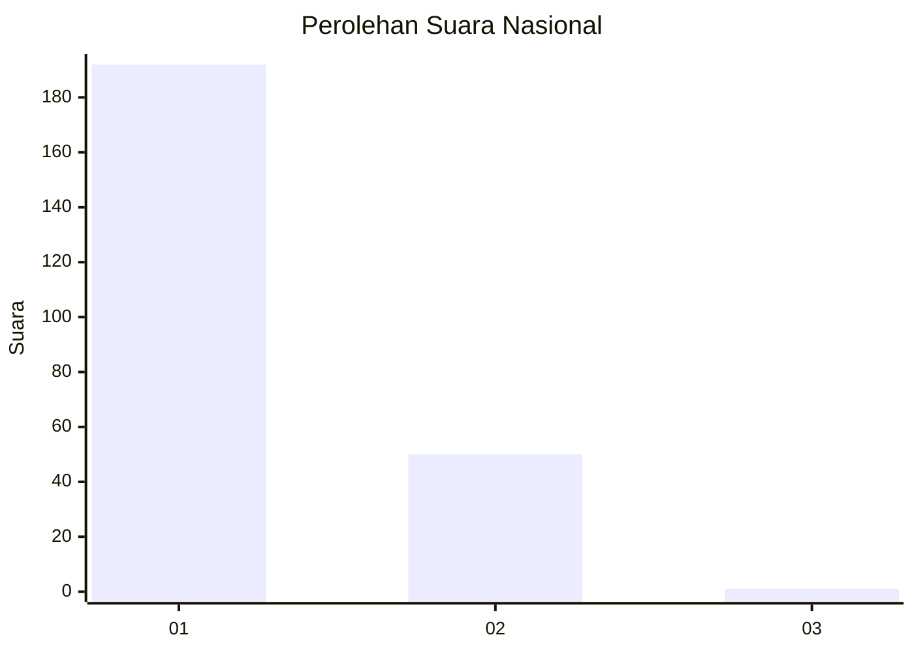
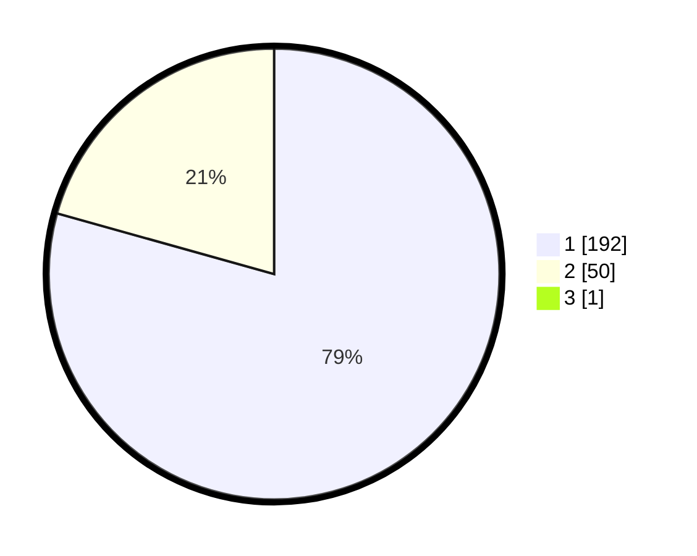

# Hasil

## Grafik

## Tabel

| No. | Nama Paslon    | Suara | Suara (raw) | Persentase |
|:--- |:-------------- | -----:| -----------:| ----------:|
| 1   | ANIES MUHAIMIN | 192   | [192][p-1]  | 79,01      |
| 2   | PRABOWO GIBRAN | 50    | [50][p-2]   | 20,58      |
| 3   | GANJAR MAHFUD  | 1     | [1][p-3]    | 0,41       |

[p-1]: https://github.com/gigit-pemilu/pemilu-2024/blob/main/pilpres/hitung-suara/sub/11-aceh/sub/07-pidie/sub/14-padang-tiji/sub/2035-pasar-paloh/sub/002-tps/sub/paslon-1.txt
[p-2]: https://github.com/gigit-pemilu/pemilu-2024/blob/main/pilpres/hitung-suara/sub/11-aceh/sub/07-pidie/sub/14-padang-tiji/sub/2035-pasar-paloh/sub/002-tps/sub/paslon-2.txt
[p-3]: https://github.com/gigit-pemilu/pemilu-2024/blob/main/pilpres/hitung-suara/sub/11-aceh/sub/07-pidie/sub/14-padang-tiji/sub/2035-pasar-paloh/sub/002-tps/sub/paslon-3.txt

## Foto C Plano

https://sirekap-obj-formc.kpu.go.id/8872/pemilu/ppwp/11/07/14/20/35/1107142035002-20240215-172750--d5fb427a-18e5-4586-82c6-135c8812fe0c.jpg

https://sirekap-obj-formc.kpu.go.id/8872/pemilu/ppwp/11/07/14/20/35/1107142035002-20240215-151120--ea32cee2-8abe-4e71-ba2b-df37bef41bae.jpg

https://sirekap-obj-formc.kpu.go.id/8872/pemilu/ppwp/11/07/14/20/35/1107142035002-20240215-151147--a2aad28f-e640-45af-9efa-6247c46039a5.jpg

## Metadata

| Key        | Value               |
| ---------- | ------------------- |
| Time Stamp | 2024-02-19 06:16:00 |

