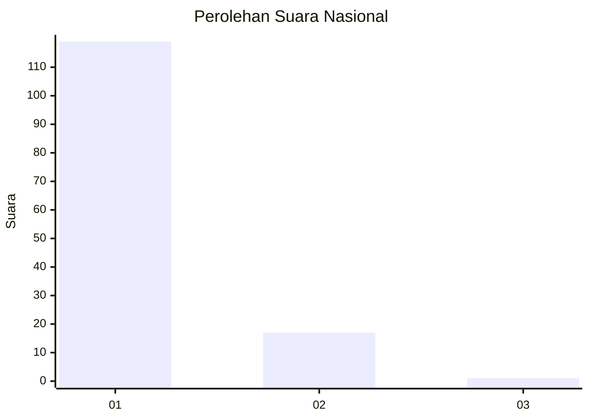
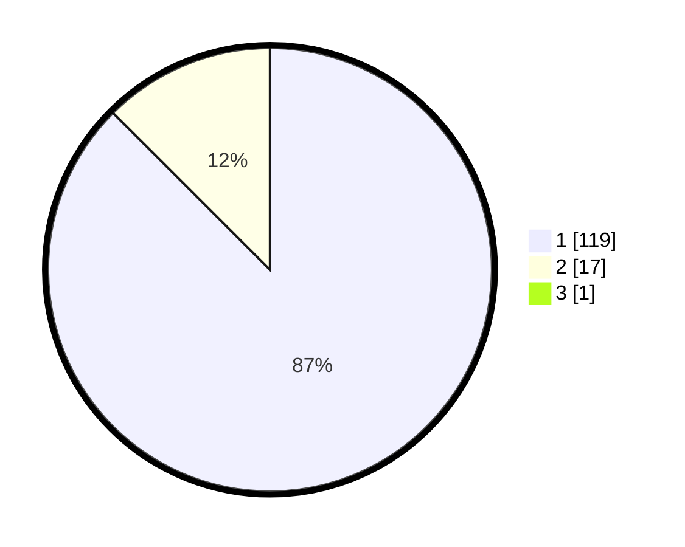

# Hasil

## Grafik

## Tabel

| No. | Nama Paslon    | Suara | Suara (raw) | Persentase |
|:--- |:-------------- | -----:| -----------:| ----------:|
| 1   | ANIES MUHAIMIN | 119   | [119][p-1]  | 86,86      |
| 2   | PRABOWO GIBRAN | 17    | [17][p-2]   | 12,41      |
| 3   | GANJAR MAHFUD  | 1     | [1][p-3]    | 0,73       |

[p-1]: https://github.com/gigit-pemilu/pemilu-2024/blob/main/pilpres/hitung-suara/sub/11-aceh/sub/07-pidie/sub/14-padang-tiji/sub/2040-baro-beurabo/sub/001-tps/sub/paslon-1.txt
[p-2]: https://github.com/gigit-pemilu/pemilu-2024/blob/main/pilpres/hitung-suara/sub/11-aceh/sub/07-pidie/sub/14-padang-tiji/sub/2040-baro-beurabo/sub/001-tps/sub/paslon-2.txt
[p-3]: https://github.com/gigit-pemilu/pemilu-2024/blob/main/pilpres/hitung-suara/sub/11-aceh/sub/07-pidie/sub/14-padang-tiji/sub/2040-baro-beurabo/sub/001-tps/sub/paslon-3.txt

## Foto C Plano

https://sirekap-obj-formc.kpu.go.id/142f/pemilu/ppwp/11/07/14/20/40/1107142040001-20240215-123241--59fd9a90-645e-4862-8621-f91990117ca9.jpg

https://sirekap-obj-formc.kpu.go.id/142f/pemilu/ppwp/11/07/14/20/40/1107142040001-20240215-110051--a1bd99d1-56c6-495b-b3b5-40661301e18e.jpg

https://sirekap-obj-formc.kpu.go.id/142f/pemilu/ppwp/11/07/14/20/40/1107142040001-20240215-123350--3957ea27-7955-4af7-9668-4a95b92736e3.jpg

## Metadata

| Key        | Value               |
| ---------- | ------------------- |
| Time Stamp | 2024-02-15 17:30:25 |

## DATA PEMILIH TETAP

Jumlah pemilih dalam DPT: **164**.
 * L: **85**.
 * P: **79**.

## DATA PENGGUNA HAK PILIH

Jumlah pengguna hak pilih dalam DPT: **137**.
 * L: **66**.
 * P: **71**.

Jumlah pengguna hak pilih dalam DPTb: **0**.
 * L: **0**.
 * P: **0**.

Jumlah pengguna hak pilih dalam DPK: **0**.
 * L: **0**.
 * P: **0**.

Jumlah pengguna hak pilih: **137**.
 * L: **66**.
 * P: **71**.

## JUMLAH SUARA SAH DAN TIDAK SAH

JUMLAH SELURUH SUARA SAH: **137**.

JUMLAH SUARA TIDAK SAH: **32**.

JUMLAH SELURUH SUARA SAH DAN SUARA TIDAK SAH: **169**.

