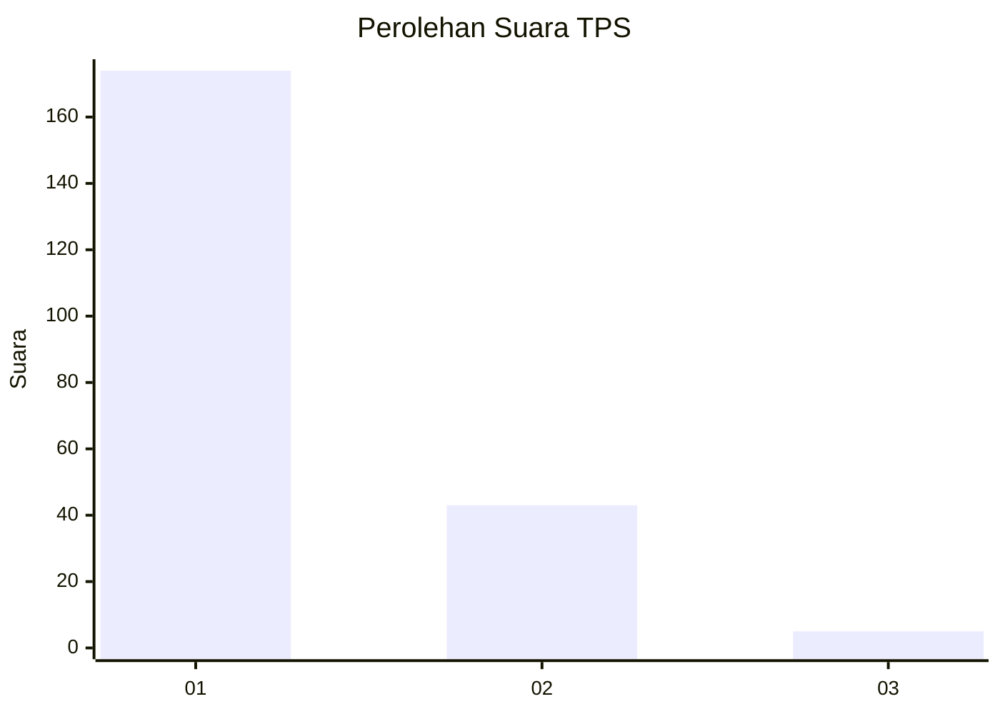
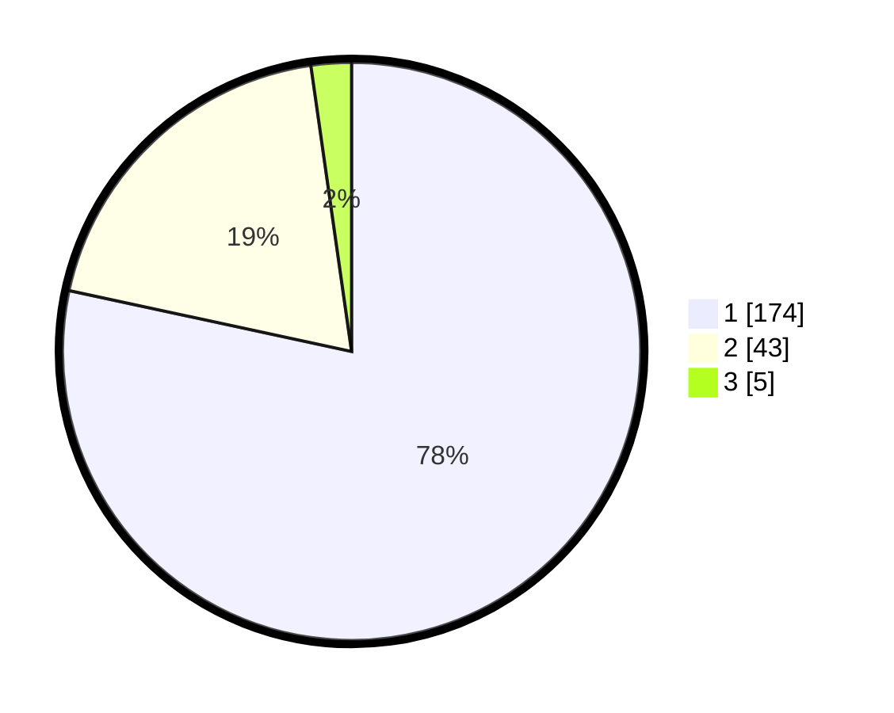

# Hasil

## Grafik

## Tabel

| No. | Nama Paslon    | Suara | Suara (raw) | Persentase |
|:--- |:-------------- | -----:| -----------:| ----------:|
| 1   | ANIES MUHAIMIN | 174   | [174][p-1]  | 78,38      |
| 2   | PRABOWO GIBRAN | 43    | [43][p-2]   | 19,37      |
| 3   | GANJAR MAHFUD  | 5     | [5][p-3]    | 2,25       |

[p-1]: https://github.com/gigit-pemilu/pemilu-2024-11-aceh/blob/main/pilpres/hitung-suara/sub/11-aceh/sub/07-pidie/sub/14-padang-tiji/sub/2045-kumbang-gogo/sub/001-tps/sub/paslon-1.txt
[p-2]: https://github.com/gigit-pemilu/pemilu-2024-11-aceh/blob/main/pilpres/hitung-suara/sub/11-aceh/sub/07-pidie/sub/14-padang-tiji/sub/2045-kumbang-gogo/sub/001-tps/sub/paslon-2.txt
[p-3]: https://github.com/gigit-pemilu/pemilu-2024-11-aceh/blob/main/pilpres/hitung-suara/sub/11-aceh/sub/07-pidie/sub/14-padang-tiji/sub/2045-kumbang-gogo/sub/001-tps/sub/paslon-3.txt

## Foto C Plano

https://sirekap-obj-formc.kpu.go.id/ccba/pemilu/ppwp/11/07/14/20/45/1107142045001-20240215-105538--e4bf0765-2d10-472d-9d8d-836aa2679338.jpg

https://sirekap-obj-formc.kpu.go.id/ccba/pemilu/ppwp/11/07/14/20/45/1107142045001-20240214-194023--aa916149-300d-43f6-b57f-580710dc33f1.jpg

https://sirekap-obj-formc.kpu.go.id/ccba/pemilu/ppwp/11/07/14/20/45/1107142045001-20240214-194208--bf0a78d9-07fa-414f-b9e3-fab29bd6c733.jpg

## Metadata

| Key        | Value               |
| ---------- | ------------------- |
| Time Stamp | 2024-02-15 17:30:25 |

