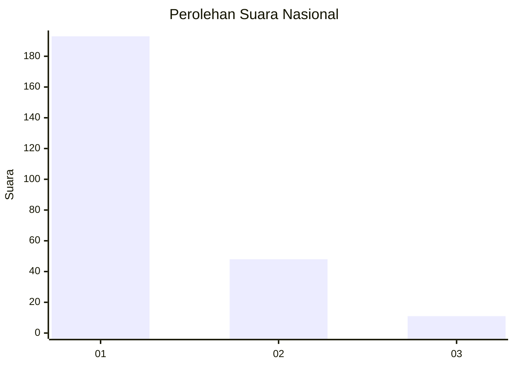
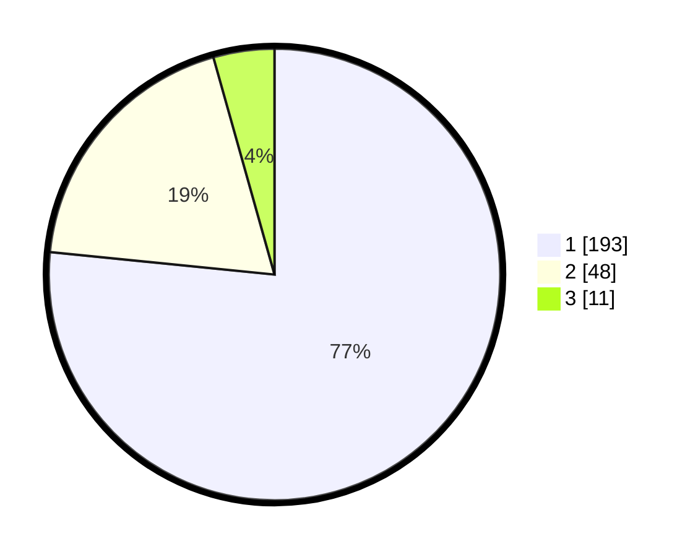

# Hasil

## Grafik

## Tabel

| No. | Nama Paslon    | Suara | Suara (raw) | Persentase |
|:--- |:-------------- | -----:| -----------:| ----------:|
| 1   | ANIES MUHAIMIN | 193   | [193][p-1]  | 76,59      |
| 2   | PRABOWO GIBRAN | 48    | [48][p-2]   | 19,05      |
| 3   | GANJAR MAHFUD  | 11    | [11][p-3]   | 4,37       |

[p-1]: https://github.com/gigit-pemilu/pemilu-2024/blob/main/pilpres/hitung-suara/sub/11-aceh/sub/07-pidie/sub/14-padang-tiji/sub/2047-tuha-gogo/sub/001-tps/sub/paslon-1.txt
[p-2]: https://github.com/gigit-pemilu/pemilu-2024/blob/main/pilpres/hitung-suara/sub/11-aceh/sub/07-pidie/sub/14-padang-tiji/sub/2047-tuha-gogo/sub/001-tps/sub/paslon-2.txt
[p-3]: https://github.com/gigit-pemilu/pemilu-2024/blob/main/pilpres/hitung-suara/sub/11-aceh/sub/07-pidie/sub/14-padang-tiji/sub/2047-tuha-gogo/sub/001-tps/sub/paslon-3.txt

## Foto C Plano

https://sirekap-obj-formc.kpu.go.id/46f2/pemilu/ppwp/11/07/14/20/47/1107142047001-20240216-100937--6931d5e5-8109-47e9-8a99-0910a5dab83d.jpg

https://sirekap-obj-formc.kpu.go.id/46f2/pemilu/ppwp/11/07/14/20/47/1107142047001-20240216-101246--d9b005d7-7950-42fe-a17c-6edc592e2b6a.jpg

## Metadata

| Key        | Value               |
| ---------- | ------------------- |
| Time Stamp | 2024-02-24 22:31:28 |

