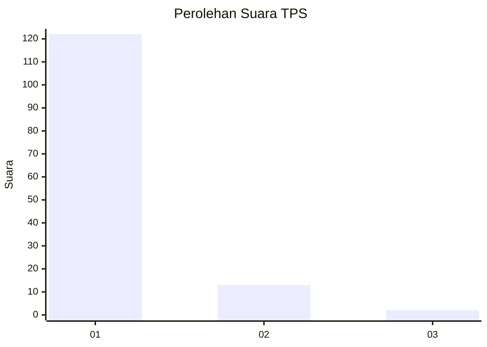
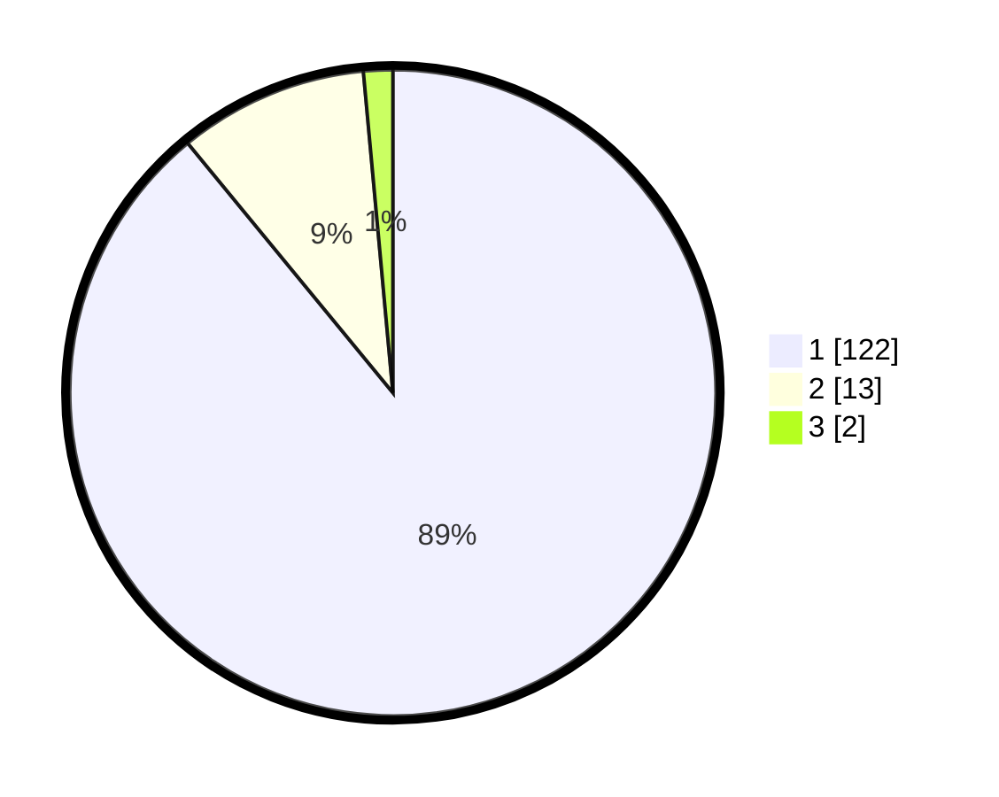

# Hasil

## Grafik

## Tabel

| No. | Nama Paslon    | Suara | Suara (raw) | Persentase |
|:--- |:-------------- | -----:| -----------:| ----------:|
| 1   | ANIES MUHAIMIN | 122   | [122][p-1]  | 89,05      |
| 2   | PRABOWO GIBRAN | 13    | [13][p-2]   | 9,49       |
| 3   | GANJAR MAHFUD  | 2     | [2][p-3]    | 1,46       |

[p-1]: https://github.com/gigit-pemilu/pemilu-2024-11-aceh/blob/main/pilpres/hitung-suara/sub/11-aceh/sub/07-pidie/sub/14-padang-tiji/sub/2049-meuke-gogo/sub/001-tps/sub/paslon-1.txt
[p-2]: https://github.com/gigit-pemilu/pemilu-2024-11-aceh/blob/main/pilpres/hitung-suara/sub/11-aceh/sub/07-pidie/sub/14-padang-tiji/sub/2049-meuke-gogo/sub/001-tps/sub/paslon-2.txt
[p-3]: https://github.com/gigit-pemilu/pemilu-2024-11-aceh/blob/main/pilpres/hitung-suara/sub/11-aceh/sub/07-pidie/sub/14-padang-tiji/sub/2049-meuke-gogo/sub/001-tps/sub/paslon-3.txt

## Foto C Plano

https://sirekap-obj-formc.kpu.go.id/0c9e/pemilu/ppwp/11/07/14/20/49/1107142049001-20240215-091203--1f21455c-c57f-4506-9099-7411ed0f6293.jpg

https://sirekap-obj-formc.kpu.go.id/0c9e/pemilu/ppwp/11/07/14/20/49/1107142049001-20240215-010732--2a18d076-c80b-47d1-8690-87c491f85761.jpg

https://sirekap-obj-formc.kpu.go.id/0c9e/pemilu/ppwp/11/07/14/20/49/1107142049001-20240215-002310--b69908aa-e6f2-4cf2-bef9-e0397dd199a7.jpg

## Metadata

| Key        | Value               |
| ---------- | ------------------- |
| Time Stamp | 2024-02-16 08:00:28 |

