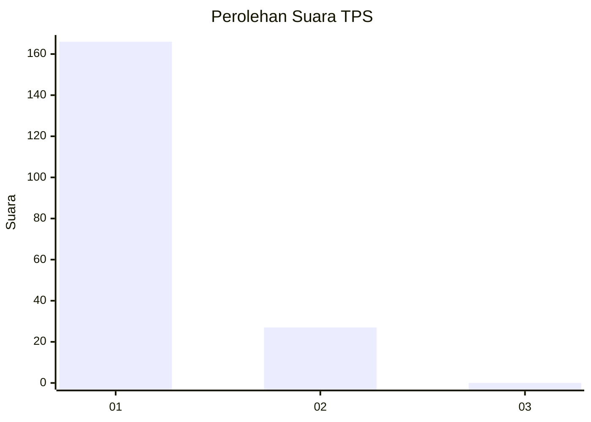
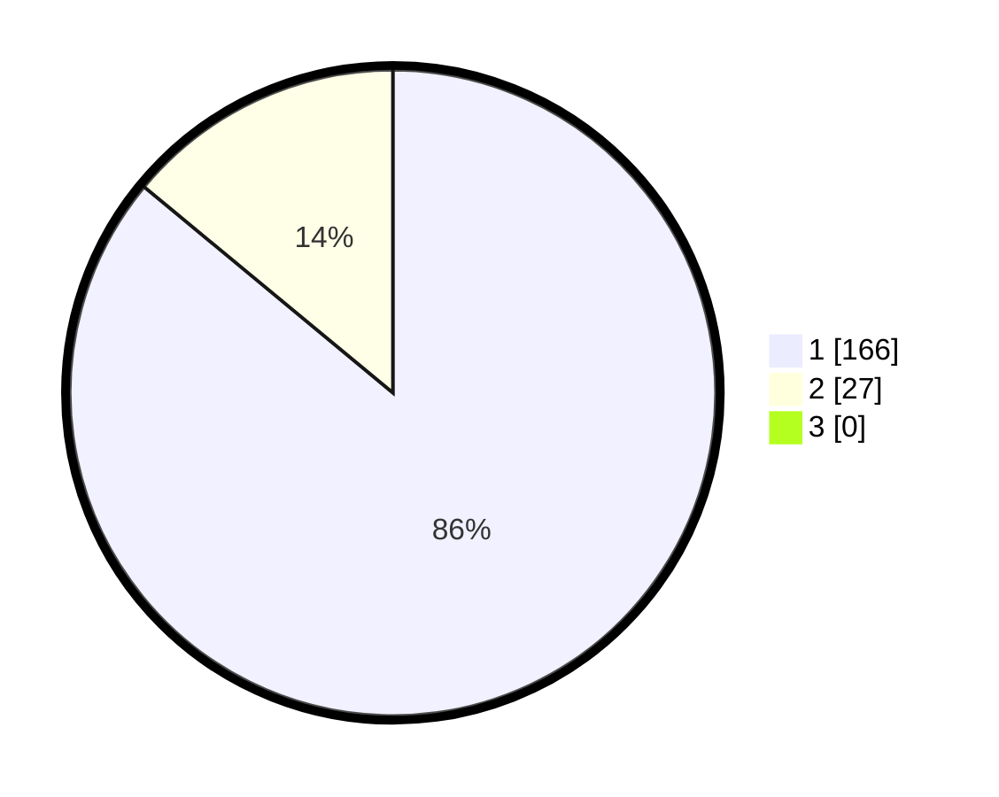

# Hasil

## Grafik

## Tabel

| No. | Nama Paslon    | Suara | Suara (raw) | Persentase |
|:--- |:-------------- | -----:| -----------:| ----------:|
| 1   | ANIES MUHAIMIN | 166   | [166][p-1]  | 86,01      |
| 2   | PRABOWO GIBRAN | 27    | [27][p-2]   | 13,99      |
| 3   | GANJAR MAHFUD  | 0     | [0][p-3]    | 0,00       |

[p-1]: https://github.com/gigit-pemilu/pemilu-2024-11-aceh/blob/main/pilpres/hitung-suara/sub/11-aceh/sub/07-pidie/sub/14-padang-tiji/sub/2058-pante-crueng-tanjong/sub/002-tps/sub/paslon-1.txt
[p-2]: https://github.com/gigit-pemilu/pemilu-2024-11-aceh/blob/main/pilpres/hitung-suara/sub/11-aceh/sub/07-pidie/sub/14-padang-tiji/sub/2058-pante-crueng-tanjong/sub/002-tps/sub/paslon-2.txt
[p-3]: https://github.com/gigit-pemilu/pemilu-2024-11-aceh/blob/main/pilpres/hitung-suara/sub/11-aceh/sub/07-pidie/sub/14-padang-tiji/sub/2058-pante-crueng-tanjong/sub/002-tps/sub/paslon-3.txt

## Foto C Plano

https://sirekap-obj-formc.kpu.go.id/1a34/pemilu/ppwp/11/07/14/20/58/1107142058002-20240215-133428--1dff7ca8-48ae-4510-a0e9-eb99751eeefb.jpg

https://sirekap-obj-formc.kpu.go.id/1a34/pemilu/ppwp/11/07/14/20/58/1107142058002-20240215-133534--9be4ad32-3e41-45ad-9559-fd092f3978bd.jpg

https://sirekap-obj-formc.kpu.go.id/1a34/pemilu/ppwp/11/07/14/20/58/1107142058002-20240215-133653--4c1b5ca3-caa2-4020-9e1c-3ca2d2927285.jpg

## Metadata

| Key        | Value               |
| ---------- | ------------------- |
| Time Stamp | 2024-02-19 06:16:00 |

