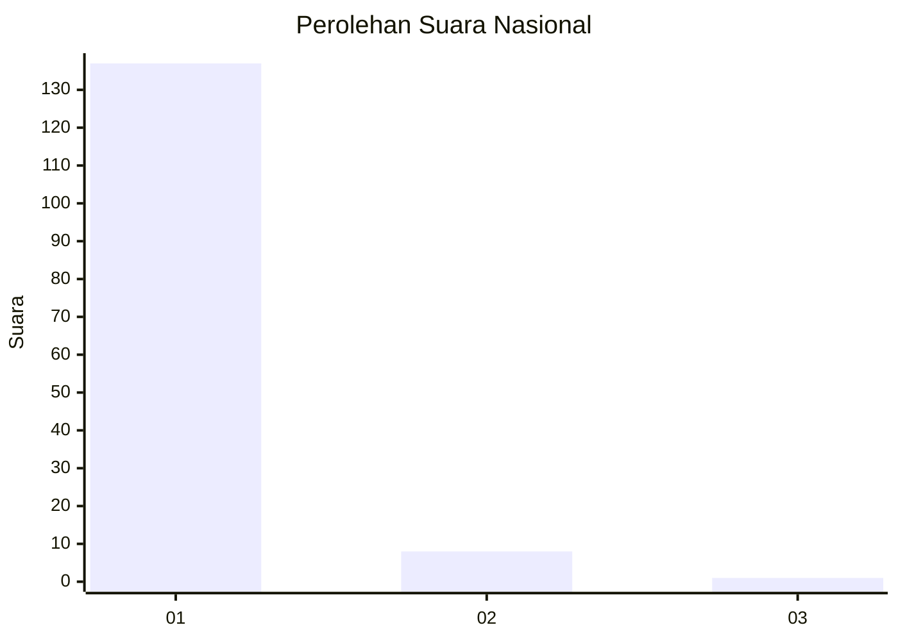
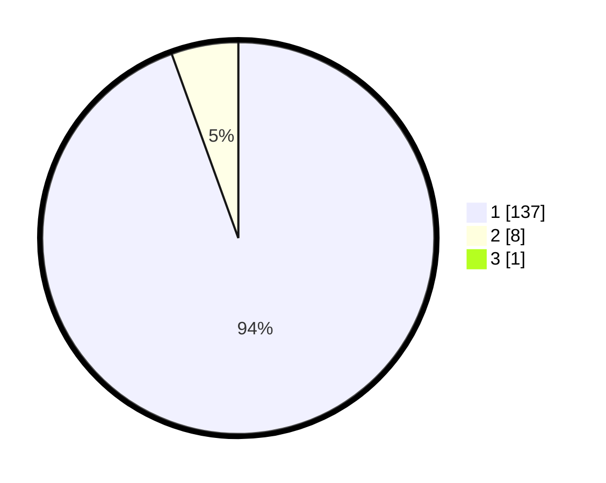

# Hasil

## Grafik

## Tabel

| No. | Nama Paslon    | Suara | Suara (raw) | Persentase |
|:--- |:-------------- | -----:| -----------:| ----------:|
| 1   | ANIES MUHAIMIN | 137   | [137][p-1]  | 93,84      |
| 2   | PRABOWO GIBRAN | 8     | [8][p-2]    | 5,48       |
| 3   | GANJAR MAHFUD  | 1     | [1][p-3]    | 0,68       |

[p-1]: https://github.com/gigit-pemilu/pemilu-2024/blob/main/pilpres/hitung-suara/sub/11-aceh/sub/07-pidie/sub/15-peukan-baro/sub/2002-cot-mulu/sub/002-tps/sub/paslon-1.txt
[p-2]: https://github.com/gigit-pemilu/pemilu-2024/blob/main/pilpres/hitung-suara/sub/11-aceh/sub/07-pidie/sub/15-peukan-baro/sub/2002-cot-mulu/sub/002-tps/sub/paslon-2.txt
[p-3]: https://github.com/gigit-pemilu/pemilu-2024/blob/main/pilpres/hitung-suara/sub/11-aceh/sub/07-pidie/sub/15-peukan-baro/sub/2002-cot-mulu/sub/002-tps/sub/paslon-3.txt

## Foto C Plano

https://sirekap-obj-formc.kpu.go.id/f433/pemilu/ppwp/11/07/15/20/02/1107152002002-20240215-024751--a916ff49-3049-44f7-9d26-10b685e31b69.jpg

https://sirekap-obj-formc.kpu.go.id/f433/pemilu/ppwp/11/07/15/20/02/1107152002002-20240215-025116--9aa0f4a2-cb29-4fd0-a99b-dfe6476d84cb.jpg

https://sirekap-obj-formc.kpu.go.id/f433/pemilu/ppwp/11/07/15/20/02/1107152002002-20240215-024630--b776f1ca-8812-4e59-a100-7987c5acd1f0.jpg

## Metadata

| Key        | Value               |
| ---------- | ------------------- |
| Time Stamp | 2024-02-19 06:16:00 |

