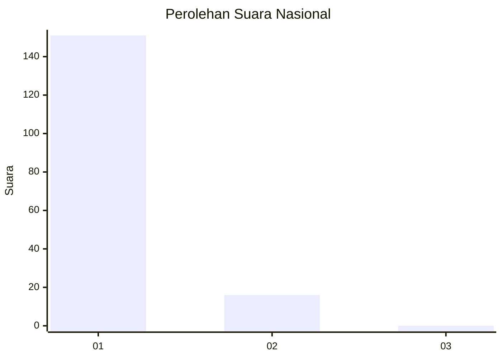
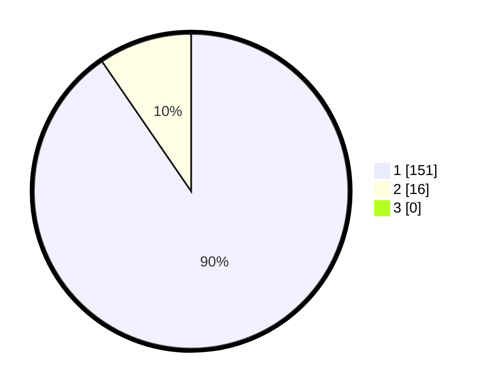

# Hasil

## Grafik

## Tabel

| No. | Nama Paslon    | Suara | Suara (raw) | Persentase |
|:--- |:-------------- | -----:| -----------:| ----------:|
| 1   | ANIES MUHAIMIN | 151   | [151][p-1]  | 90,42      |
| 2   | PRABOWO GIBRAN | 16    | [16][p-2]   | 9,58       |
| 3   | GANJAR MAHFUD  | 0     | [0][p-3]    | 0,00       |

[p-1]: https://github.com/gigit-pemilu/pemilu-2024/blob/main/pilpres/hitung-suara/sub/11-aceh/sub/07-pidie/sub/15-peukan-baro/sub/2006-rambayan-kupula/sub/001-tps/sub/paslon-1.txt
[p-2]: https://github.com/gigit-pemilu/pemilu-2024/blob/main/pilpres/hitung-suara/sub/11-aceh/sub/07-pidie/sub/15-peukan-baro/sub/2006-rambayan-kupula/sub/001-tps/sub/paslon-2.txt
[p-3]: https://github.com/gigit-pemilu/pemilu-2024/blob/main/pilpres/hitung-suara/sub/11-aceh/sub/07-pidie/sub/15-peukan-baro/sub/2006-rambayan-kupula/sub/001-tps/sub/paslon-3.txt

## Foto C Plano

https://sirekap-obj-formc.kpu.go.id/e50d/pemilu/ppwp/11/07/15/20/06/1107152006001-20240215-033856--fc5bf518-d8cb-4795-812f-847ac30ca181.jpg

https://sirekap-obj-formc.kpu.go.id/e50d/pemilu/ppwp/11/07/15/20/06/1107152006001-20240215-024913--7daef659-4800-4c41-ad35-fd92b95685af.jpg

https://sirekap-obj-formc.kpu.go.id/e50d/pemilu/ppwp/11/07/15/20/06/1107152006001-20240215-025013--fa801411-8d99-4b16-b4b0-4a61f20daa3f.jpg

## Metadata

| Key        | Value               |
| ---------- | ------------------- |
| Time Stamp | 2024-02-19 06:16:00 |

