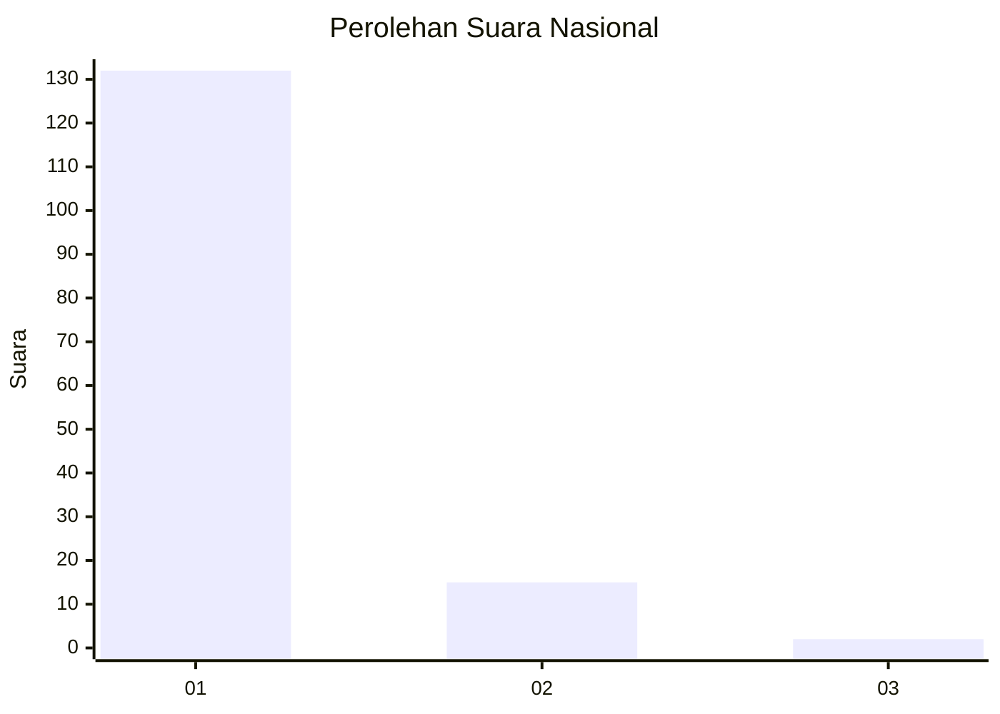
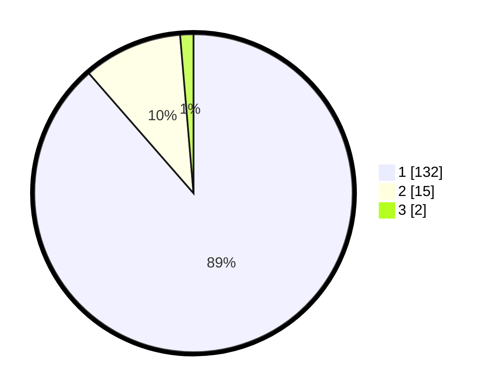

# Hasil

## Grafik

## Tabel

| No. | Nama Paslon    | Suara | Suara (raw) | Persentase |
|:--- |:-------------- | -----:| -----------:| ----------:|
| 1   | ANIES MUHAIMIN | 132   | [132][p-1]  | 88,59      |
| 2   | PRABOWO GIBRAN | 15    | [15][p-2]   | 10,07      |
| 3   | GANJAR MAHFUD  | 2     | [2][p-3]    | 1,34       |

[p-1]: https://github.com/gigit-pemilu/pemilu-2024/blob/main/pilpres/hitung-suara/sub/11-aceh/sub/07-pidie/sub/15-peukan-baro/sub/2006-rambayan-kupula/sub/002-tps/sub/paslon-1.txt
[p-2]: https://github.com/gigit-pemilu/pemilu-2024/blob/main/pilpres/hitung-suara/sub/11-aceh/sub/07-pidie/sub/15-peukan-baro/sub/2006-rambayan-kupula/sub/002-tps/sub/paslon-2.txt
[p-3]: https://github.com/gigit-pemilu/pemilu-2024/blob/main/pilpres/hitung-suara/sub/11-aceh/sub/07-pidie/sub/15-peukan-baro/sub/2006-rambayan-kupula/sub/002-tps/sub/paslon-3.txt

## Foto C Plano

https://sirekap-obj-formc.kpu.go.id/e2ed/pemilu/ppwp/11/07/15/20/06/1107152006002-20240215-034831--056b3f22-784a-48c1-ad52-76d47c56526d.jpg

https://sirekap-obj-formc.kpu.go.id/e2ed/pemilu/ppwp/11/07/15/20/06/1107152006002-20240215-034723--3eb4f09e-a363-48dd-891c-2947d1c82882.jpg

https://sirekap-obj-formc.kpu.go.id/e2ed/pemilu/ppwp/11/07/15/20/06/1107152006002-20240215-035037--ab27c464-7e3e-44df-9f5d-5de90ce0e8ce.jpg

## Metadata

| Key        | Value               |
| ---------- | ------------------- |
| Time Stamp | 2024-02-19 06:16:00 |

