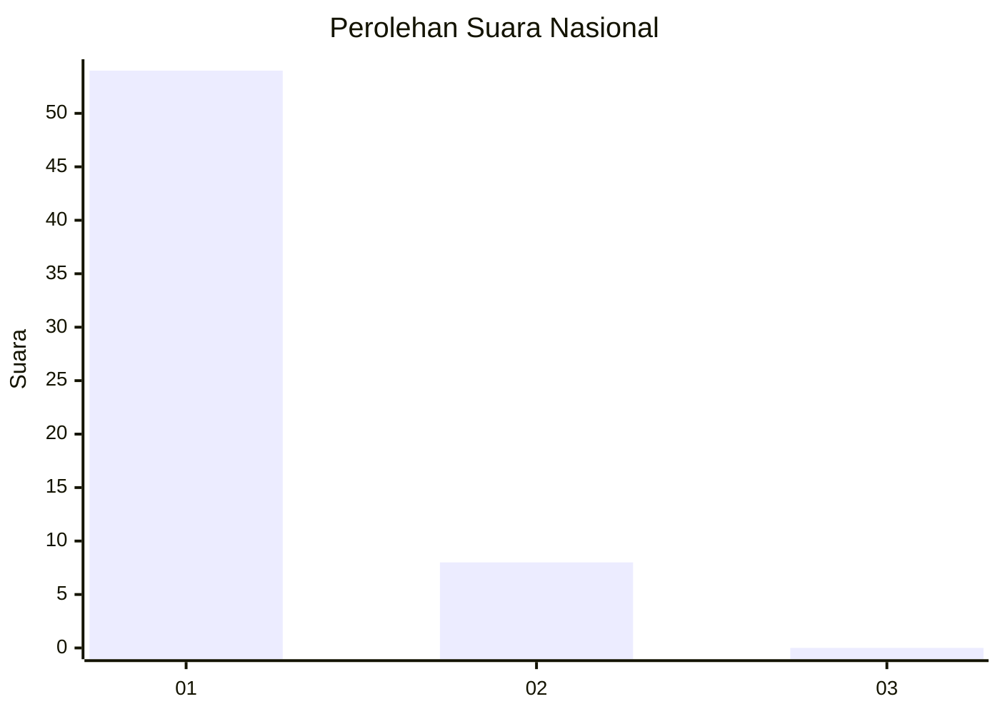
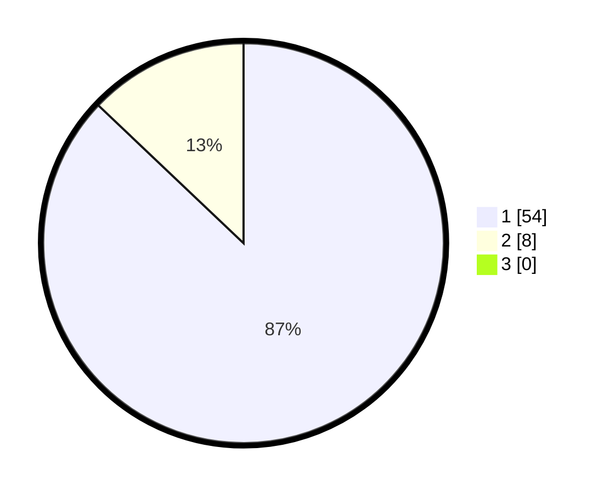

# Hasil

## Grafik

## Tabel

| No. | Nama Paslon    | Suara | Suara (raw) | Persentase |
|:--- |:-------------- | -----:| -----------:| ----------:|
| 1   | ANIES MUHAIMIN | 54    | [54][p-1]   | 87,10      |
| 2   | PRABOWO GIBRAN | 8     | [8][p-2]    | 12,90      |
| 3   | GANJAR MAHFUD  | 0     | [0][p-3]    | 0,00       |

[p-1]: https://github.com/gigit-pemilu/pemilu-2024/blob/main/pilpres/hitung-suara/sub/11-aceh/sub/07-pidie/sub/15-peukan-baro/sub/2013-mee-krukon/sub/001-tps/sub/paslon-1.txt
[p-2]: https://github.com/gigit-pemilu/pemilu-2024/blob/main/pilpres/hitung-suara/sub/11-aceh/sub/07-pidie/sub/15-peukan-baro/sub/2013-mee-krukon/sub/001-tps/sub/paslon-2.txt
[p-3]: https://github.com/gigit-pemilu/pemilu-2024/blob/main/pilpres/hitung-suara/sub/11-aceh/sub/07-pidie/sub/15-peukan-baro/sub/2013-mee-krukon/sub/001-tps/sub/paslon-3.txt

## Foto C Plano

https://sirekap-obj-formc.kpu.go.id/5e45/pemilu/ppwp/11/07/15/20/13/1107152013001-20240215-015116--62223e26-b851-4815-bf52-cbb2c4a89aee.jpg

https://sirekap-obj-formc.kpu.go.id/5e45/pemilu/ppwp/11/07/15/20/13/1107152013001-20240215-030853--afb65f62-a362-47b5-b4b1-ac415f3fdb86.jpg

https://sirekap-obj-formc.kpu.go.id/5e45/pemilu/ppwp/11/07/15/20/13/1107152013001-20240215-015255--1a48f6e4-57ee-44c7-97c9-95feeb1f52ae.jpg

## Metadata

| Key        | Value               |
| ---------- | ------------------- |
| Time Stamp | 2024-02-15 19:00:26 |

