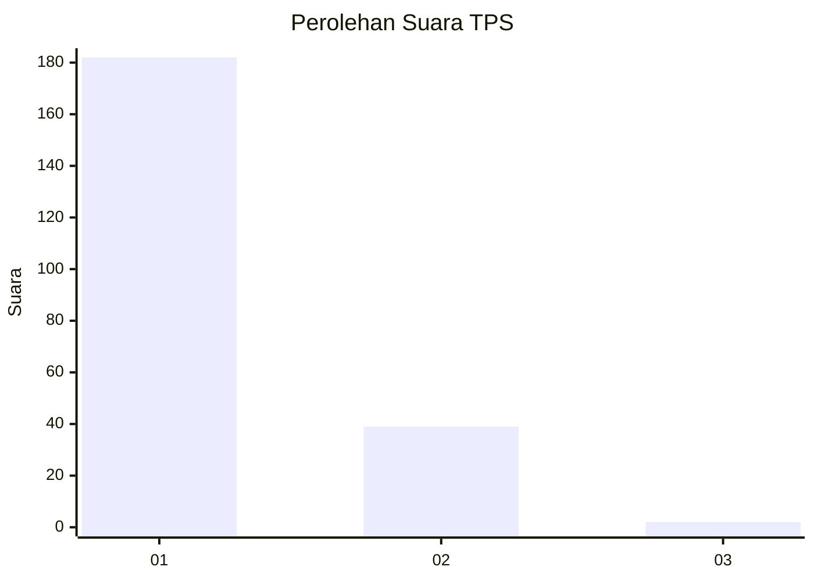
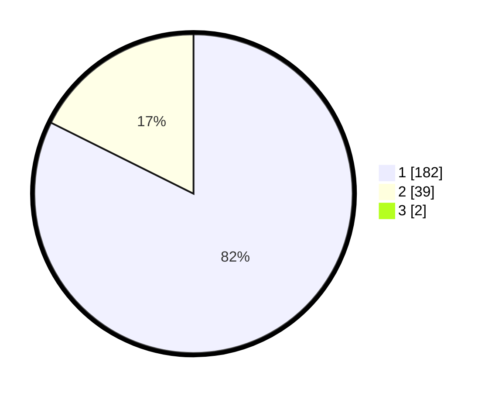

# Hasil

## Grafik

## Tabel

| No. | Nama Paslon    | Suara | Suara (raw) | Persentase |
|:--- |:-------------- | -----:| -----------:| ----------:|
| 1   | ANIES MUHAIMIN | 182   | [182][p-1]  | 81,61      |
| 2   | PRABOWO GIBRAN | 39    | [39][p-2]   | 17,49      |
| 3   | GANJAR MAHFUD  | 2     | [2][p-3]    | 0,90       |

[p-1]: https://github.com/gigit-pemilu/pemilu-2024-11-aceh/blob/main/pilpres/hitung-suara/sub/11-aceh/sub/07-pidie/sub/15-peukan-baro/sub/2014-mee-lampoih-saka/sub/001-tps/sub/paslon-1.txt
[p-2]: https://github.com/gigit-pemilu/pemilu-2024-11-aceh/blob/main/pilpres/hitung-suara/sub/11-aceh/sub/07-pidie/sub/15-peukan-baro/sub/2014-mee-lampoih-saka/sub/001-tps/sub/paslon-2.txt
[p-3]: https://github.com/gigit-pemilu/pemilu-2024-11-aceh/blob/main/pilpres/hitung-suara/sub/11-aceh/sub/07-pidie/sub/15-peukan-baro/sub/2014-mee-lampoih-saka/sub/001-tps/sub/paslon-3.txt

## Foto C Plano

https://sirekap-obj-formc.kpu.go.id/1562/pemilu/ppwp/11/07/15/20/14/1107152014001-20240217-175530--46fd0a3c-e430-48d3-b798-d5bd4d1e70ee.jpg

https://sirekap-obj-formc.kpu.go.id/1562/pemilu/ppwp/11/07/15/20/14/1107152014001-20240217-175535--3f700c49-026f-4329-82bd-e98989055dc6.jpg

https://sirekap-obj-formc.kpu.go.id/1562/pemilu/ppwp/11/07/15/20/14/1107152014001-20240217-175540--7f45c784-3001-4ea6-b1d3-7a54309e3d91.jpg

## Metadata

| Key        | Value               |
| ---------- | ------------------- |
| Time Stamp | 2024-02-19 06:16:00 |

