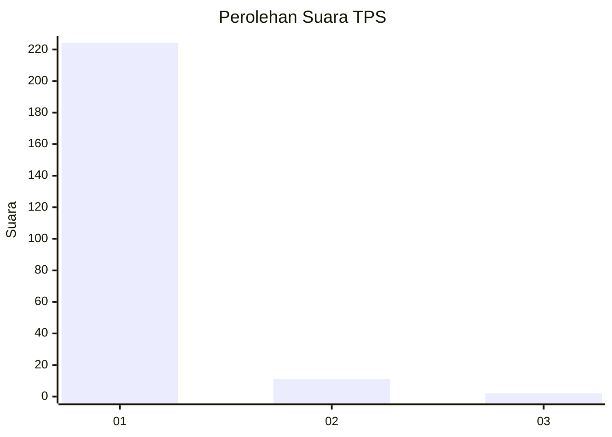
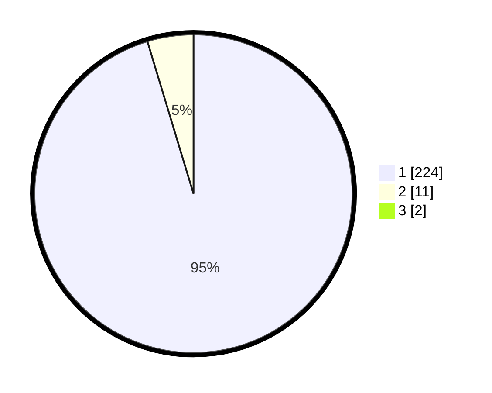

# Hasil

## Grafik

## Tabel

| No. | Nama Paslon    | Suara | Suara (raw) | Persentase |
|:--- |:-------------- | -----:| -----------:| ----------:|
| 1   | ANIES MUHAIMIN | 224   | [224][p-1]  | 94,51      |
| 2   | PRABOWO GIBRAN | 11    | [11][p-2]   | 4,64       |
| 3   | GANJAR MAHFUD  | 2     | [2][p-3]    | 0,84       |

[p-1]: https://github.com/gigit-pemilu/pemilu-2024-11-aceh/blob/main/pilpres/hitung-suara/sub/11-aceh/sub/07-pidie/sub/15-peukan-baro/sub/2020-jurong-raya/sub/001-tps/sub/paslon-1.txt
[p-2]: https://github.com/gigit-pemilu/pemilu-2024-11-aceh/blob/main/pilpres/hitung-suara/sub/11-aceh/sub/07-pidie/sub/15-peukan-baro/sub/2020-jurong-raya/sub/001-tps/sub/paslon-2.txt
[p-3]: https://github.com/gigit-pemilu/pemilu-2024-11-aceh/blob/main/pilpres/hitung-suara/sub/11-aceh/sub/07-pidie/sub/15-peukan-baro/sub/2020-jurong-raya/sub/001-tps/sub/paslon-3.txt

## Foto C Plano

https://sirekap-obj-formc.kpu.go.id/7792/pemilu/ppwp/11/07/15/20/20/1107152020001-20240215-005343--94b3e76c-a94e-474d-aa9f-c4e540b3e8ec.jpg

https://sirekap-obj-formc.kpu.go.id/7792/pemilu/ppwp/11/07/15/20/20/1107152020001-20240215-005508--64abbca5-c1da-4386-aaa8-739b174fee06.jpg

https://sirekap-obj-formc.kpu.go.id/7792/pemilu/ppwp/11/07/15/20/20/1107152020001-20240215-005751--624f315b-c780-42e8-a1c6-b0fc9f445592.jpg

## Metadata

| Key        | Value               |
| ---------- | ------------------- |
| Time Stamp | 2024-02-19 06:16:00 |

