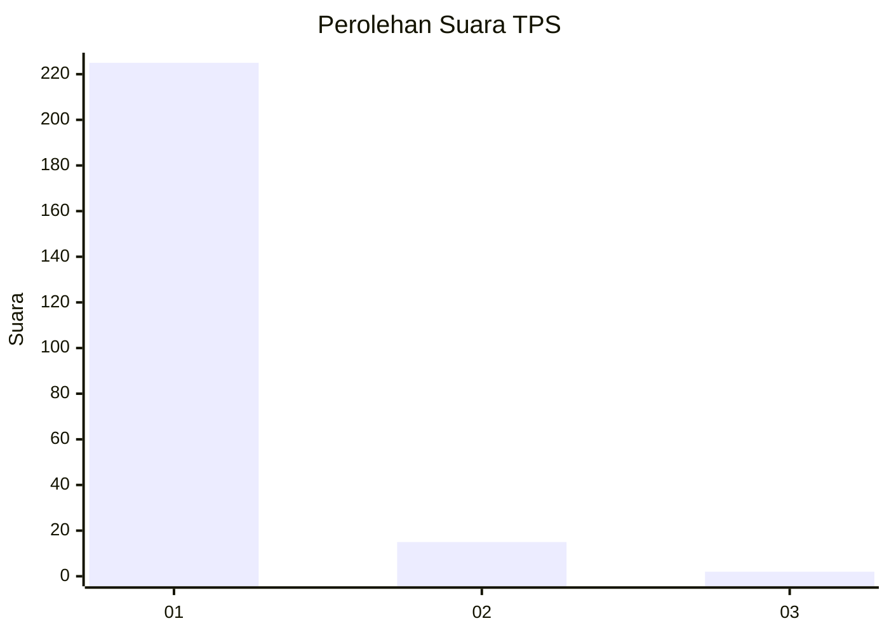
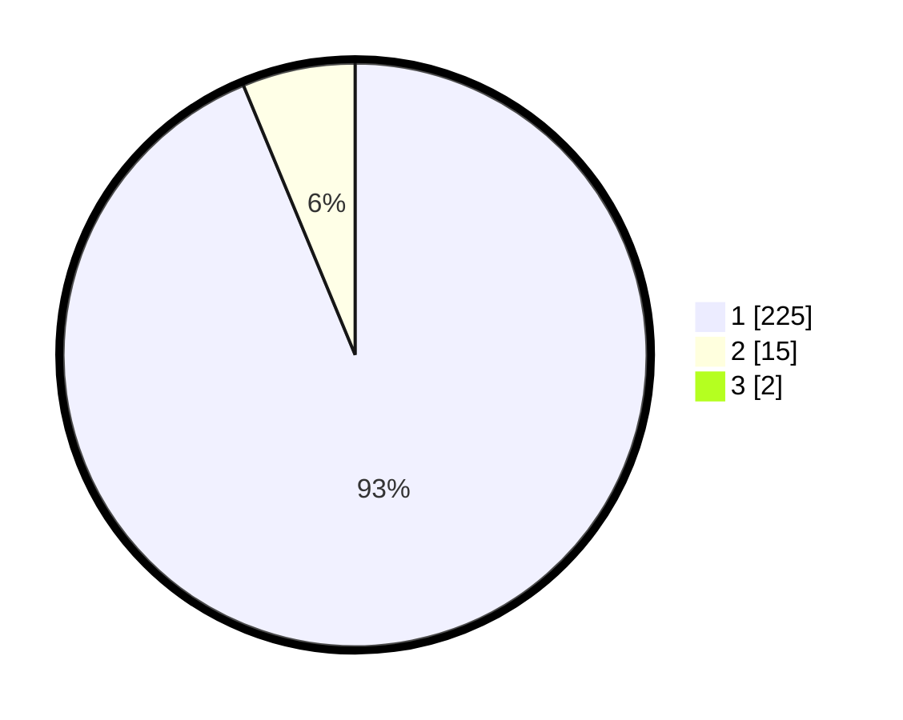

# Hasil

## Grafik

## Tabel

| No. | Nama Paslon    | Suara | Suara (raw) | Persentase |
|:--- |:-------------- | -----:| -----------:| ----------:|
| 1   | ANIES MUHAIMIN | 225   | [225][p-1]  | 92,98      |
| 2   | PRABOWO GIBRAN | 15    | [15][p-2]   | 6,20       |
| 3   | GANJAR MAHFUD  | 2     | [2][p-3]    | 0,83       |

[p-1]: https://github.com/gigit-pemilu/pemilu-2024-11-aceh/blob/main/pilpres/hitung-suara/sub/11-aceh/sub/07-pidie/sub/15-peukan-baro/sub/2020-jurong-raya/sub/002-tps/sub/paslon-1.txt
[p-2]: https://github.com/gigit-pemilu/pemilu-2024-11-aceh/blob/main/pilpres/hitung-suara/sub/11-aceh/sub/07-pidie/sub/15-peukan-baro/sub/2020-jurong-raya/sub/002-tps/sub/paslon-2.txt
[p-3]: https://github.com/gigit-pemilu/pemilu-2024-11-aceh/blob/main/pilpres/hitung-suara/sub/11-aceh/sub/07-pidie/sub/15-peukan-baro/sub/2020-jurong-raya/sub/002-tps/sub/paslon-3.txt

## Foto C Plano

https://sirekap-obj-formc.kpu.go.id/9562/pemilu/ppwp/11/07/15/20/20/1107152020002-20240214-233143--eb757db3-99d3-49b3-8e45-30c72da82690.jpg

https://sirekap-obj-formc.kpu.go.id/9562/pemilu/ppwp/11/07/15/20/20/1107152020002-20240214-233226--8231b501-7eb8-457d-8262-d6ce399ed449.jpg

https://sirekap-obj-formc.kpu.go.id/9562/pemilu/ppwp/11/07/15/20/20/1107152020002-20240215-050410--6d187bd6-aeaa-4202-a3ef-67cd26f982db.jpg

## Metadata

| Key        | Value               |
| ---------- | ------------------- |
| Time Stamp | 2024-02-19 06:16:00 |

