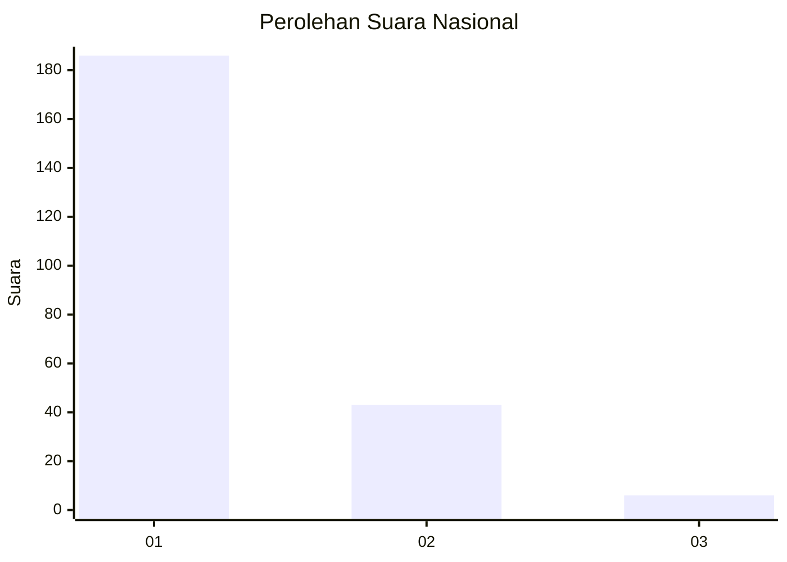
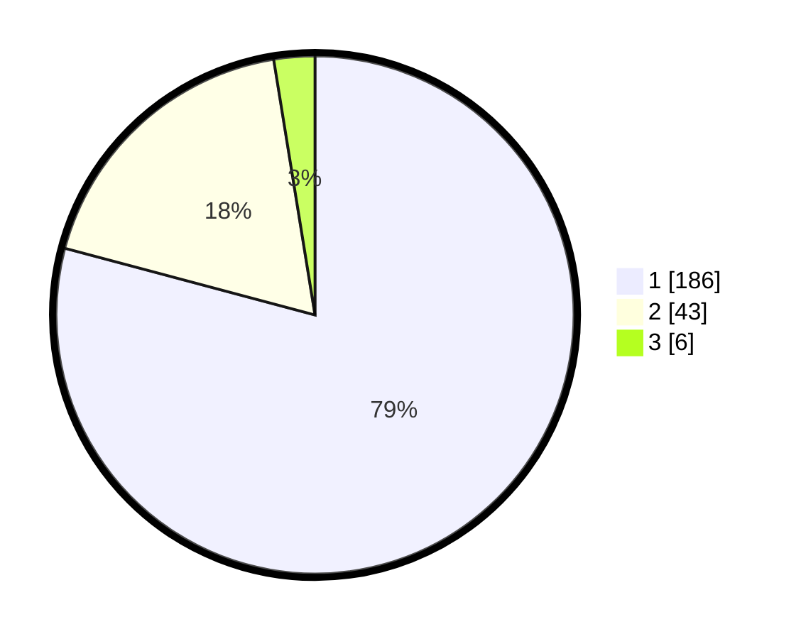

# Hasil

## Grafik

## Tabel

| No. | Nama Paslon    | Suara | Suara (raw) | Persentase |
|:--- |:-------------- | -----:| -----------:| ----------:|
| 1   | ANIES MUHAIMIN | 186   | [186][p-1]  | 79,15      |
| 2   | PRABOWO GIBRAN | 43    | [43][p-2]   | 18,30      |
| 3   | GANJAR MAHFUD  | 6     | [6][p-3]    | 2,55       |

[p-1]: https://github.com/gigit-pemilu/pemilu-2024/blob/main/pilpres/hitung-suara/sub/11-aceh/sub/07-pidie/sub/15-peukan-baro/sub/2022-lueng-mesjid/sub/001-tps/sub/paslon-1.txt
[p-2]: https://github.com/gigit-pemilu/pemilu-2024/blob/main/pilpres/hitung-suara/sub/11-aceh/sub/07-pidie/sub/15-peukan-baro/sub/2022-lueng-mesjid/sub/001-tps/sub/paslon-2.txt
[p-3]: https://github.com/gigit-pemilu/pemilu-2024/blob/main/pilpres/hitung-suara/sub/11-aceh/sub/07-pidie/sub/15-peukan-baro/sub/2022-lueng-mesjid/sub/001-tps/sub/paslon-3.txt

## Foto C Plano

https://sirekap-obj-formc.kpu.go.id/078c/pemilu/ppwp/11/07/15/20/22/1107152022001-20240214-185226--69c7e0cb-e686-40e3-81d1-7eb9a086903b.jpg

https://sirekap-obj-formc.kpu.go.id/078c/pemilu/ppwp/11/07/15/20/22/1107152022001-20240214-185335--ccc68937-1a10-4458-b19a-1ae223de0da5.jpg

https://sirekap-obj-formc.kpu.go.id/078c/pemilu/ppwp/11/07/15/20/22/1107152022001-20240214-185425--c3abab20-c5dc-4540-8d48-4b05e8111c1d.jpg

## Metadata

| Key        | Value               |
| ---------- | ------------------- |
| Time Stamp | 2024-02-19 06:16:00 |

