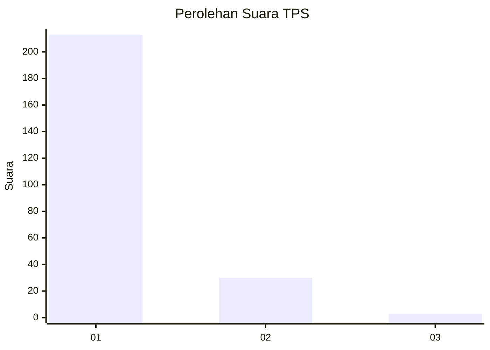
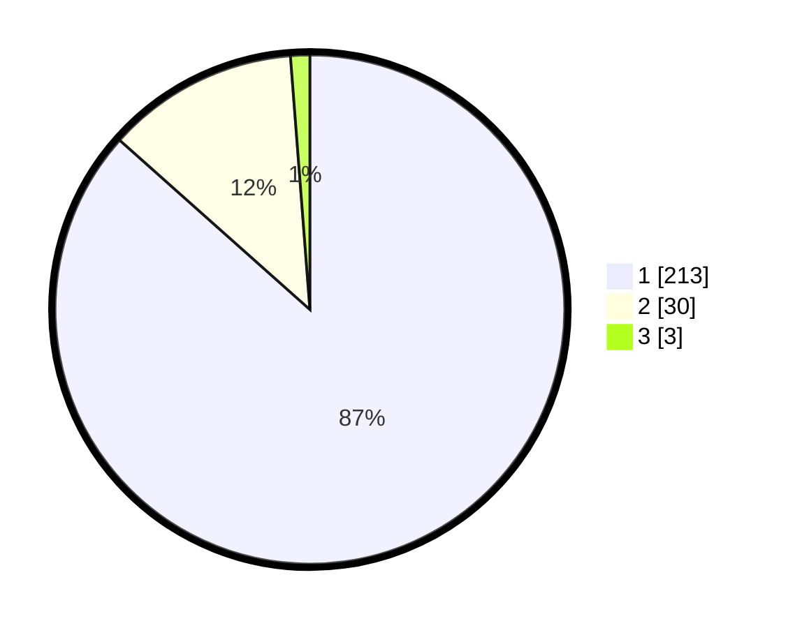

# Hasil

## Grafik

## Tabel

| No. | Nama Paslon    | Suara | Suara (raw) | Persentase |
|:--- |:-------------- | -----:| -----------:| ----------:|
| 1   | ANIES MUHAIMIN | 213   | [213][p-1]  | 86,59      |
| 2   | PRABOWO GIBRAN | 30    | [30][p-2]   | 12,20      |
| 3   | GANJAR MAHFUD  | 3     | [3][p-3]    | 1,22       |

[p-1]: https://github.com/gigit-pemilu/pemilu-2024-11-aceh/blob/main/pilpres/hitung-suara/sub/11-aceh/sub/07-pidie/sub/15-peukan-baro/sub/2022-lueng-mesjid/sub/002-tps/sub/paslon-1.txt
[p-2]: https://github.com/gigit-pemilu/pemilu-2024-11-aceh/blob/main/pilpres/hitung-suara/sub/11-aceh/sub/07-pidie/sub/15-peukan-baro/sub/2022-lueng-mesjid/sub/002-tps/sub/paslon-2.txt
[p-3]: https://github.com/gigit-pemilu/pemilu-2024-11-aceh/blob/main/pilpres/hitung-suara/sub/11-aceh/sub/07-pidie/sub/15-peukan-baro/sub/2022-lueng-mesjid/sub/002-tps/sub/paslon-3.txt

## Foto C Plano

https://sirekap-obj-formc.kpu.go.id/6f36/pemilu/ppwp/11/07/15/20/22/1107152022002-20240214-211559--7c27dbfa-03cb-4010-93cc-857176b3370c.jpg

https://sirekap-obj-formc.kpu.go.id/6f36/pemilu/ppwp/11/07/15/20/22/1107152022002-20240214-211655--21d186de-081c-48fc-a404-086891f6be61.jpg

https://sirekap-obj-formc.kpu.go.id/6f36/pemilu/ppwp/11/07/15/20/22/1107152022002-20240214-211753--4e847bdc-4ec1-4b50-a649-6532810fd761.jpg

## Metadata

| Key        | Value               |
| ---------- | ------------------- |
| Time Stamp | 2024-02-19 06:16:00 |

