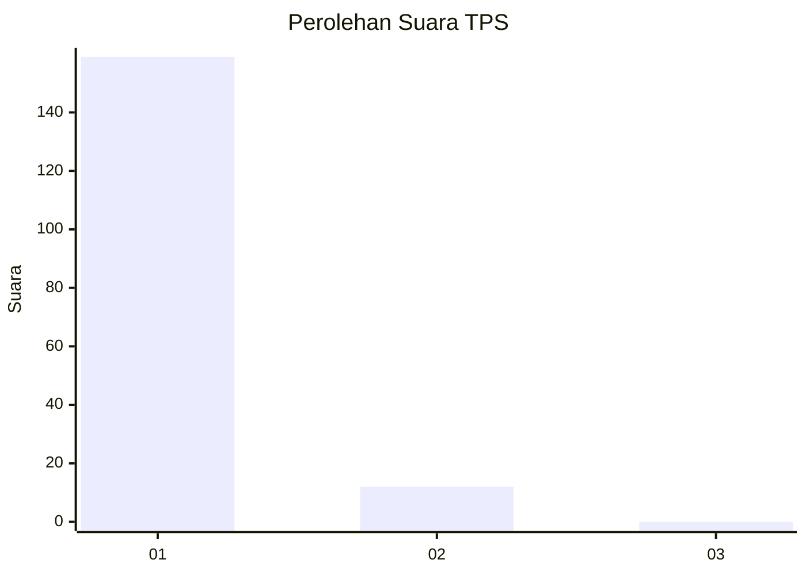
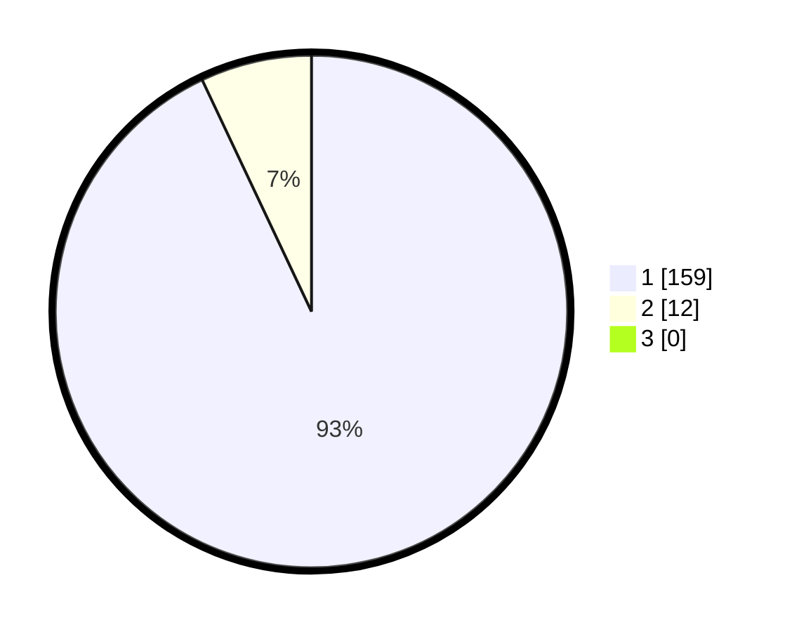

# Hasil

## Grafik

## Tabel

| No. | Nama Paslon    | Suara | Suara (raw) | Persentase |
|:--- |:-------------- | -----:| -----------:| ----------:|
| 1   | ANIES MUHAIMIN | 159   | [159][p-1]  | 92,98      |
| 2   | PRABOWO GIBRAN | 12    | [12][p-2]   | 7,02       |
| 3   | GANJAR MAHFUD  | 0     | [0][p-3]    | 0,00       |

[p-1]: https://github.com/gigit-pemilu/pemilu-2024-11-aceh/blob/main/pilpres/hitung-suara/sub/11-aceh/sub/07-pidie/sub/15-peukan-baro/sub/2024-mee-hagu/sub/002-tps/sub/paslon-1.txt
[p-2]: https://github.com/gigit-pemilu/pemilu-2024-11-aceh/blob/main/pilpres/hitung-suara/sub/11-aceh/sub/07-pidie/sub/15-peukan-baro/sub/2024-mee-hagu/sub/002-tps/sub/paslon-2.txt
[p-3]: https://github.com/gigit-pemilu/pemilu-2024-11-aceh/blob/main/pilpres/hitung-suara/sub/11-aceh/sub/07-pidie/sub/15-peukan-baro/sub/2024-mee-hagu/sub/002-tps/sub/paslon-3.txt

## Foto C Plano

https://sirekap-obj-formc.kpu.go.id/8a42/pemilu/ppwp/11/07/15/20/24/1107152024002-20240215-070024--a2aa1326-3792-4f27-a038-b1866902c180.jpg

https://sirekap-obj-formc.kpu.go.id/8a42/pemilu/ppwp/11/07/15/20/24/1107152024002-20240215-065635--becaa115-143c-4f0e-9fb3-e613c35912dd.jpg

https://sirekap-obj-formc.kpu.go.id/8a42/pemilu/ppwp/11/07/15/20/24/1107152024002-20240214-231809--2ca085bc-c47a-49ca-a417-b0bfa3fd64c3.jpg

## Metadata

| Key        | Value               |
| ---------- | ------------------- |
| Time Stamp | 2024-02-24 22:31:28 |

