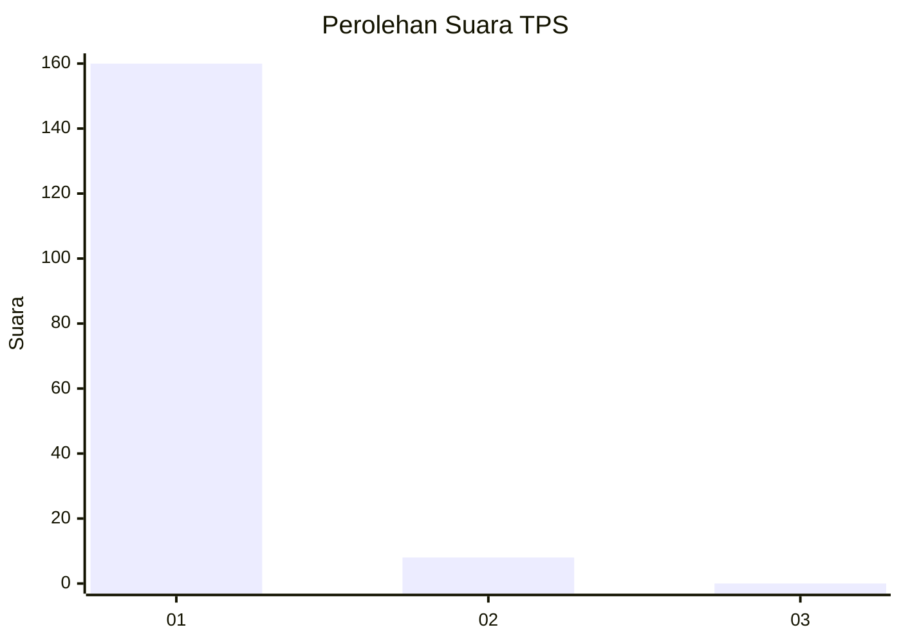
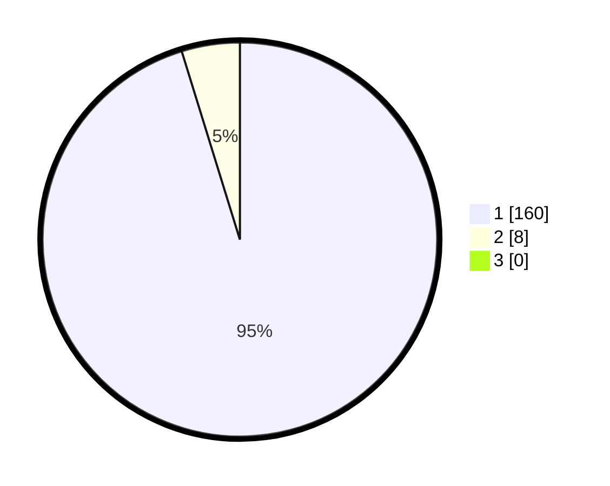

# Hasil

## Grafik

## Tabel

| No. | Nama Paslon    | Suara | Suara (raw) | Persentase |
|:--- |:-------------- | -----:| -----------:| ----------:|
| 1   | ANIES MUHAIMIN | 160   | [160][p-1]  | 95,24      |
| 2   | PRABOWO GIBRAN | 8     | [8][p-2]    | 4,76       |
| 3   | GANJAR MAHFUD  | 0     | [0][p-3]    | 0,00       |

[p-1]: https://github.com/gigit-pemilu/pemilu-2024-11-aceh/blob/main/pilpres/hitung-suara/sub/11-aceh/sub/07-pidie/sub/15-peukan-baro/sub/2025-dayah-sukon/sub/001-tps/sub/paslon-1.txt
[p-2]: https://github.com/gigit-pemilu/pemilu-2024-11-aceh/blob/main/pilpres/hitung-suara/sub/11-aceh/sub/07-pidie/sub/15-peukan-baro/sub/2025-dayah-sukon/sub/001-tps/sub/paslon-2.txt
[p-3]: https://github.com/gigit-pemilu/pemilu-2024-11-aceh/blob/main/pilpres/hitung-suara/sub/11-aceh/sub/07-pidie/sub/15-peukan-baro/sub/2025-dayah-sukon/sub/001-tps/sub/paslon-3.txt

## Foto C Plano

https://sirekap-obj-formc.kpu.go.id/7e1f/pemilu/ppwp/11/07/15/20/25/1107152025001-20240215-005315--05c4099e-cfa0-4d0e-96cb-8751cfae89cf.jpg

https://sirekap-obj-formc.kpu.go.id/7e1f/pemilu/ppwp/11/07/15/20/25/1107152025001-20240215-005729--d0344f73-131f-4da8-b3e1-91931754edd0.jpg

https://sirekap-obj-formc.kpu.go.id/7e1f/pemilu/ppwp/11/07/15/20/25/1107152025001-20240215-005915--b4bd4ac6-c7b5-43e1-9cfb-5fc30a209eea.jpg

## Metadata

| Key        | Value               |
| ---------- | ------------------- |
| Time Stamp | 2024-02-24 22:31:28 |

