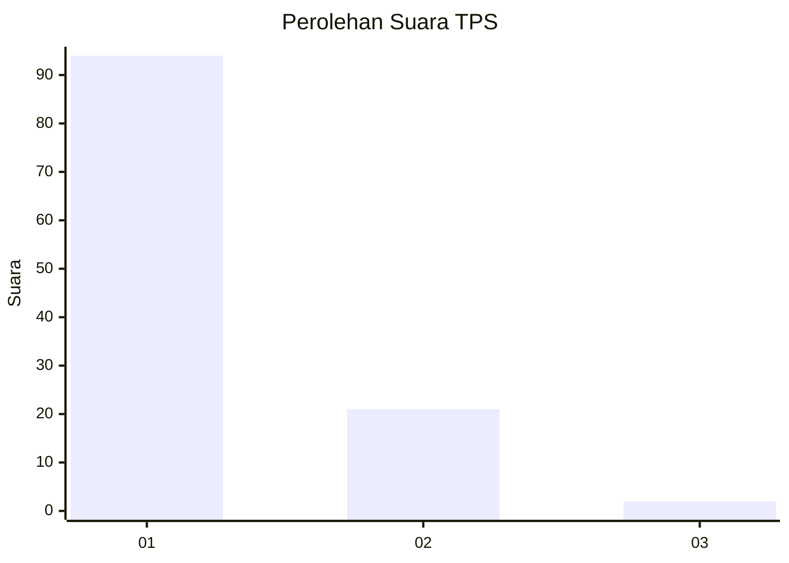
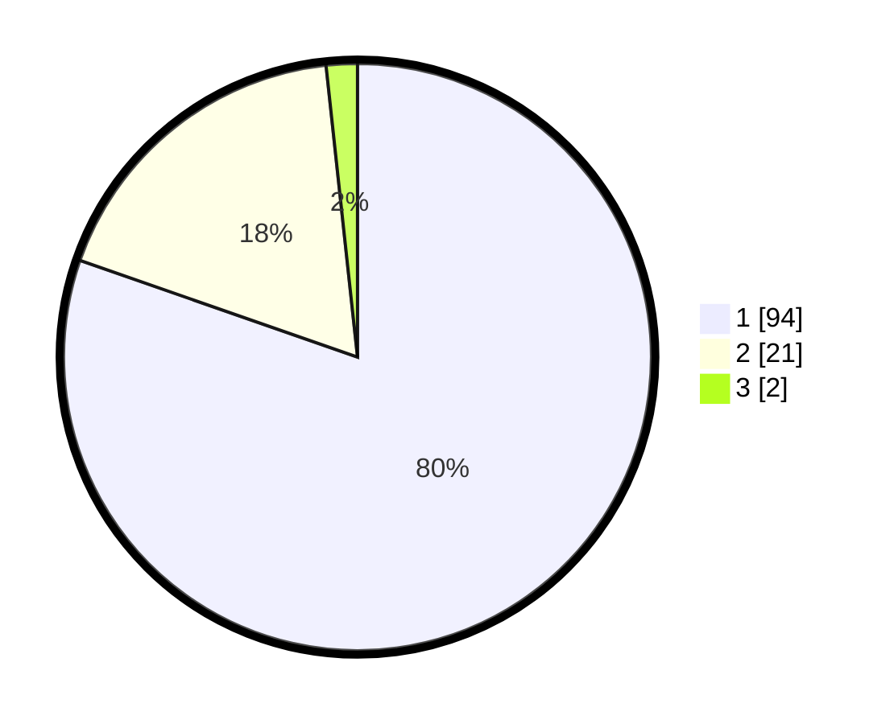

# Hasil

## Grafik

## Tabel

| No. | Nama Paslon    | Suara | Suara (raw) | Persentase |
|:--- |:-------------- | -----:| -----------:| ----------:|
| 1   | ANIES MUHAIMIN | 94    | [94][p-1]   | 80,34      |
| 2   | PRABOWO GIBRAN | 21    | [21][p-2]   | 17,95      |
| 3   | GANJAR MAHFUD  | 2     | [2][p-3]    | 1,71       |

[p-1]: https://github.com/gigit-pemilu/pemilu-2024-11-aceh/blob/main/pilpres/hitung-suara/sub/11-aceh/sub/07-pidie/sub/15-peukan-baro/sub/2031-bluek-arab/sub/001-tps/sub/paslon-1.txt
[p-2]: https://github.com/gigit-pemilu/pemilu-2024-11-aceh/blob/main/pilpres/hitung-suara/sub/11-aceh/sub/07-pidie/sub/15-peukan-baro/sub/2031-bluek-arab/sub/001-tps/sub/paslon-2.txt
[p-3]: https://github.com/gigit-pemilu/pemilu-2024-11-aceh/blob/main/pilpres/hitung-suara/sub/11-aceh/sub/07-pidie/sub/15-peukan-baro/sub/2031-bluek-arab/sub/001-tps/sub/paslon-3.txt

## Foto C Plano

https://sirekap-obj-formc.kpu.go.id/f640/pemilu/ppwp/11/07/15/20/31/1107152031001-20240214-225324--cad917f3-f965-4916-b322-b2c707206868.jpg

https://sirekap-obj-formc.kpu.go.id/f640/pemilu/ppwp/11/07/15/20/31/1107152031001-20240214-225521--a0cbf83f-7010-4cbb-b27b-29093c5046a5.jpg

https://sirekap-obj-formc.kpu.go.id/f640/pemilu/ppwp/11/07/15/20/31/1107152031001-20240214-225702--b9c0c9d4-8a81-48d8-8dd4-25194f556dc1.jpg

## Metadata

| Key        | Value               |
| ---------- | ------------------- |
| Time Stamp | 2024-02-19 06:16:00 |

