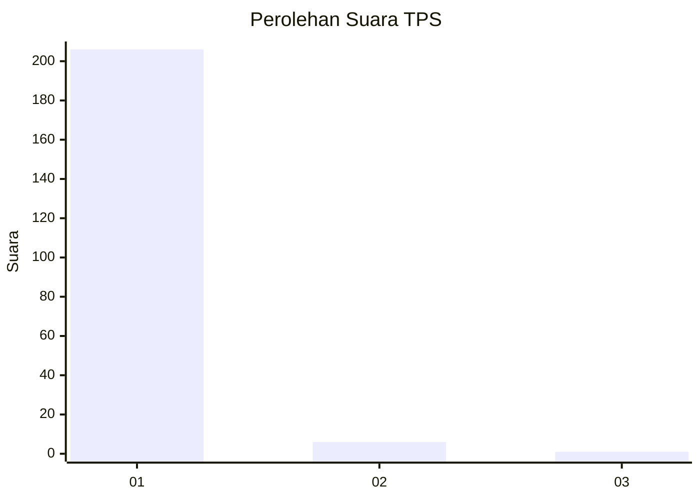
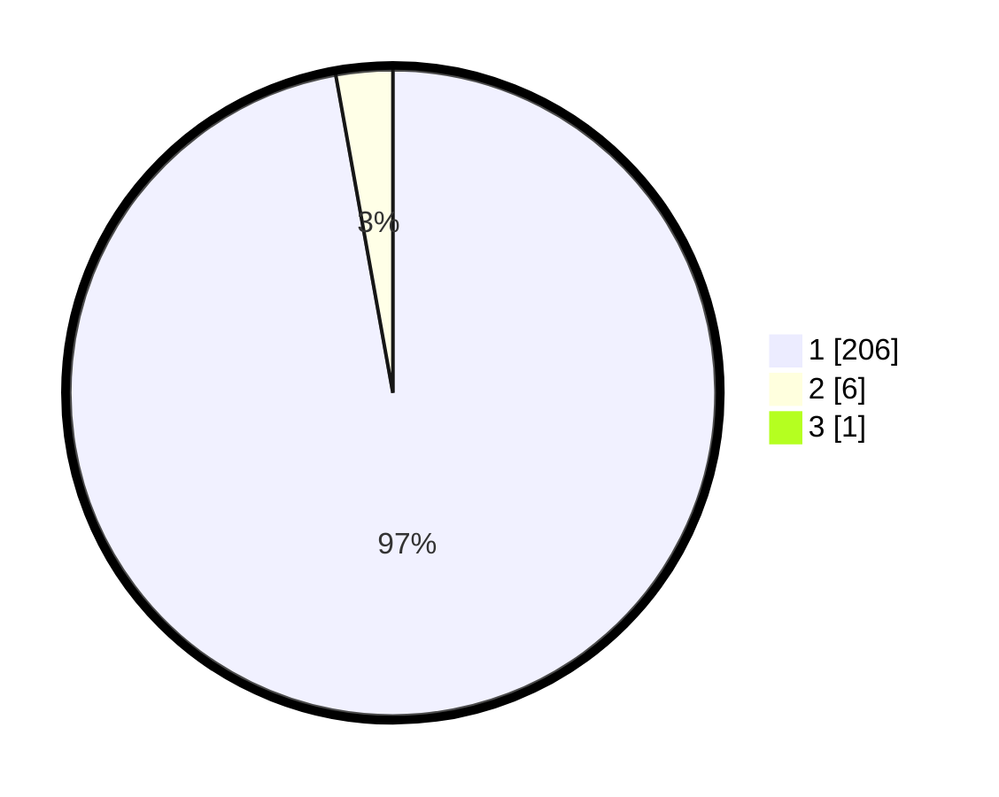

# Hasil

## Grafik

## Tabel

| No. | Nama Paslon    | Suara | Suara (raw) | Persentase |
|:--- |:-------------- | -----:| -----------:| ----------:|
| 1   | ANIES MUHAIMIN | 206   | [206][p-1]  | 96,71      |
| 2   | PRABOWO GIBRAN | 6     | [6][p-2]    | 2,82       |
| 3   | GANJAR MAHFUD  | 1     | [1][p-3]    | 0,47       |

[p-1]: https://github.com/gigit-pemilu/pemilu-2024-11-aceh/blob/main/pilpres/hitung-suara/sub/11-aceh/sub/07-pidie/sub/15-peukan-baro/sub/2035-ulee-tutue/sub/001-tps/sub/paslon-1.txt
[p-2]: https://github.com/gigit-pemilu/pemilu-2024-11-aceh/blob/main/pilpres/hitung-suara/sub/11-aceh/sub/07-pidie/sub/15-peukan-baro/sub/2035-ulee-tutue/sub/001-tps/sub/paslon-2.txt
[p-3]: https://github.com/gigit-pemilu/pemilu-2024-11-aceh/blob/main/pilpres/hitung-suara/sub/11-aceh/sub/07-pidie/sub/15-peukan-baro/sub/2035-ulee-tutue/sub/001-tps/sub/paslon-3.txt

## Foto C Plano

https://sirekap-obj-formc.kpu.go.id/607b/pemilu/ppwp/11/07/15/20/35/1107152035001-20240215-000943--223abd2c-bb70-4a0f-9199-972da5073bba.jpg

https://sirekap-obj-formc.kpu.go.id/607b/pemilu/ppwp/11/07/15/20/35/1107152035001-20240215-001143--4785030b-d2db-4802-9bac-5ea0b2763d0b.jpg

https://sirekap-obj-formc.kpu.go.id/607b/pemilu/ppwp/11/07/15/20/35/1107152035001-20240215-001300--3eb8339e-badb-44a5-9123-b7c77d8e9250.jpg

## Metadata

| Key        | Value               |
| ---------- | ------------------- |
| Time Stamp | 2024-02-19 06:16:00 |

