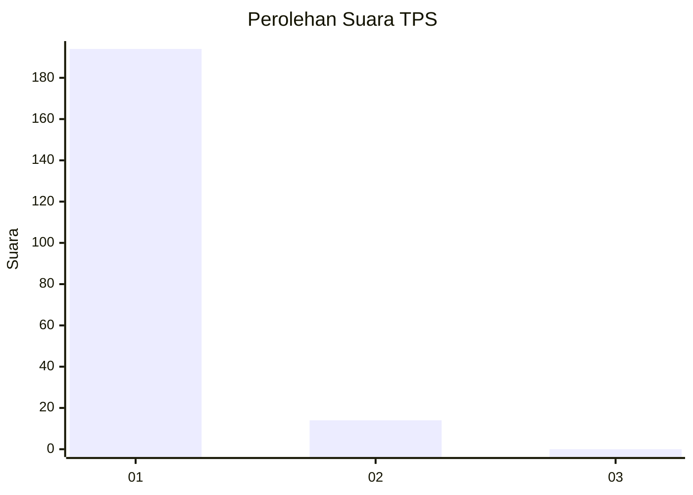
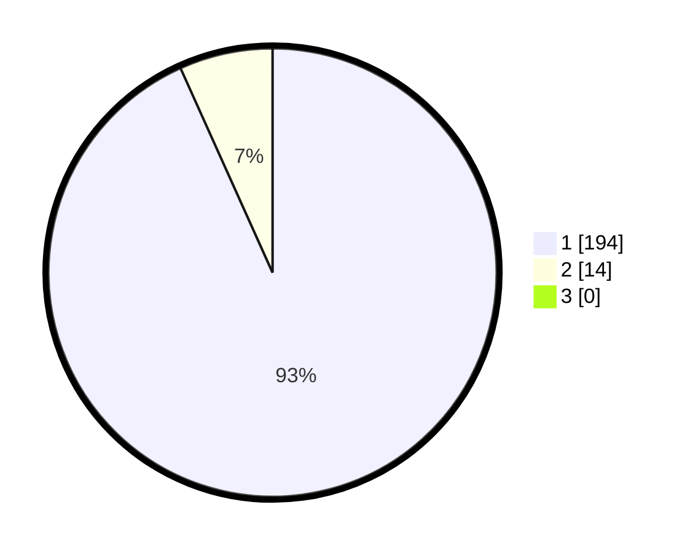

# Hasil

## Grafik

## Tabel

| No. | Nama Paslon    | Suara | Suara (raw) | Persentase |
|:--- |:-------------- | -----:| -----------:| ----------:|
| 1   | ANIES MUHAIMIN | 194   | [194][p-1]  | 93,27      |
| 2   | PRABOWO GIBRAN | 14    | [14][p-2]   | 6,73       |
| 3   | GANJAR MAHFUD  | 0     | [0][p-3]    | 0,00       |

[p-1]: https://github.com/gigit-pemilu/pemilu-2024-11-aceh/blob/main/pilpres/hitung-suara/sub/11-aceh/sub/07-pidie/sub/15-peukan-baro/sub/2038-meuleuweuk/sub/001-tps/sub/paslon-1.txt
[p-2]: https://github.com/gigit-pemilu/pemilu-2024-11-aceh/blob/main/pilpres/hitung-suara/sub/11-aceh/sub/07-pidie/sub/15-peukan-baro/sub/2038-meuleuweuk/sub/001-tps/sub/paslon-2.txt
[p-3]: https://github.com/gigit-pemilu/pemilu-2024-11-aceh/blob/main/pilpres/hitung-suara/sub/11-aceh/sub/07-pidie/sub/15-peukan-baro/sub/2038-meuleuweuk/sub/001-tps/sub/paslon-3.txt

## Foto C Plano

https://sirekap-obj-formc.kpu.go.id/5ebc/pemilu/ppwp/11/07/15/20/38/1107152038001-20240214-155810--c9140bc7-c7da-4e27-83bc-51c7a26167a3.jpg

https://sirekap-obj-formc.kpu.go.id/5ebc/pemilu/ppwp/11/07/15/20/38/1107152038001-20240214-160140--847996cf-ae6e-4821-bcb6-c81f74199587.jpg

https://sirekap-obj-formc.kpu.go.id/5ebc/pemilu/ppwp/11/07/15/20/38/1107152038001-20240214-160116--a2716585-8570-472d-adb4-64983b82fa2f.jpg

## Metadata

| Key        | Value               |
| ---------- | ------------------- |
| Time Stamp | 2024-02-19 06:16:00 |

