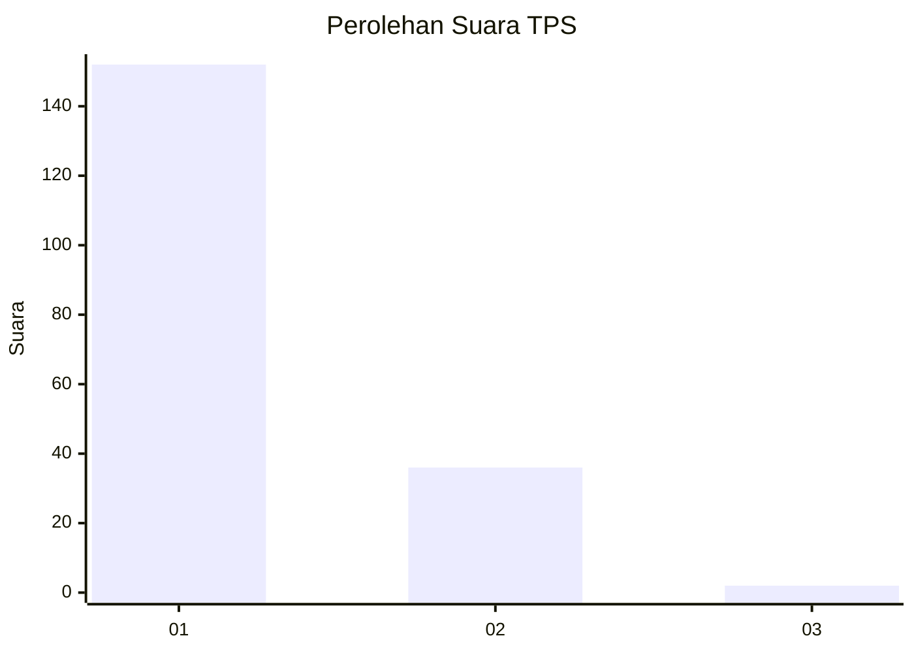
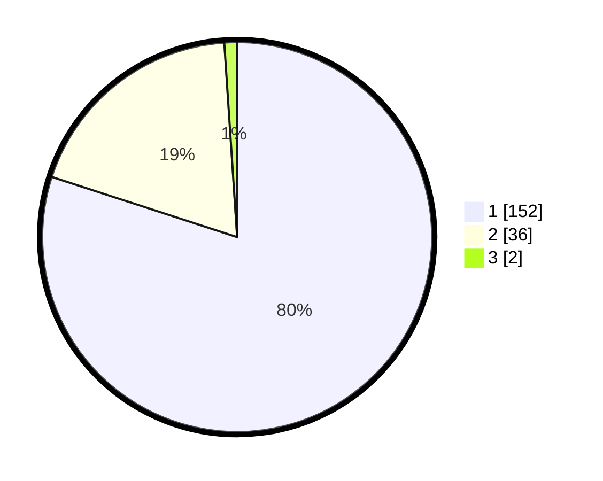

# Hasil

## Grafik

## Tabel

| No. | Nama Paslon    | Suara | Suara (raw) | Persentase |
|:--- |:-------------- | -----:| -----------:| ----------:|
| 1   | ANIES MUHAIMIN | 152   | [152][p-1]  | 80,00      |
| 2   | PRABOWO GIBRAN | 36    | [36][p-2]   | 18,95      |
| 3   | GANJAR MAHFUD  | 2     | [2][p-3]    | 1,05       |

[p-1]: https://github.com/gigit-pemilu/pemilu-2024-11-aceh/blob/main/pilpres/hitung-suara/sub/11-aceh/sub/07-pidie/sub/15-peukan-baro/sub/2039-jurong/sub/001-tps/sub/paslon-1.txt
[p-2]: https://github.com/gigit-pemilu/pemilu-2024-11-aceh/blob/main/pilpres/hitung-suara/sub/11-aceh/sub/07-pidie/sub/15-peukan-baro/sub/2039-jurong/sub/001-tps/sub/paslon-2.txt
[p-3]: https://github.com/gigit-pemilu/pemilu-2024-11-aceh/blob/main/pilpres/hitung-suara/sub/11-aceh/sub/07-pidie/sub/15-peukan-baro/sub/2039-jurong/sub/001-tps/sub/paslon-3.txt

## Foto C Plano

https://sirekap-obj-formc.kpu.go.id/958e/pemilu/ppwp/11/07/15/20/39/1107152039001-20240214-221540--7585b83a-4296-4b68-a88c-1cf9a1f26315.jpg

https://sirekap-obj-formc.kpu.go.id/958e/pemilu/ppwp/11/07/15/20/39/1107152039001-20240214-222246--3f1510ac-07ae-413c-8942-de5bee482b35.jpg

https://sirekap-obj-formc.kpu.go.id/958e/pemilu/ppwp/11/07/15/20/39/1107152039001-20240214-222649--90d9ad02-cf56-438c-9507-5137e6656f6d.jpg

## Metadata

| Key        | Value               |
| ---------- | ------------------- |
| Time Stamp | 2024-02-15 17:30:25 |

