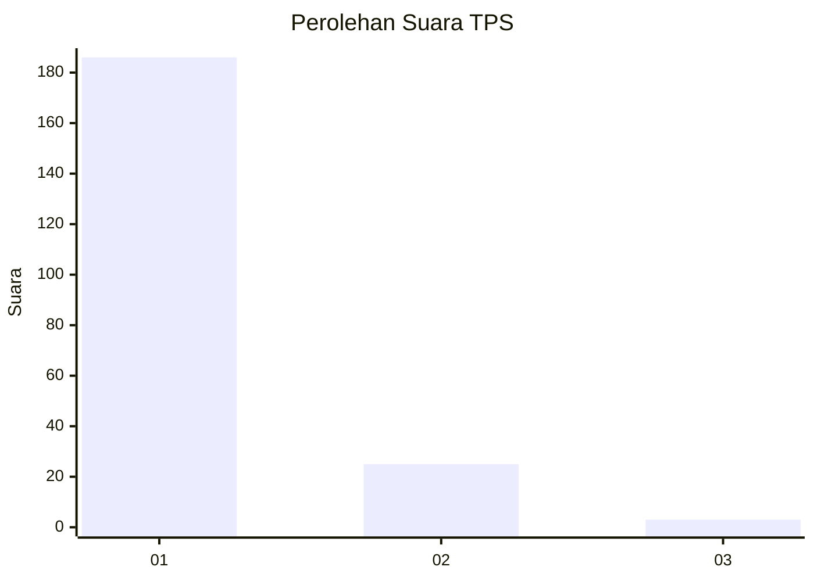
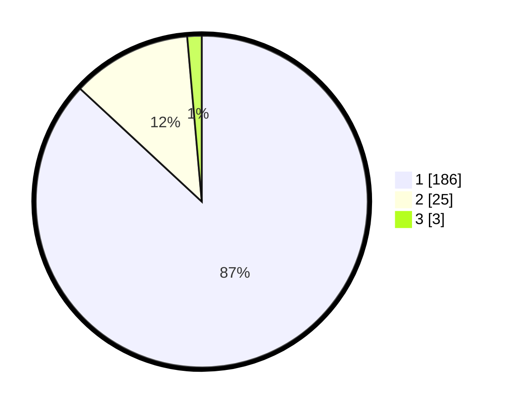

# Hasil

## Grafik

## Tabel

| No. | Nama Paslon    | Suara | Suara (raw) | Persentase |
|:--- |:-------------- | -----:| -----------:| ----------:|
| 1   | ANIES MUHAIMIN | 186   | [186][p-1]  | 86,92      |
| 2   | PRABOWO GIBRAN | 25    | [25][p-2]   | 11,68      |
| 3   | GANJAR MAHFUD  | 3     | [3][p-3]    | 1,40       |

[p-1]: https://github.com/gigit-pemilu/pemilu-2024-11-aceh/blob/main/pilpres/hitung-suara/sub/11-aceh/sub/07-pidie/sub/15-peukan-baro/sub/2041-sukon-krueng-seumideun/sub/001-tps/sub/paslon-1.txt
[p-2]: https://github.com/gigit-pemilu/pemilu-2024-11-aceh/blob/main/pilpres/hitung-suara/sub/11-aceh/sub/07-pidie/sub/15-peukan-baro/sub/2041-sukon-krueng-seumideun/sub/001-tps/sub/paslon-2.txt
[p-3]: https://github.com/gigit-pemilu/pemilu-2024-11-aceh/blob/main/pilpres/hitung-suara/sub/11-aceh/sub/07-pidie/sub/15-peukan-baro/sub/2041-sukon-krueng-seumideun/sub/001-tps/sub/paslon-3.txt

## Foto C Plano

https://sirekap-obj-formc.kpu.go.id/6ab8/pemilu/ppwp/11/07/15/20/41/1107152041001-20240214-232317--d554d885-ebf3-4a55-97d9-65863b035786.jpg

https://sirekap-obj-formc.kpu.go.id/6ab8/pemilu/ppwp/11/07/15/20/41/1107152041001-20240214-232050--2529ec84-7644-4034-8468-aa3ac1d62b70.jpg

https://sirekap-obj-formc.kpu.go.id/6ab8/pemilu/ppwp/11/07/15/20/41/1107152041001-20240214-232128--5d2f0ab5-231d-4982-b6e8-cf9787e66bc6.jpg

## Metadata

| Key        | Value               |
| ---------- | ------------------- |
| Time Stamp | 2024-02-19 06:16:00 |

