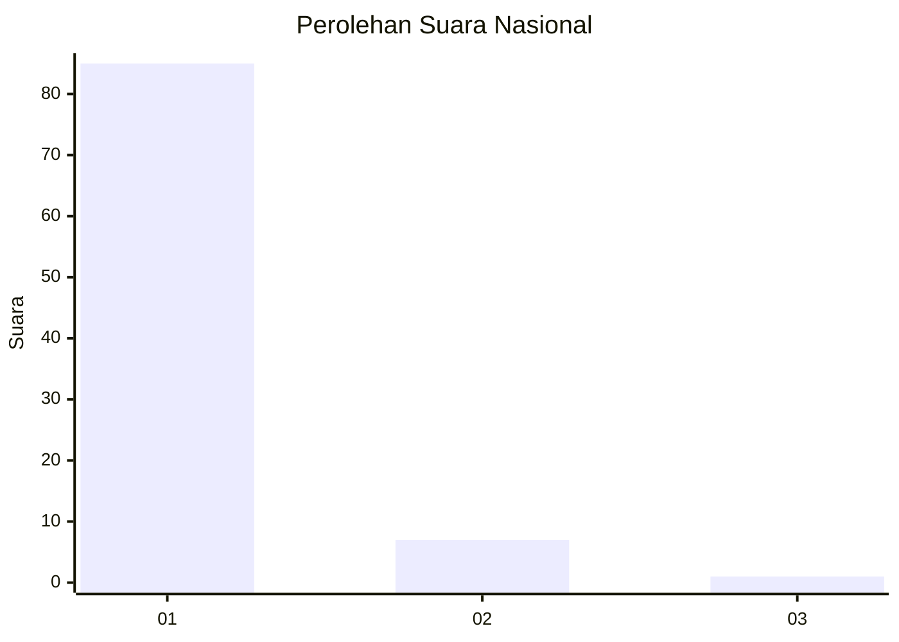
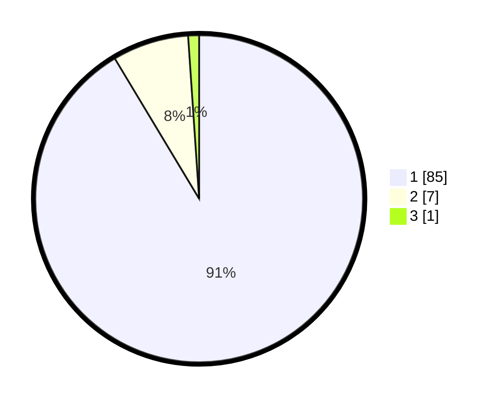

# Hasil

## Grafik

## Tabel

| No. | Nama Paslon    | Suara | Suara (raw) | Persentase |
|:--- |:-------------- | -----:| -----------:| ----------:|
| 1   | ANIES MUHAIMIN | 85    | [85][p-1]   | 91,40      |
| 2   | PRABOWO GIBRAN | 7     | [7][p-2]    | 7,53       |
| 3   | GANJAR MAHFUD  | 1     | [1][p-3]    | 1,08       |

[p-1]: https://github.com/gigit-pemilu/pemilu-2024/blob/main/pilpres/hitung-suara/sub/11-aceh/sub/07-pidie/sub/15-peukan-baro/sub/2050-gampong-krueng-seumideun/sub/001-tps/sub/paslon-1.txt
[p-2]: https://github.com/gigit-pemilu/pemilu-2024/blob/main/pilpres/hitung-suara/sub/11-aceh/sub/07-pidie/sub/15-peukan-baro/sub/2050-gampong-krueng-seumideun/sub/001-tps/sub/paslon-2.txt
[p-3]: https://github.com/gigit-pemilu/pemilu-2024/blob/main/pilpres/hitung-suara/sub/11-aceh/sub/07-pidie/sub/15-peukan-baro/sub/2050-gampong-krueng-seumideun/sub/001-tps/sub/paslon-3.txt

## Foto C Plano

https://sirekap-obj-formc.kpu.go.id/105d/pemilu/ppwp/11/07/15/20/50/1107152050001-20240214-155044--78a78c55-8ebf-4b8e-aa38-3871b5e7ee12.jpg

https://sirekap-obj-formc.kpu.go.id/105d/pemilu/ppwp/11/07/15/20/50/1107152050001-20240216-170011--550bb02c-0ec0-4341-b348-77c6e30af83a.jpg

https://sirekap-obj-formc.kpu.go.id/105d/pemilu/ppwp/11/07/15/20/50/1107152050001-20240216-165039--7a8125ed-7d64-41d8-8004-ebfca8f3cb36.jpg

## Metadata

| Key        | Value               |
| ---------- | ------------------- |
| Time Stamp | 2024-02-24 22:31:28 |

## DATA PEMILIH TETAP

Jumlah pemilih dalam DPT: **93**.
 * L: **43**.
 * P: **50**.

## DATA PENGGUNA HAK PILIH

Jumlah pengguna hak pilih dalam DPT: **93**.
 * L: **43**.
 * P: **50**.

Jumlah pengguna hak pilih dalam DPTb: **1**.
 * L: **0**.
 * P: **1**.

Jumlah pengguna hak pilih dalam DPK: **0**.
 * L: **0**.
 * P: **0**.

Jumlah pengguna hak pilih: **94**.
 * L: **43**.
 * P: **51**.

## JUMLAH SUARA SAH DAN TIDAK SAH

JUMLAH SELURUH SUARA SAH: **93**.

JUMLAH SUARA TIDAK SAH: **1**.

JUMLAH SELURUH SUARA SAH DAN SUARA TIDAK SAH: **94**.

