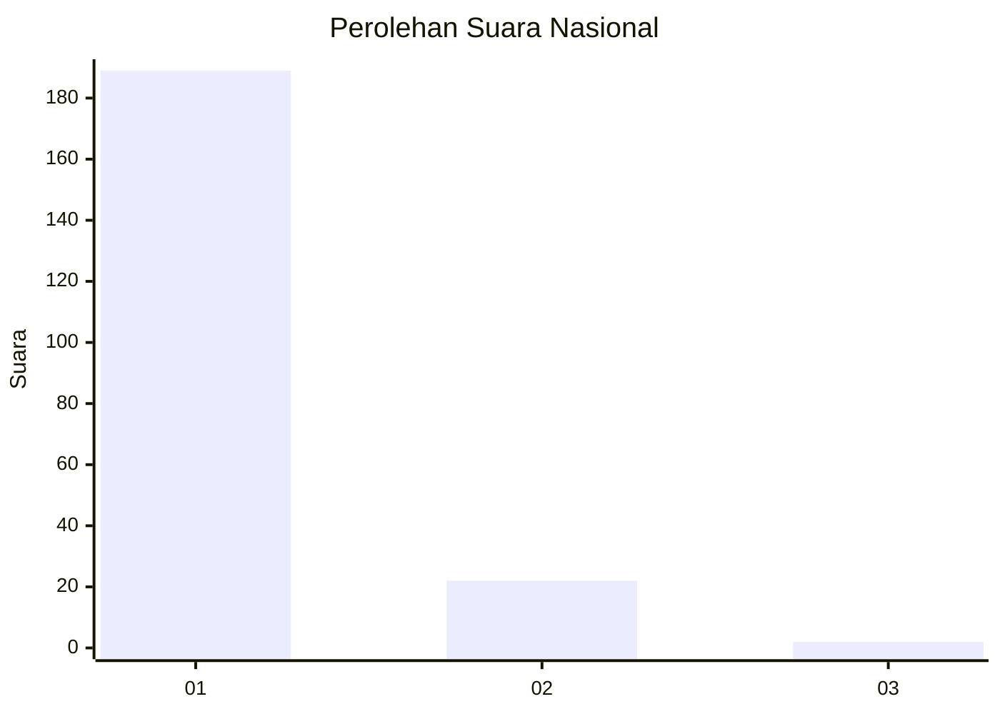
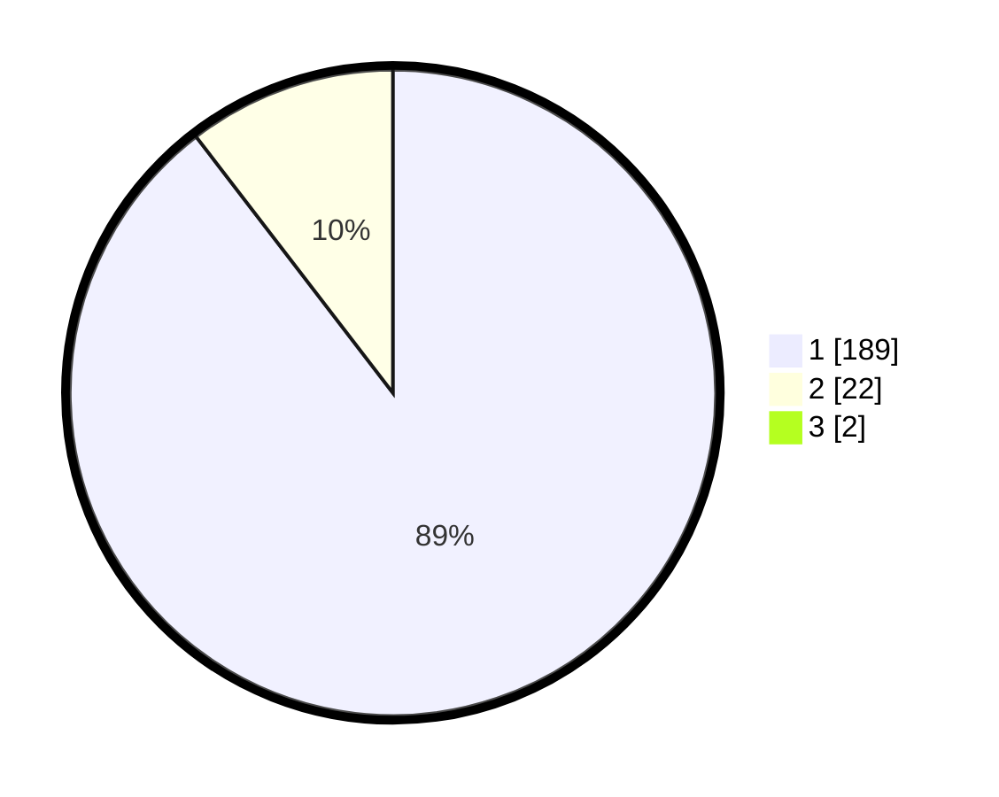

# Hasil

## Grafik

## Tabel

| No. | Nama Paslon    | Suara | Suara (raw) | Persentase |
|:--- |:-------------- | -----:| -----------:| ----------:|
| 1   | ANIES MUHAIMIN | 189   | [189][p-1]  | 88,73      |
| 2   | PRABOWO GIBRAN | 22    | [22][p-2]   | 10,33      |
| 3   | GANJAR MAHFUD  | 2     | [2][p-3]    | 0,94       |

[p-1]: https://github.com/gigit-pemilu/pemilu-2024/blob/main/pilpres/hitung-suara/sub/11-aceh/sub/07-pidie/sub/16-pidie/sub/2001-tijue/sub/001-tps/sub/paslon-1.txt
[p-2]: https://github.com/gigit-pemilu/pemilu-2024/blob/main/pilpres/hitung-suara/sub/11-aceh/sub/07-pidie/sub/16-pidie/sub/2001-tijue/sub/001-tps/sub/paslon-2.txt
[p-3]: https://github.com/gigit-pemilu/pemilu-2024/blob/main/pilpres/hitung-suara/sub/11-aceh/sub/07-pidie/sub/16-pidie/sub/2001-tijue/sub/001-tps/sub/paslon-3.txt

## Foto C Plano

https://sirekap-obj-formc.kpu.go.id/2d9a/pemilu/ppwp/11/07/16/20/01/1107162001001-20240215-045327--405e063e-4533-40b0-800d-79c85e0c121d.jpg

https://sirekap-obj-formc.kpu.go.id/2d9a/pemilu/ppwp/11/07/16/20/01/1107162001001-20240215-052142--398d2fa2-3993-4aaa-97c6-65617d4c888a.jpg

https://sirekap-obj-formc.kpu.go.id/2d9a/pemilu/ppwp/11/07/16/20/01/1107162001001-20240215-052449--6d7d28eb-ac23-4776-ade8-a080c34c1723.jpg

## Metadata

| Key        | Value               |
| ---------- | ------------------- |
| Time Stamp | 2024-02-24 22:31:28 |

