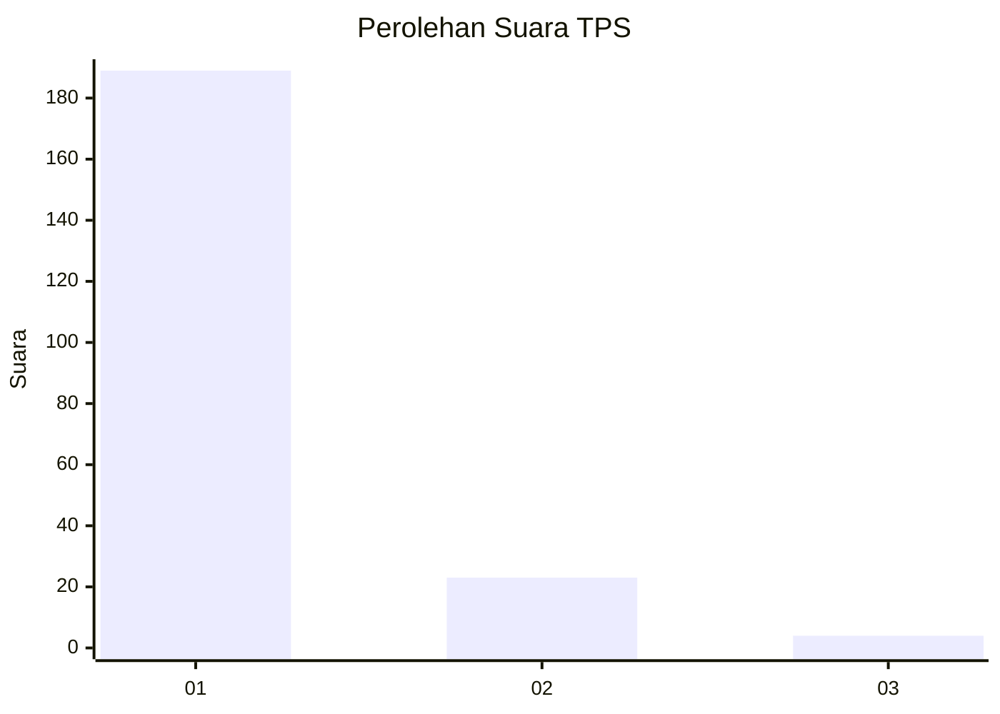
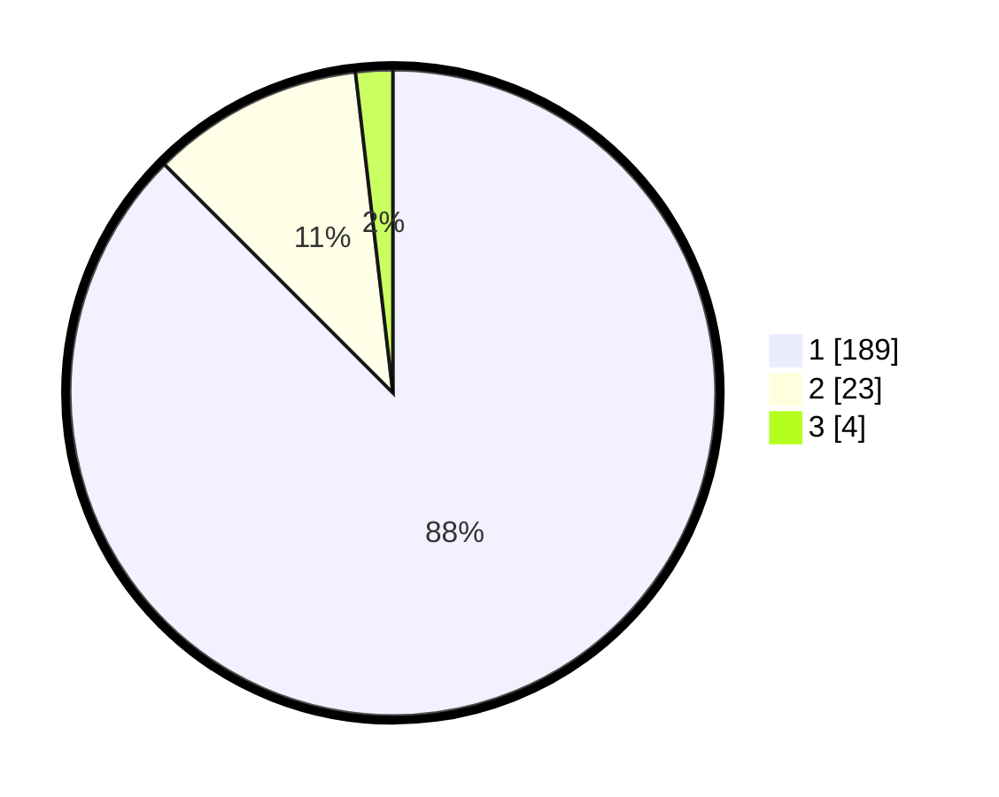

# Hasil

## Grafik

## Tabel

| No. | Nama Paslon    | Suara | Suara (raw) | Persentase |
|:--- |:-------------- | -----:| -----------:| ----------:|
| 1   | ANIES MUHAIMIN | 189   | [189][p-1]  | 87,50      |
| 2   | PRABOWO GIBRAN | 23    | [23][p-2]   | 10,65      |
| 3   | GANJAR MAHFUD  | 4     | [4][p-3]    | 1,85       |

[p-1]: https://github.com/gigit-pemilu/pemilu-2024-11-aceh/blob/main/pilpres/hitung-suara/sub/11-aceh/sub/07-pidie/sub/16-pidie/sub/2001-tijue/sub/004-tps/sub/paslon-1.txt
[p-2]: https://github.com/gigit-pemilu/pemilu-2024-11-aceh/blob/main/pilpres/hitung-suara/sub/11-aceh/sub/07-pidie/sub/16-pidie/sub/2001-tijue/sub/004-tps/sub/paslon-2.txt
[p-3]: https://github.com/gigit-pemilu/pemilu-2024-11-aceh/blob/main/pilpres/hitung-suara/sub/11-aceh/sub/07-pidie/sub/16-pidie/sub/2001-tijue/sub/004-tps/sub/paslon-3.txt

## Foto C Plano

https://sirekap-obj-formc.kpu.go.id/9f86/pemilu/ppwp/11/07/16/20/01/1107162001004-20240215-062722--85b2e1b8-6d1f-4ad4-be8c-035b1c7e6925.jpg

https://sirekap-obj-formc.kpu.go.id/9f86/pemilu/ppwp/11/07/16/20/01/1107162001004-20240215-063310--0606dc00-6281-417b-9d0d-757dd02da477.jpg

https://sirekap-obj-formc.kpu.go.id/9f86/pemilu/ppwp/11/07/16/20/01/1107162001004-20240215-063415--5a3f1769-c2df-48f2-baba-8060fc0b5ecb.jpg

## Metadata

| Key        | Value               |
| ---------- | ------------------- |
| Time Stamp | 2024-02-19 06:16:00 |

