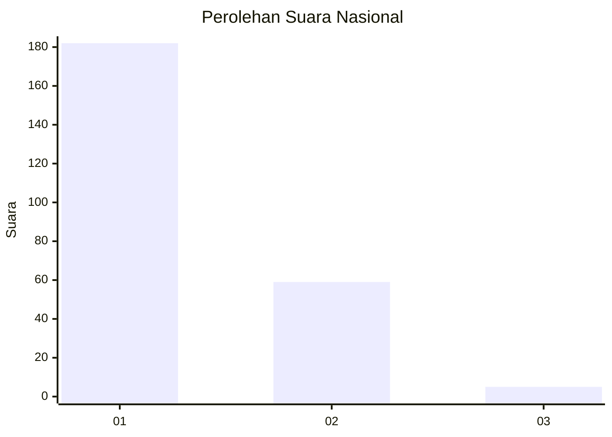
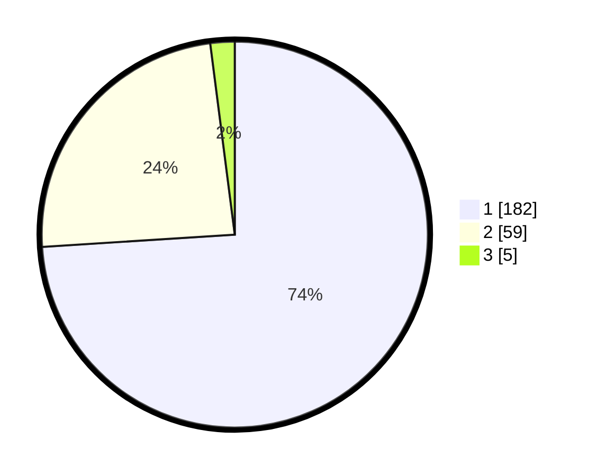

# Hasil

## Grafik

## Tabel

| No. | Nama Paslon    | Suara | Suara (raw) | Persentase |
|:--- |:-------------- | -----:| -----------:| ----------:|
| 1   | ANIES MUHAIMIN | 182   | [182][p-1]  | 73,98      |
| 2   | PRABOWO GIBRAN | 59    | [59][p-2]   | 23,98      |
| 3   | GANJAR MAHFUD  | 5     | [5][p-3]    | 2,03       |

[p-1]: https://github.com/gigit-pemilu/pemilu-2024/blob/main/pilpres/hitung-suara/sub/11-aceh/sub/07-pidie/sub/16-pidie/sub/2004-lampeudue-baroh/sub/002-tps/sub/paslon-1.txt
[p-2]: https://github.com/gigit-pemilu/pemilu-2024/blob/main/pilpres/hitung-suara/sub/11-aceh/sub/07-pidie/sub/16-pidie/sub/2004-lampeudue-baroh/sub/002-tps/sub/paslon-2.txt
[p-3]: https://github.com/gigit-pemilu/pemilu-2024/blob/main/pilpres/hitung-suara/sub/11-aceh/sub/07-pidie/sub/16-pidie/sub/2004-lampeudue-baroh/sub/002-tps/sub/paslon-3.txt

## Foto C Plano

https://sirekap-obj-formc.kpu.go.id/c385/pemilu/ppwp/11/07/16/20/04/1107162004002-20240215-005105--61b65c76-6953-457b-a07c-4be86a7c4e28.jpg

https://sirekap-obj-formc.kpu.go.id/c385/pemilu/ppwp/11/07/16/20/04/1107162004002-20240215-005123--f8fdbdf4-26f9-4ccd-a476-8d79214e6c25.jpg

https://sirekap-obj-formc.kpu.go.id/c385/pemilu/ppwp/11/07/16/20/04/1107162004002-20240215-005140--c11eadae-fa6e-41f6-85e1-48f9a7a0923b.jpg

## Metadata

| Key        | Value               |
| ---------- | ------------------- |
| Time Stamp | 2024-02-24 22:31:28 |

