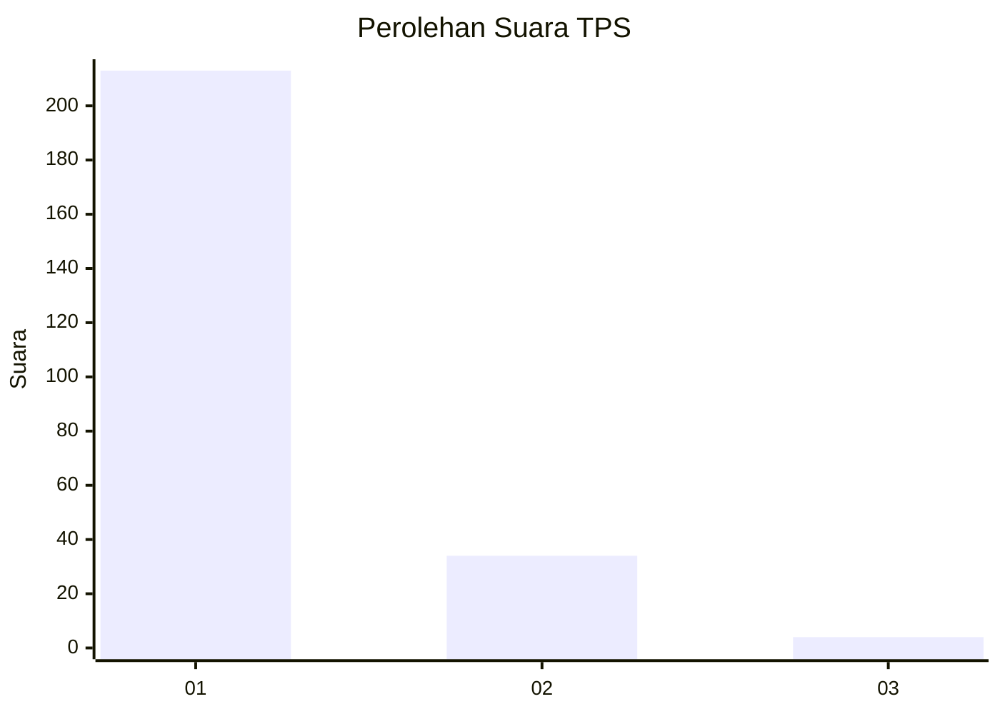
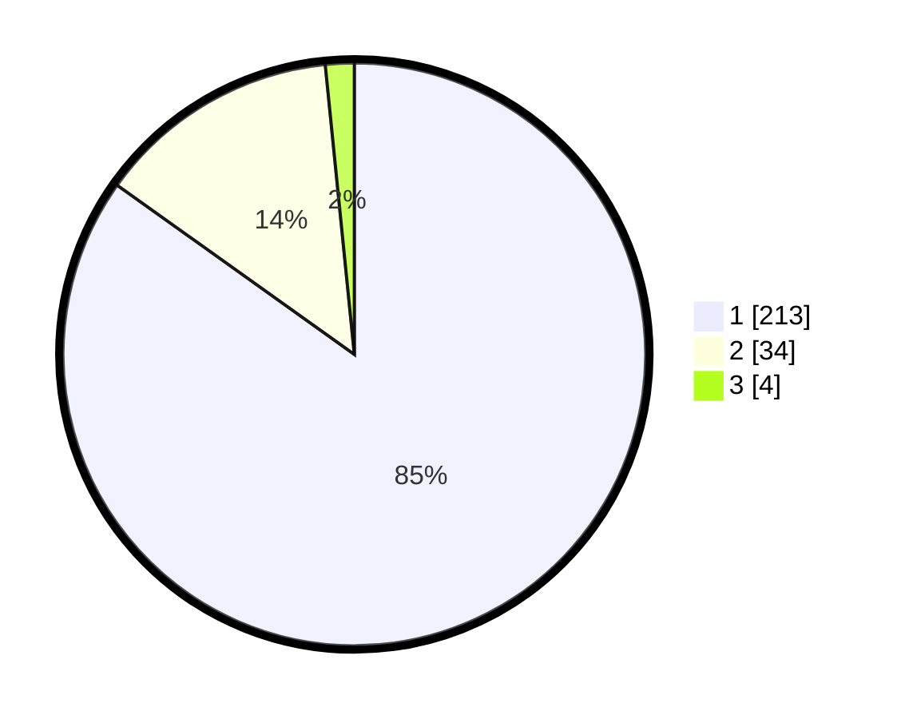

# Hasil

## Grafik

## Tabel

| No. | Nama Paslon    | Suara | Suara (raw) | Persentase |
|:--- |:-------------- | -----:| -----------:| ----------:|
| 1   | ANIES MUHAIMIN | 213   | [213][p-1]  | 84,86      |
| 2   | PRABOWO GIBRAN | 34    | [34][p-2]   | 13,55      |
| 3   | GANJAR MAHFUD  | 4     | [4][p-3]    | 1,59       |

[p-1]: https://github.com/gigit-pemilu/pemilu-2024-11-aceh/blob/main/pilpres/hitung-suara/sub/11-aceh/sub/07-pidie/sub/16-pidie/sub/2006-mesjid-runtoh/sub/001-tps/sub/paslon-1.txt
[p-2]: https://github.com/gigit-pemilu/pemilu-2024-11-aceh/blob/main/pilpres/hitung-suara/sub/11-aceh/sub/07-pidie/sub/16-pidie/sub/2006-mesjid-runtoh/sub/001-tps/sub/paslon-2.txt
[p-3]: https://github.com/gigit-pemilu/pemilu-2024-11-aceh/blob/main/pilpres/hitung-suara/sub/11-aceh/sub/07-pidie/sub/16-pidie/sub/2006-mesjid-runtoh/sub/001-tps/sub/paslon-3.txt

## Foto C Plano

https://sirekap-obj-formc.kpu.go.id/d8f5/pemilu/ppwp/11/07/16/20/06/1107162006001-20240215-064310--d7430312-521f-41dd-9ae9-700faecf97a8.jpg

https://sirekap-obj-formc.kpu.go.id/d8f5/pemilu/ppwp/11/07/16/20/06/1107162006001-20240215-064602--df5c989a-2486-4334-9c75-69ee93c6e31b.jpg

https://sirekap-obj-formc.kpu.go.id/d8f5/pemilu/ppwp/11/07/16/20/06/1107162006001-20240215-064704--b50c03b1-279a-43e5-b431-ac7d60813320.jpg

## Metadata

| Key        | Value               |
| ---------- | ------------------- |
| Time Stamp | 2024-02-19 06:16:00 |

