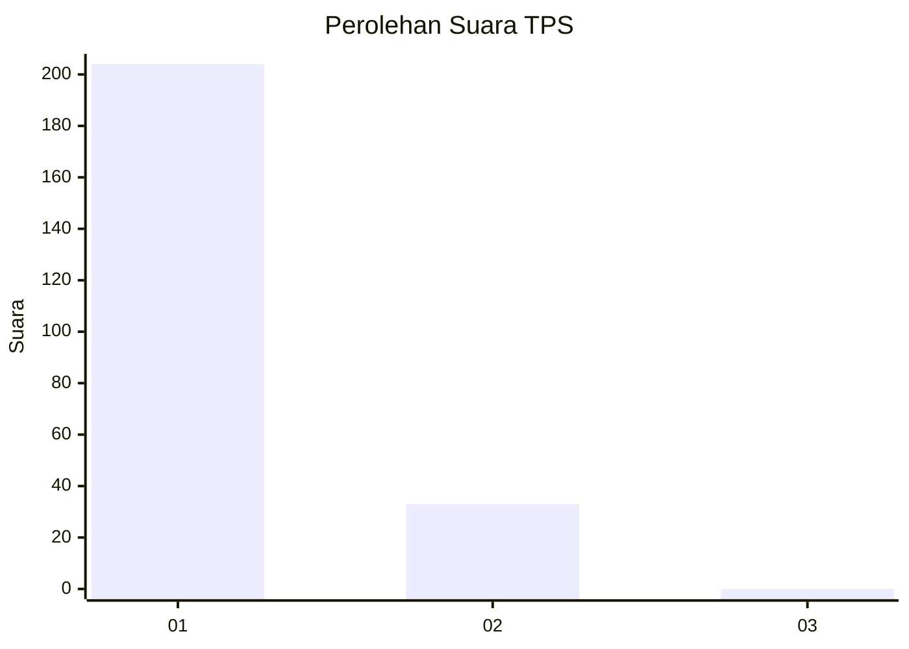
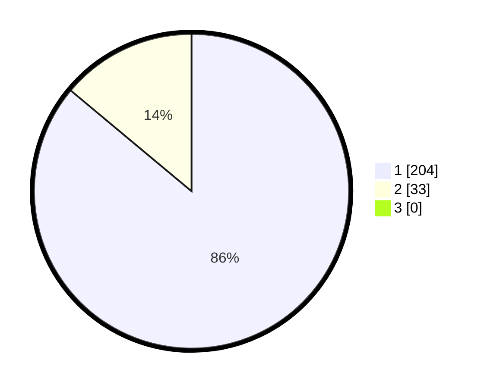

# Hasil

## Grafik

## Tabel

| No. | Nama Paslon    | Suara | Suara (raw) | Persentase |
|:--- |:-------------- | -----:| -----------:| ----------:|
| 1   | ANIES MUHAIMIN | 204   | [204][p-1]  | 86,08      |
| 2   | PRABOWO GIBRAN | 33    | [33][p-2]   | 13,92      |
| 3   | GANJAR MAHFUD  | 0     | [0][p-3]    | 0,00       |

[p-1]: https://github.com/gigit-pemilu/pemilu-2024-11-aceh/blob/main/pilpres/hitung-suara/sub/11-aceh/sub/07-pidie/sub/16-pidie/sub/2006-mesjid-runtoh/sub/002-tps/sub/paslon-1.txt
[p-2]: https://github.com/gigit-pemilu/pemilu-2024-11-aceh/blob/main/pilpres/hitung-suara/sub/11-aceh/sub/07-pidie/sub/16-pidie/sub/2006-mesjid-runtoh/sub/002-tps/sub/paslon-2.txt
[p-3]: https://github.com/gigit-pemilu/pemilu-2024-11-aceh/blob/main/pilpres/hitung-suara/sub/11-aceh/sub/07-pidie/sub/16-pidie/sub/2006-mesjid-runtoh/sub/002-tps/sub/paslon-3.txt

## Foto C Plano

https://sirekap-obj-formc.kpu.go.id/8670/pemilu/ppwp/11/07/16/20/06/1107162006002-20240214-204853--adc8381a-265e-4050-b85e-9ca3af785273.jpg

https://sirekap-obj-formc.kpu.go.id/8670/pemilu/ppwp/11/07/16/20/06/1107162006002-20240214-205200--d4be58ab-f6ce-4faf-8c9d-b3126441cdaa.jpg

https://sirekap-obj-formc.kpu.go.id/8670/pemilu/ppwp/11/07/16/20/06/1107162006002-20240214-205701--4656d292-b6c9-4276-8a82-78431304b7f2.jpg

## Metadata

| Key        | Value               |
| ---------- | ------------------- |
| Time Stamp | 2024-02-24 22:31:28 |

## DATA PEMILIH TETAP

Jumlah pemilih dalam DPT: **443**.
 * L: **21**.
 * P: **661**.

## DATA PENGGUNA HAK PILIH

Jumlah pengguna hak pilih dalam DPT: **44**.
 * L: **20**.
 * P: **34**.

Jumlah pengguna hak pilih dalam DPTb: **404**.
 * L: **107**.
 * P: **304**.

Jumlah pengguna hak pilih dalam DPK: **0**.
 * L: **0**.
 * P: **0**.

Jumlah pengguna hak pilih: **4**.
 * L: **0**.
 * P: **0**.

## JUMLAH SUARA SAH DAN TIDAK SAH

JUMLAH SELURUH SUARA SAH: **237**.

JUMLAH SUARA TIDAK SAH: **3**.

JUMLAH SELURUH SUARA SAH DAN SUARA TIDAK SAH: **240**.

