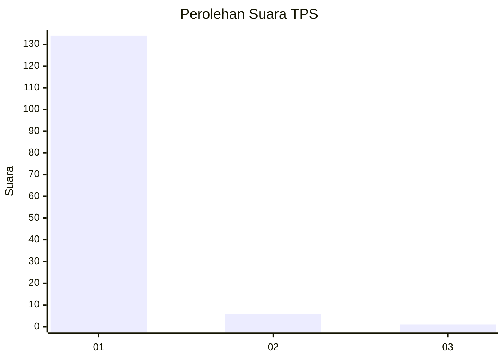
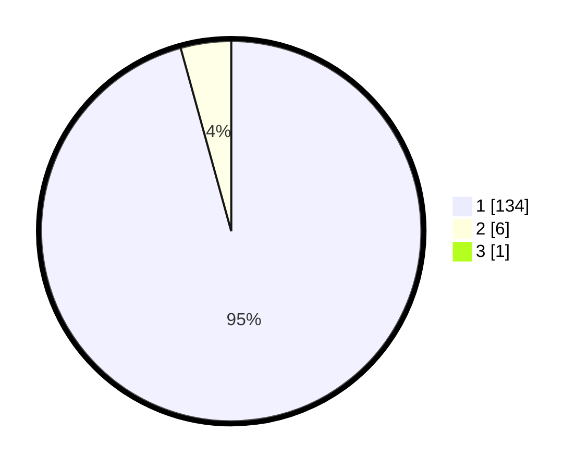

# Hasil

## Grafik

## Tabel

| No. | Nama Paslon    | Suara | Suara (raw) | Persentase |
|:--- |:-------------- | -----:| -----------:| ----------:|
| 1   | ANIES MUHAIMIN | 134   | [134][p-1]  | 95,04      |
| 2   | PRABOWO GIBRAN | 6     | [6][p-2]    | 4,26       |
| 3   | GANJAR MAHFUD  | 1     | [1][p-3]    | 0,71       |

[p-1]: https://github.com/gigit-pemilu/pemilu-2024-11-aceh/blob/main/pilpres/hitung-suara/sub/11-aceh/sub/07-pidie/sub/16-pidie/sub/2012-ulee-ceue-keulibeut/sub/001-tps/sub/paslon-1.txt
[p-2]: https://github.com/gigit-pemilu/pemilu-2024-11-aceh/blob/main/pilpres/hitung-suara/sub/11-aceh/sub/07-pidie/sub/16-pidie/sub/2012-ulee-ceue-keulibeut/sub/001-tps/sub/paslon-2.txt
[p-3]: https://github.com/gigit-pemilu/pemilu-2024-11-aceh/blob/main/pilpres/hitung-suara/sub/11-aceh/sub/07-pidie/sub/16-pidie/sub/2012-ulee-ceue-keulibeut/sub/001-tps/sub/paslon-3.txt

## Foto C Plano

https://sirekap-obj-formc.kpu.go.id/0ac0/pemilu/ppwp/11/07/16/20/12/1107162012001-20240215-015205--2087930b-f74a-40f1-a9fa-94a3ea949164.jpg

https://sirekap-obj-formc.kpu.go.id/0ac0/pemilu/ppwp/11/07/16/20/12/1107162012001-20240215-015423--0685d98b-4208-467b-9a2e-0c00bb702ff6.jpg

https://sirekap-obj-formc.kpu.go.id/0ac0/pemilu/ppwp/11/07/16/20/12/1107162012001-20240215-015551--194c46c2-22dd-4f9d-a1a9-4b38f579fbbf.jpg

## Metadata

| Key        | Value               |
| ---------- | ------------------- |
| Time Stamp | 2024-02-16 23:30:00 |

