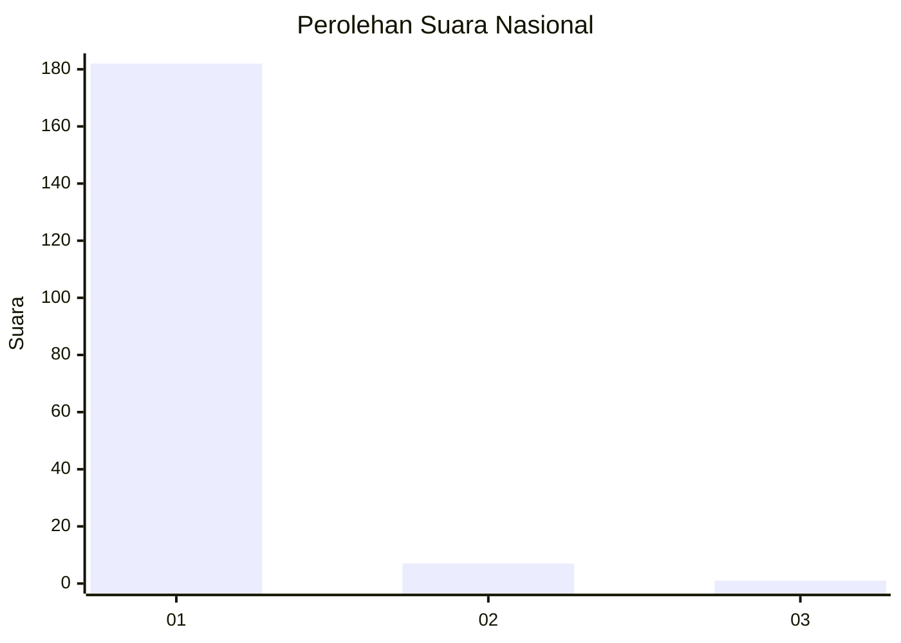
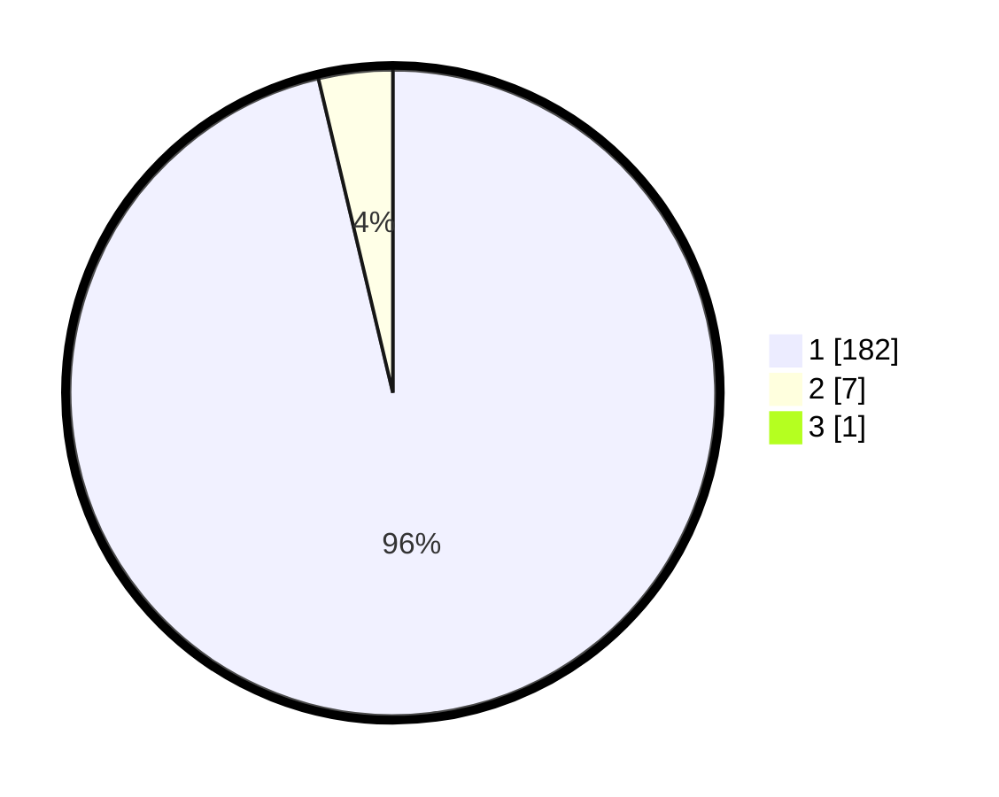

# Hasil

## Grafik

## Tabel

| No. | Nama Paslon    | Suara | Suara (raw) | Persentase |
|:--- |:-------------- | -----:| -----------:| ----------:|
| 1   | ANIES MUHAIMIN | 182   | [182][p-1]  | 95,79      |
| 2   | PRABOWO GIBRAN | 7     | [7][p-2]    | 3,68       |
| 3   | GANJAR MAHFUD  | 1     | [1][p-3]    | 0,53       |

[p-1]: https://github.com/gigit-pemilu/pemilu-2024/blob/main/pilpres/hitung-suara/sub/11-aceh/sub/07-pidie/sub/16-pidie/sub/2013-keudee/sub/001-tps/sub/paslon-1.txt
[p-2]: https://github.com/gigit-pemilu/pemilu-2024/blob/main/pilpres/hitung-suara/sub/11-aceh/sub/07-pidie/sub/16-pidie/sub/2013-keudee/sub/001-tps/sub/paslon-2.txt
[p-3]: https://github.com/gigit-pemilu/pemilu-2024/blob/main/pilpres/hitung-suara/sub/11-aceh/sub/07-pidie/sub/16-pidie/sub/2013-keudee/sub/001-tps/sub/paslon-3.txt

## Foto C Plano

https://sirekap-obj-formc.kpu.go.id/369e/pemilu/ppwp/11/07/16/20/13/1107162013001-20240215-052024--3703412d-67ec-4772-8f17-434dad9dd7c6.jpg

https://sirekap-obj-formc.kpu.go.id/369e/pemilu/ppwp/11/07/16/20/13/1107162013001-20240215-105449--a7e6a4fd-1910-47ff-8ea8-c3d878da81c2.jpg

https://sirekap-obj-formc.kpu.go.id/369e/pemilu/ppwp/11/07/16/20/13/1107162013001-20240214-224307--c8d01abe-e607-4ada-89f7-e40f54e9e3f0.jpg

## Metadata

| Key        | Value               |
| ---------- | ------------------- |
| Time Stamp | 2024-02-19 06:16:00 |

