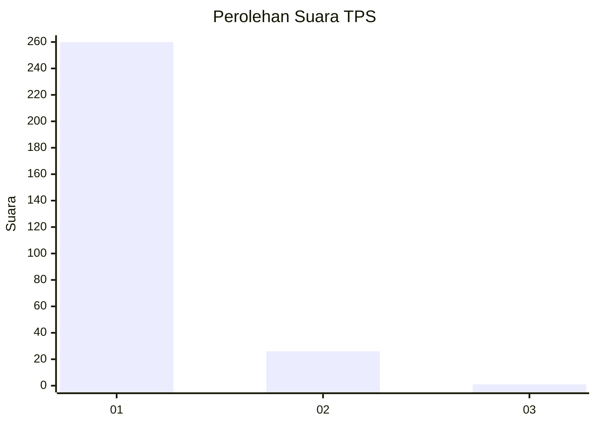
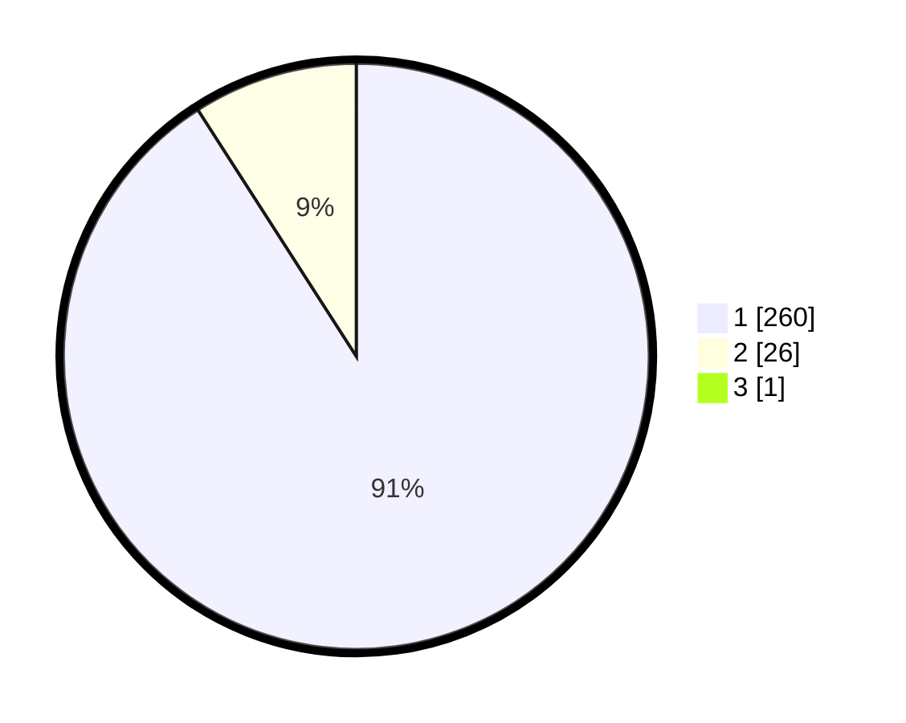

# Hasil

## Grafik

## Tabel

| No. | Nama Paslon    | Suara | Suara (raw) | Persentase |
|:--- |:-------------- | -----:| -----------:| ----------:|
| 1   | ANIES MUHAIMIN | 260   | [260][p-1]  | 90,59      |
| 2   | PRABOWO GIBRAN | 26    | [26][p-2]   | 9,06       |
| 3   | GANJAR MAHFUD  | 1     | [1][p-3]    | 0,35       |

[p-1]: https://github.com/gigit-pemilu/pemilu-2024-11-aceh/blob/main/pilpres/hitung-suara/sub/11-aceh/sub/07-pidie/sub/16-pidie/sub/2022-gampong/sub/001-tps/sub/paslon-1.txt
[p-2]: https://github.com/gigit-pemilu/pemilu-2024-11-aceh/blob/main/pilpres/hitung-suara/sub/11-aceh/sub/07-pidie/sub/16-pidie/sub/2022-gampong/sub/001-tps/sub/paslon-2.txt
[p-3]: https://github.com/gigit-pemilu/pemilu-2024-11-aceh/blob/main/pilpres/hitung-suara/sub/11-aceh/sub/07-pidie/sub/16-pidie/sub/2022-gampong/sub/001-tps/sub/paslon-3.txt

## Foto C Plano

https://sirekap-obj-formc.kpu.go.id/c744/pemilu/ppwp/11/07/16/20/22/1107162022001-20240214-214419--d2e4bf62-4e75-4e66-adf1-22e7934cb7a6.jpg

https://sirekap-obj-formc.kpu.go.id/c744/pemilu/ppwp/11/07/16/20/22/1107162022001-20240214-214608--dcfdcf10-2b62-4351-9ec9-3d2610bb8b68.jpg

https://sirekap-obj-formc.kpu.go.id/c744/pemilu/ppwp/11/07/16/20/22/1107162022001-20240214-214846--57112ee0-ea2b-4754-9635-628f19ffd869.jpg

## Metadata

| Key        | Value               |
| ---------- | ------------------- |
| Time Stamp | 2024-02-24 22:31:28 |

