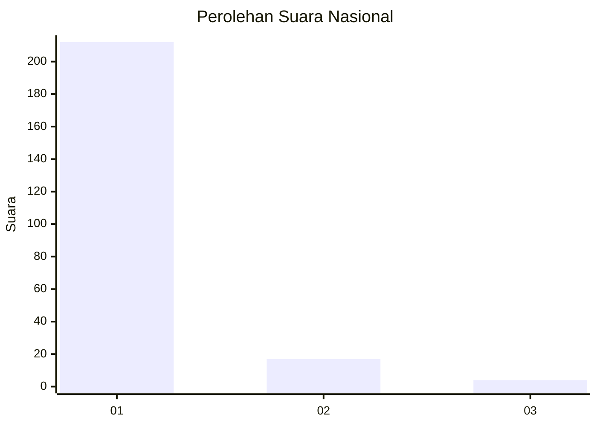
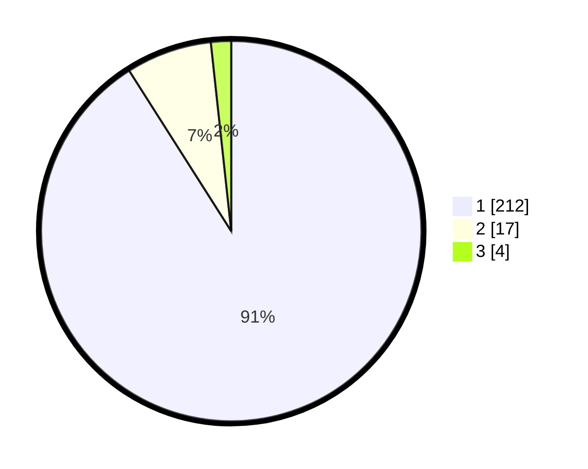

# Hasil

## Grafik

## Tabel

| No. | Nama Paslon    | Suara | Suara (raw) | Persentase |
|:--- |:-------------- | -----:| -----------:| ----------:|
| 1   | ANIES MUHAIMIN | 212   | [212][p-1]  | 90,99      |
| 2   | PRABOWO GIBRAN | 17    | [17][p-2]   | 7,30       |
| 3   | GANJAR MAHFUD  | 4     | [4][p-3]    | 1,72       |

[p-1]: https://github.com/gigit-pemilu/pemilu-2024/blob/main/pilpres/hitung-suara/sub/11-aceh/sub/07-pidie/sub/16-pidie/sub/2025-kampong-pukat/sub/002-tps/sub/paslon-1.txt
[p-2]: https://github.com/gigit-pemilu/pemilu-2024/blob/main/pilpres/hitung-suara/sub/11-aceh/sub/07-pidie/sub/16-pidie/sub/2025-kampong-pukat/sub/002-tps/sub/paslon-2.txt
[p-3]: https://github.com/gigit-pemilu/pemilu-2024/blob/main/pilpres/hitung-suara/sub/11-aceh/sub/07-pidie/sub/16-pidie/sub/2025-kampong-pukat/sub/002-tps/sub/paslon-3.txt

## Foto C Plano

https://sirekap-obj-formc.kpu.go.id/a9d3/pemilu/ppwp/11/07/16/20/25/1107162025002-20240214-203925--d07289e9-9161-438f-8de0-31933149f410.jpg

https://sirekap-obj-formc.kpu.go.id/a9d3/pemilu/ppwp/11/07/16/20/25/1107162025002-20240214-203943--c00c6528-29af-454f-bbe5-9d580d548c7f.jpg

https://sirekap-obj-formc.kpu.go.id/a9d3/pemilu/ppwp/11/07/16/20/25/1107162025002-20240214-203953--737acab7-e0ad-4605-a613-8dfb3c05ee89.jpg

## Metadata

| Key        | Value               |
| ---------- | ------------------- |
| Time Stamp | 2024-02-19 06:16:00 |

