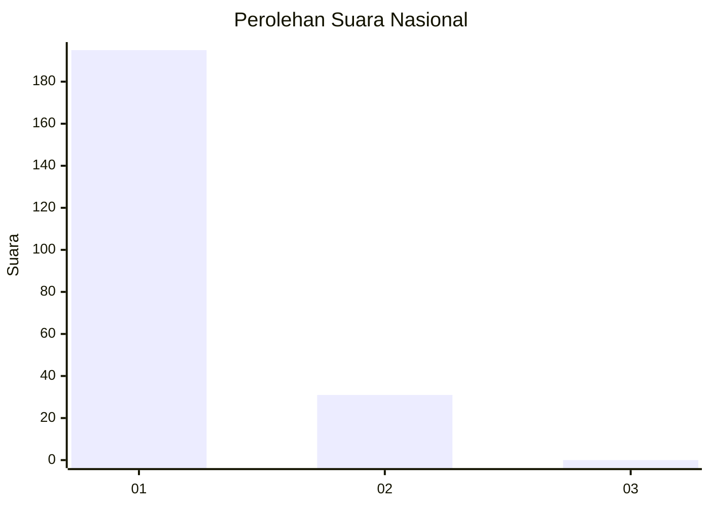
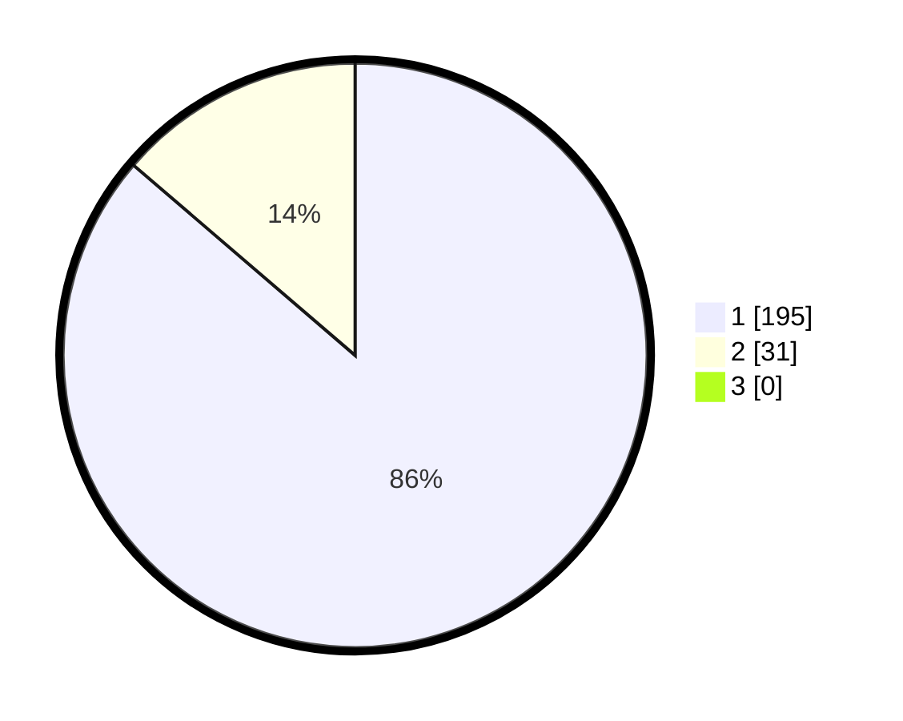

# Hasil

## Grafik

## Tabel

| No. | Nama Paslon    | Suara | Suara (raw) | Persentase |
|:--- |:-------------- | -----:| -----------:| ----------:|
| 1   | ANIES MUHAIMIN | 195   | [195][p-1]  | 86,28      |
| 2   | PRABOWO GIBRAN | 31    | [31][p-2]   | 13,72      |
| 3   | GANJAR MAHFUD  | 0     | [0][p-3]    | 0,00       |

[p-1]: https://github.com/gigit-pemilu/pemilu-2024/blob/main/pilpres/hitung-suara/sub/11-aceh/sub/07-pidie/sub/16-pidie/sub/2030-tibang/sub/001-tps/sub/paslon-1.txt
[p-2]: https://github.com/gigit-pemilu/pemilu-2024/blob/main/pilpres/hitung-suara/sub/11-aceh/sub/07-pidie/sub/16-pidie/sub/2030-tibang/sub/001-tps/sub/paslon-2.txt
[p-3]: https://github.com/gigit-pemilu/pemilu-2024/blob/main/pilpres/hitung-suara/sub/11-aceh/sub/07-pidie/sub/16-pidie/sub/2030-tibang/sub/001-tps/sub/paslon-3.txt

## Foto C Plano

https://sirekap-obj-formc.kpu.go.id/84f6/pemilu/ppwp/11/07/16/20/30/1107162030001-20240215-030458--d5ac0118-ed6f-493b-ae8a-8abd766fd75a.jpg

https://sirekap-obj-formc.kpu.go.id/84f6/pemilu/ppwp/11/07/16/20/30/1107162030001-20240215-032520--ca50cc1a-20d3-4307-93af-31552c7694a5.jpg

https://sirekap-obj-formc.kpu.go.id/84f6/pemilu/ppwp/11/07/16/20/30/1107162030001-20240215-025146--8311579b-6e74-4196-aa53-e4a8380b5379.jpg

## Metadata

| Key        | Value               |
| ---------- | ------------------- |
| Time Stamp | 2024-02-19 06:16:00 |

