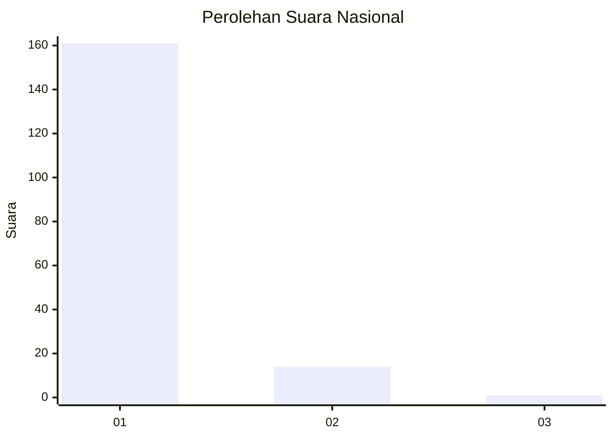
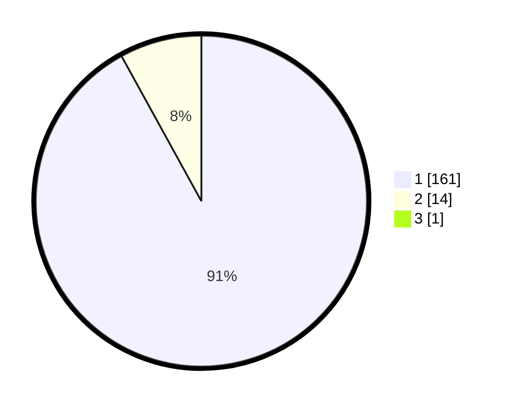

# Hasil

## Grafik

## Tabel

| No. | Nama Paslon    | Suara | Suara (raw) | Persentase |
|:--- |:-------------- | -----:| -----------:| ----------:|
| 1   | ANIES MUHAIMIN | 161   | [161][p-1]  | 91,48      |
| 2   | PRABOWO GIBRAN | 14    | [14][p-2]   | 7,95       |
| 3   | GANJAR MAHFUD  | 1     | [1][p-3]    | 0,57       |

[p-1]: https://github.com/gigit-pemilu/pemilu-2024/blob/main/pilpres/hitung-suara/sub/11-aceh/sub/07-pidie/sub/16-pidie/sub/2037-ulee-ceue-teubeng/sub/001-tps/sub/paslon-1.txt
[p-2]: https://github.com/gigit-pemilu/pemilu-2024/blob/main/pilpres/hitung-suara/sub/11-aceh/sub/07-pidie/sub/16-pidie/sub/2037-ulee-ceue-teubeng/sub/001-tps/sub/paslon-2.txt
[p-3]: https://github.com/gigit-pemilu/pemilu-2024/blob/main/pilpres/hitung-suara/sub/11-aceh/sub/07-pidie/sub/16-pidie/sub/2037-ulee-ceue-teubeng/sub/001-tps/sub/paslon-3.txt

## Foto C Plano

https://sirekap-obj-formc.kpu.go.id/9f99/pemilu/ppwp/11/07/16/20/37/1107162037001-20240214-220837--2e367909-5226-47e8-89c8-9a5004b0fabb.jpg

https://sirekap-obj-formc.kpu.go.id/9f99/pemilu/ppwp/11/07/16/20/37/1107162037001-20240214-220738--48bbe314-1973-4990-9a9a-fb7a5a0b0b44.jpg

https://sirekap-obj-formc.kpu.go.id/9f99/pemilu/ppwp/11/07/16/20/37/1107162037001-20240214-213405--e86d961e-a427-439c-8739-6cf09b01c16a.jpg

## Metadata

| Key        | Value               |
| ---------- | ------------------- |
| Time Stamp | 2024-02-19 06:16:00 |

