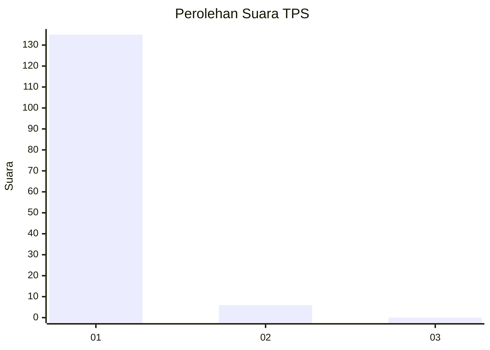
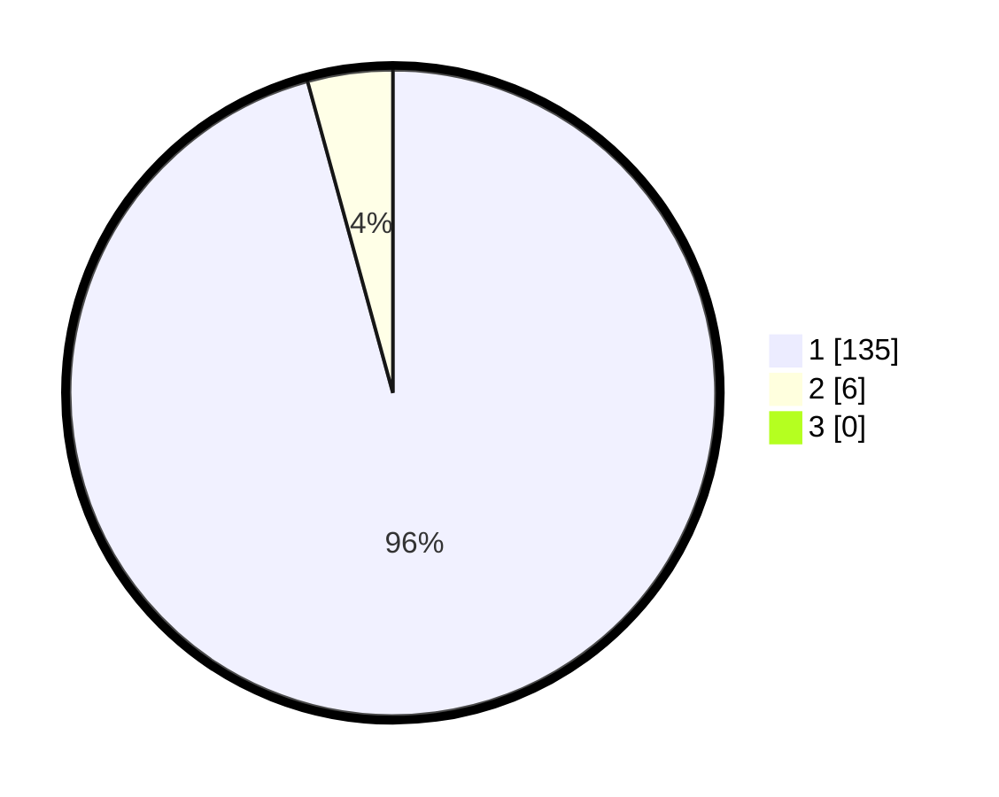

# Hasil

## Grafik

## Tabel

| No. | Nama Paslon    | Suara | Suara (raw) | Persentase |
|:--- |:-------------- | -----:| -----------:| ----------:|
| 1   | ANIES MUHAIMIN | 135   | [135][p-1]  | 95,74      |
| 2   | PRABOWO GIBRAN | 6     | [6][p-2]    | 4,26       |
| 3   | GANJAR MAHFUD  | 0     | [0][p-3]    | 0,00       |

[p-1]: https://github.com/gigit-pemilu/pemilu-2024-11-aceh/blob/main/pilpres/hitung-suara/sub/11-aceh/sub/07-pidie/sub/16-pidie/sub/2038-meucat-teubeng/sub/002-tps/sub/paslon-1.txt
[p-2]: https://github.com/gigit-pemilu/pemilu-2024-11-aceh/blob/main/pilpres/hitung-suara/sub/11-aceh/sub/07-pidie/sub/16-pidie/sub/2038-meucat-teubeng/sub/002-tps/sub/paslon-2.txt
[p-3]: https://github.com/gigit-pemilu/pemilu-2024-11-aceh/blob/main/pilpres/hitung-suara/sub/11-aceh/sub/07-pidie/sub/16-pidie/sub/2038-meucat-teubeng/sub/002-tps/sub/paslon-3.txt

## Foto C Plano

https://sirekap-obj-formc.kpu.go.id/a579/pemilu/ppwp/11/07/16/20/38/1107162038002-20240220-061046--a1565235-de8f-465e-a465-ef0654196ab5.jpg

https://sirekap-obj-formc.kpu.go.id/a579/pemilu/ppwp/11/07/16/20/38/1107162038002-20240220-061057--e9447bb2-a6e7-42d9-a814-affacd65ca7e.jpg

https://sirekap-obj-formc.kpu.go.id/a579/pemilu/ppwp/11/07/16/20/38/1107162038002-20240220-061105--1459bd31-18dc-4e9e-bf97-08709f2897d1.jpg

## Metadata

| Key        | Value               |
| ---------- | ------------------- |
| Time Stamp | 2024-02-24 22:31:28 |

