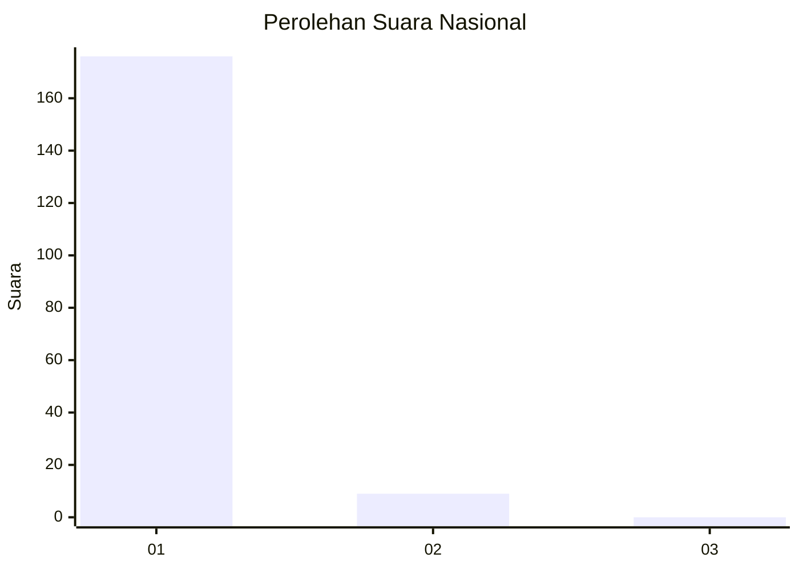
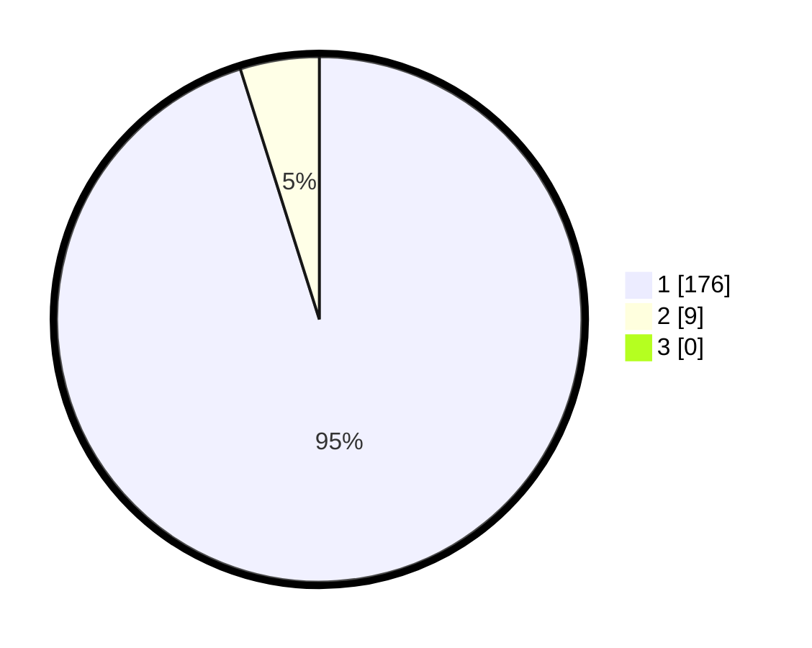

# Hasil

## Grafik

## Tabel

| No. | Nama Paslon    | Suara | Suara (raw) | Persentase |
|:--- |:-------------- | -----:| -----------:| ----------:|
| 1   | ANIES MUHAIMIN | 176   | [176][p-1]  | 95,14      |
| 2   | PRABOWO GIBRAN | 9     | [9][p-2]    | 4,86       |
| 3   | GANJAR MAHFUD  | 0     | [0][p-3]    | 0,00       |

[p-1]: https://github.com/gigit-pemilu/pemilu-2024/blob/main/pilpres/hitung-suara/sub/11-aceh/sub/07-pidie/sub/16-pidie/sub/2042-bayu-teubeng/sub/001-tps/sub/paslon-1.txt
[p-2]: https://github.com/gigit-pemilu/pemilu-2024/blob/main/pilpres/hitung-suara/sub/11-aceh/sub/07-pidie/sub/16-pidie/sub/2042-bayu-teubeng/sub/001-tps/sub/paslon-2.txt
[p-3]: https://github.com/gigit-pemilu/pemilu-2024/blob/main/pilpres/hitung-suara/sub/11-aceh/sub/07-pidie/sub/16-pidie/sub/2042-bayu-teubeng/sub/001-tps/sub/paslon-3.txt

## Foto C Plano

https://sirekap-obj-formc.kpu.go.id/f81a/pemilu/ppwp/11/07/16/20/42/1107162042001-20240214-233040--f91d44d2-f1a9-4103-9d33-fee96e7dc85c.jpg

https://sirekap-obj-formc.kpu.go.id/f81a/pemilu/ppwp/11/07/16/20/42/1107162042001-20240214-233156--3634b9d3-8547-4a03-8dc2-a12a342ce2ff.jpg

https://sirekap-obj-formc.kpu.go.id/f81a/pemilu/ppwp/11/07/16/20/42/1107162042001-20240214-233307--4e796481-386d-45e7-a1d1-1e777c989dde.jpg

## Metadata

| Key        | Value               |
| ---------- | ------------------- |
| Time Stamp | 2024-02-25 11:00:00 |

