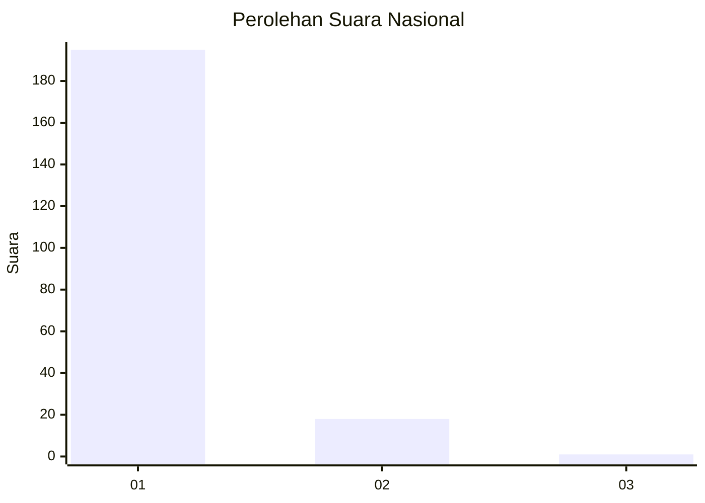
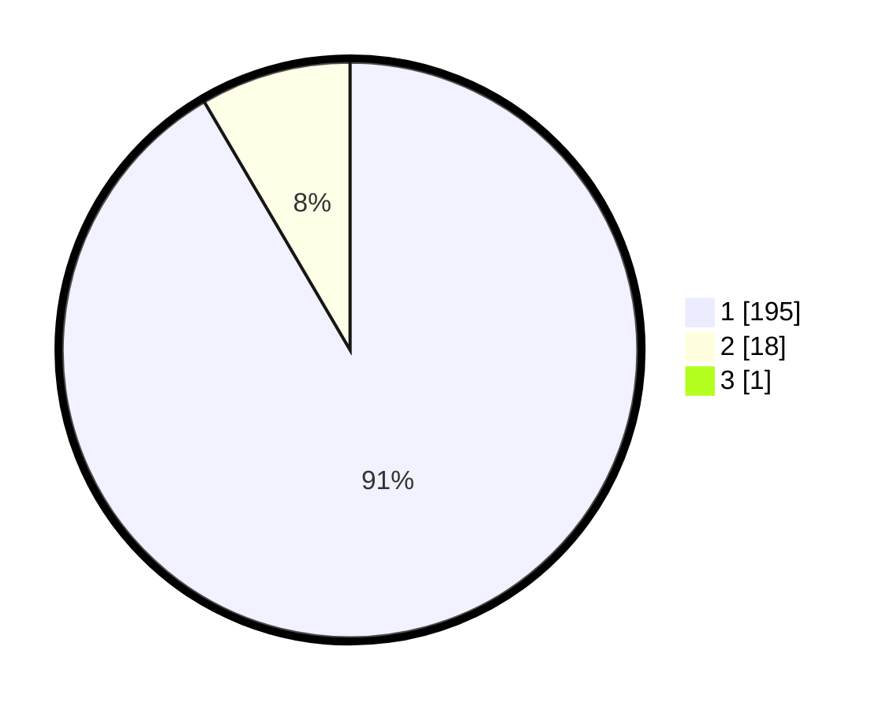

# Hasil

## Grafik

## Tabel

| No. | Nama Paslon    | Suara | Suara (raw) | Persentase |
|:--- |:-------------- | -----:| -----------:| ----------:|
| 1   | ANIES MUHAIMIN | 195   | [195][p-1]  | 91,12      |
| 2   | PRABOWO GIBRAN | 18    | [18][p-2]   | 8,41       |
| 3   | GANJAR MAHFUD  | 1     | [1][p-3]    | 0,47       |

[p-1]: https://github.com/gigit-pemilu/pemilu-2024/blob/main/pilpres/hitung-suara/sub/11-aceh/sub/07-pidie/sub/16-pidie/sub/2049-raya-sanggeue/sub/001-tps/sub/paslon-1.txt
[p-2]: https://github.com/gigit-pemilu/pemilu-2024/blob/main/pilpres/hitung-suara/sub/11-aceh/sub/07-pidie/sub/16-pidie/sub/2049-raya-sanggeue/sub/001-tps/sub/paslon-2.txt
[p-3]: https://github.com/gigit-pemilu/pemilu-2024/blob/main/pilpres/hitung-suara/sub/11-aceh/sub/07-pidie/sub/16-pidie/sub/2049-raya-sanggeue/sub/001-tps/sub/paslon-3.txt

## Foto C Plano

https://sirekap-obj-formc.kpu.go.id/1412/pemilu/ppwp/11/07/16/20/49/1107162049001-20240215-173514--634a9d4e-9b7a-4314-b562-fae37b1e84ce.jpg

https://sirekap-obj-formc.kpu.go.id/1412/pemilu/ppwp/11/07/16/20/49/1107162049001-20240215-173622--43c5f1cf-9128-4af5-b999-61e4178070f8.jpg

https://sirekap-obj-formc.kpu.go.id/1412/pemilu/ppwp/11/07/16/20/49/1107162049001-20240215-173704--279118f4-c23d-441c-84c6-80182510c366.jpg

## Metadata

| Key        | Value               |
| ---------- | ------------------- |
| Time Stamp | 2024-02-25 16:00:00 |

