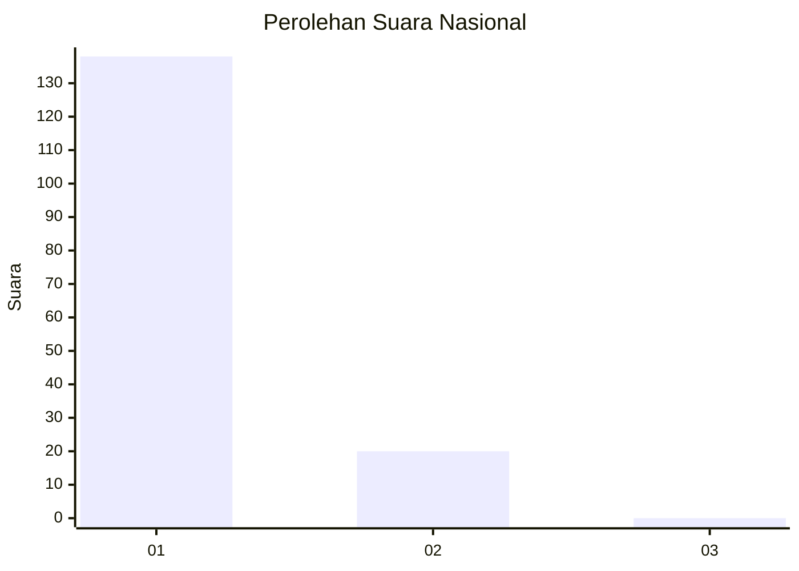
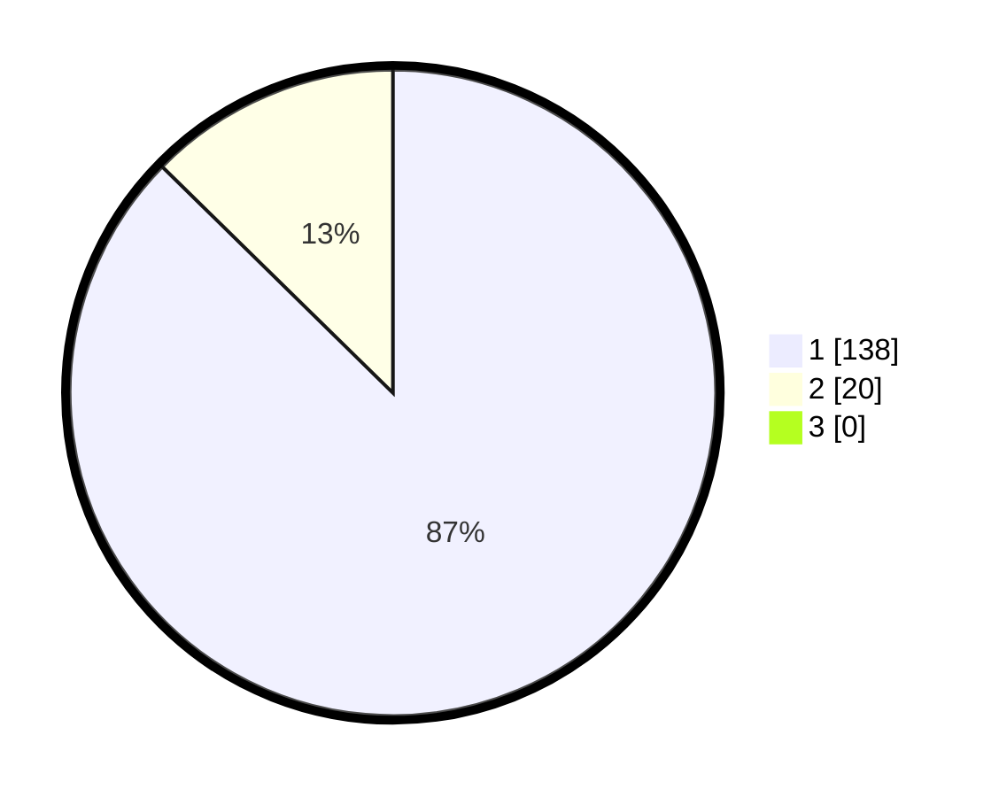

# Hasil

## Grafik

## Tabel

| No. | Nama Paslon    | Suara | Suara (raw) | Persentase |
|:--- |:-------------- | -----:| -----------:| ----------:|
| 1   | ANIES MUHAIMIN | 138   | [138][p-1]  | 87,34      |
| 2   | PRABOWO GIBRAN | 20    | [20][p-2]   | 12,66      |
| 3   | GANJAR MAHFUD  | 0     | [0][p-3]    | 0,00       |

[p-1]: https://github.com/gigit-pemilu/pemilu-2024/blob/main/pilpres/hitung-suara/sub/11-aceh/sub/07-pidie/sub/16-pidie/sub/2051-ujong-langgo/sub/002-tps/sub/paslon-1.txt
[p-2]: https://github.com/gigit-pemilu/pemilu-2024/blob/main/pilpres/hitung-suara/sub/11-aceh/sub/07-pidie/sub/16-pidie/sub/2051-ujong-langgo/sub/002-tps/sub/paslon-2.txt
[p-3]: https://github.com/gigit-pemilu/pemilu-2024/blob/main/pilpres/hitung-suara/sub/11-aceh/sub/07-pidie/sub/16-pidie/sub/2051-ujong-langgo/sub/002-tps/sub/paslon-3.txt

## Foto C Plano

https://sirekap-obj-formc.kpu.go.id/c451/pemilu/ppwp/11/07/16/20/51/1107162051002-20240215-053237--33d38fcb-cdd3-4357-ba18-54a485f051c0.jpg

https://sirekap-obj-formc.kpu.go.id/c451/pemilu/ppwp/11/07/16/20/51/1107162051002-20240215-053204--ea1a7aed-ccda-4e00-a48e-c454e372dd44.jpg

https://sirekap-obj-formc.kpu.go.id/c451/pemilu/ppwp/11/07/16/20/51/1107162051002-20240215-053354--7fe5b9aa-ca32-4e8a-9bc7-54c977ac9d8d.jpg

## Metadata

| Key        | Value               |
| ---------- | ------------------- |
| Time Stamp | 2024-02-19 06:16:00 |

