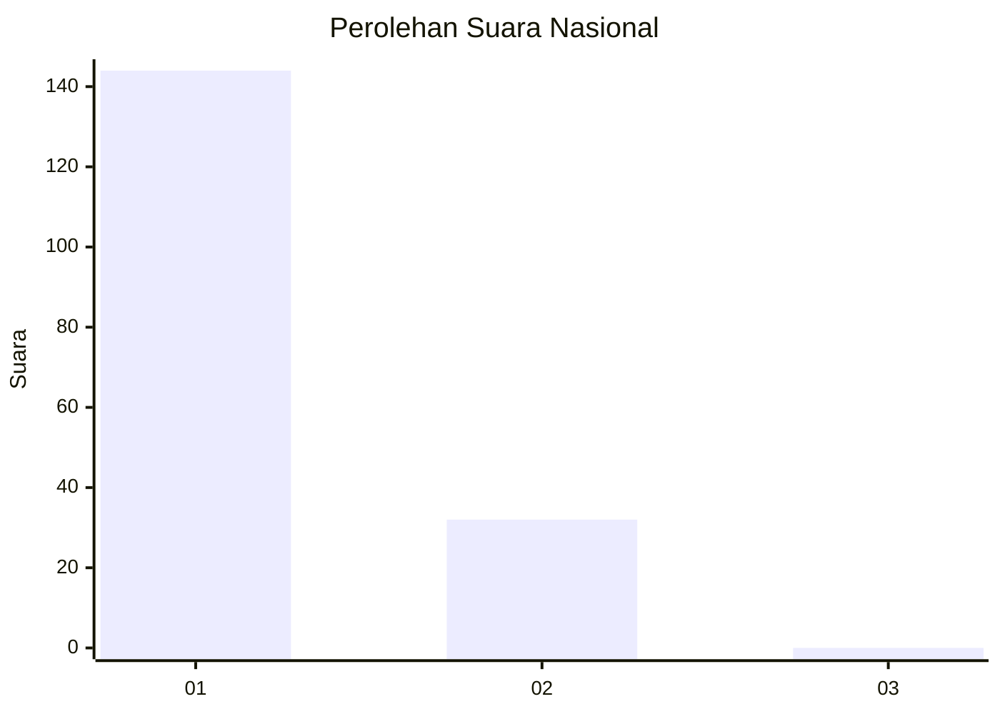
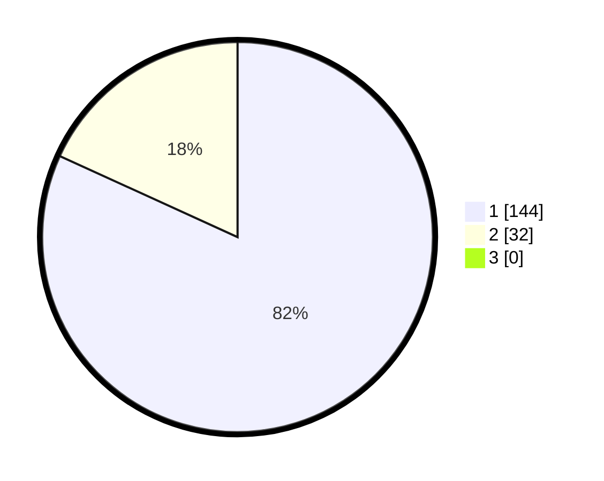

# Hasil

## Grafik

## Tabel

| No. | Nama Paslon    | Suara | Suara (raw) | Persentase |
|:--- |:-------------- | -----:| -----------:| ----------:|
| 1   | ANIES MUHAIMIN | 144   | [144][p-1]  | 81,82      |
| 2   | PRABOWO GIBRAN | 32    | [32][p-2]   | 18,18      |
| 3   | GANJAR MAHFUD  | 0     | [0][p-3]    | 0,00       |

[p-1]: https://github.com/gigit-pemilu/pemilu-2024/blob/main/pilpres/hitung-suara/sub/11-aceh/sub/07-pidie/sub/16-pidie/sub/2055-leubue/sub/001-tps/sub/paslon-1.txt
[p-2]: https://github.com/gigit-pemilu/pemilu-2024/blob/main/pilpres/hitung-suara/sub/11-aceh/sub/07-pidie/sub/16-pidie/sub/2055-leubue/sub/001-tps/sub/paslon-2.txt
[p-3]: https://github.com/gigit-pemilu/pemilu-2024/blob/main/pilpres/hitung-suara/sub/11-aceh/sub/07-pidie/sub/16-pidie/sub/2055-leubue/sub/001-tps/sub/paslon-3.txt

## Foto C Plano

https://sirekap-obj-formc.kpu.go.id/0a3e/pemilu/ppwp/11/07/16/20/55/1107162055001-20240215-024313--15ca45de-d18f-43d7-bb5d-85e7840ec2fd.jpg

https://sirekap-obj-formc.kpu.go.id/0a3e/pemilu/ppwp/11/07/16/20/55/1107162055001-20240215-024619--1a4785d4-b585-448f-be02-3a4b9448c960.jpg

https://sirekap-obj-formc.kpu.go.id/0a3e/pemilu/ppwp/11/07/16/20/55/1107162055001-20240215-024752--da3aa525-b209-4874-afa2-db8637e75406.jpg

## Metadata

| Key        | Value               |
| ---------- | ------------------- |
| Time Stamp | 2024-02-24 22:31:28 |

