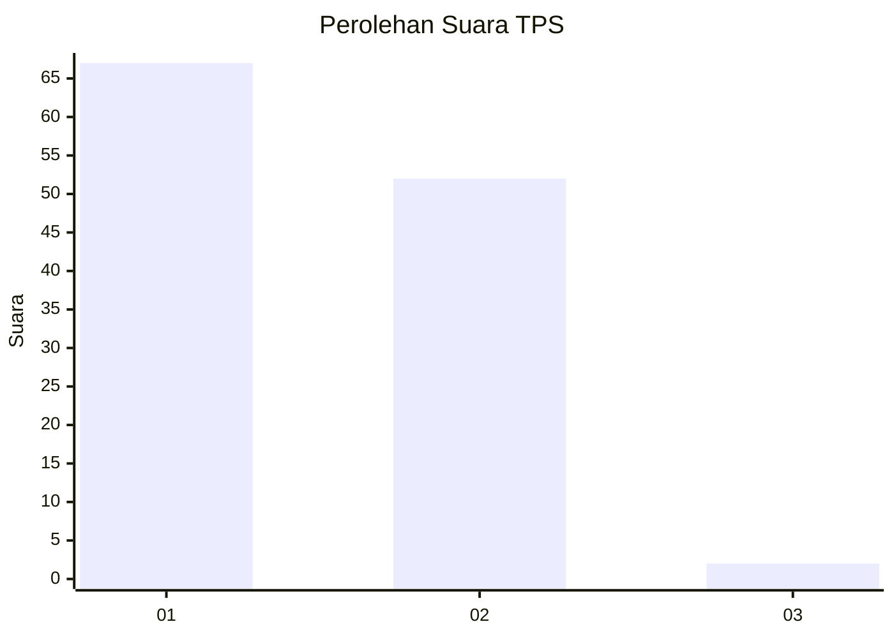
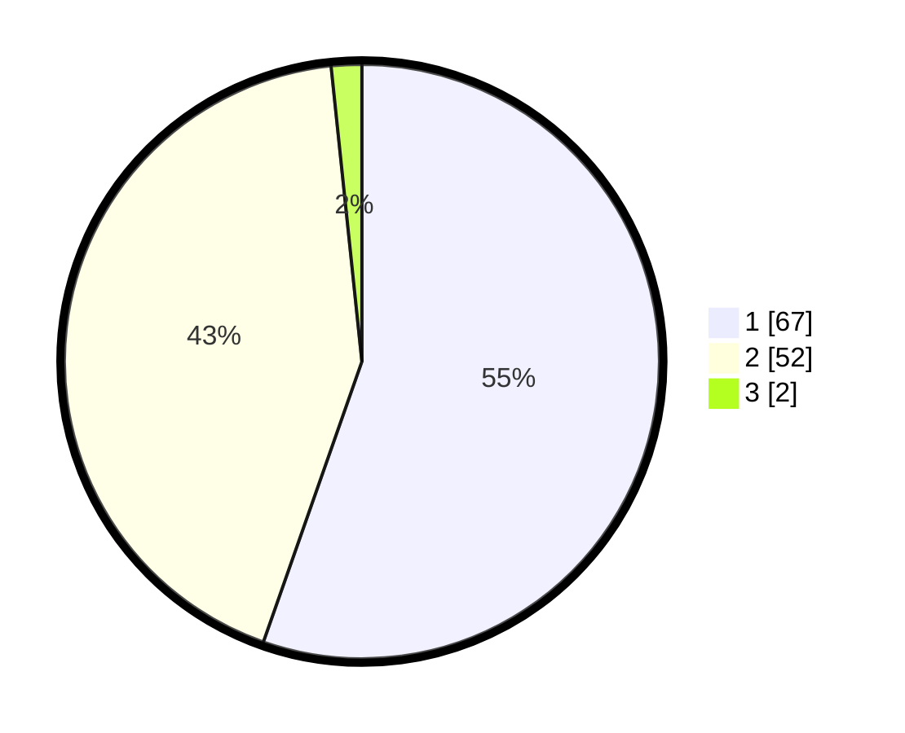

# Hasil

## Grafik

## Tabel

| No. | Nama Paslon    | Suara | Suara (raw) | Persentase |
|:--- |:-------------- | -----:| -----------:| ----------:|
| 1   | ANIES MUHAIMIN | 67    | [67][p-1]   | 55,37      |
| 2   | PRABOWO GIBRAN | 52    | [52][p-2]   | 42,98      |
| 3   | GANJAR MAHFUD  | 2     | [2][p-3]    | 1,65       |

[p-1]: https://github.com/gigit-pemilu/pemilu-2024-11-aceh/blob/main/pilpres/hitung-suara/sub/11-aceh/sub/07-pidie/sub/16-pidie/sub/2055-leubue/sub/901-tps/sub/paslon-1.txt
[p-2]: https://github.com/gigit-pemilu/pemilu-2024-11-aceh/blob/main/pilpres/hitung-suara/sub/11-aceh/sub/07-pidie/sub/16-pidie/sub/2055-leubue/sub/901-tps/sub/paslon-2.txt
[p-3]: https://github.com/gigit-pemilu/pemilu-2024-11-aceh/blob/main/pilpres/hitung-suara/sub/11-aceh/sub/07-pidie/sub/16-pidie/sub/2055-leubue/sub/901-tps/sub/paslon-3.txt

## Foto C Plano

https://sirekap-obj-formc.kpu.go.id/93ad/pemilu/ppwp/11/07/16/20/55/1107162055901-20240214-192456--26019ce9-5954-4e36-916d-7d543c4ce63d.jpg

https://sirekap-obj-formc.kpu.go.id/93ad/pemilu/ppwp/11/07/16/20/55/1107162055901-20240214-192506--bd04e041-bb13-401a-ba8a-da823e96c9e9.jpg

https://sirekap-obj-formc.kpu.go.id/93ad/pemilu/ppwp/11/07/16/20/55/1107162055901-20240214-192511--26f106e7-4007-4a03-8cc1-403cf43398de.jpg

## Metadata

| Key        | Value               |
| ---------- | ------------------- |
| Time Stamp | 2024-02-15 00:41:44 |

## DATA PEMILIH TETAP

Jumlah pemilih dalam DPT: **69**.
 * L: **0**.
 * P: **69**.

## DATA PENGGUNA HAK PILIH

Jumlah pengguna hak pilih dalam DPT: **58**.
 * L: **0**.
 * P: **58**.

Jumlah pengguna hak pilih dalam DPTb: **63**.
 * L: **7**.
 * P: **56**.

Jumlah pengguna hak pilih dalam DPK: **0**.
 * L: **0**.
 * P: **0**.

Jumlah pengguna hak pilih: **121**.
 * L: **7**.
 * P: **114**.

## JUMLAH SUARA SAH DAN TIDAK SAH

JUMLAH SELURUH SUARA SAH: **121**.

JUMLAH SUARA TIDAK SAH: **0**.

JUMLAH SELURUH SUARA SAH DAN SUARA TIDAK SAH: **121**.

