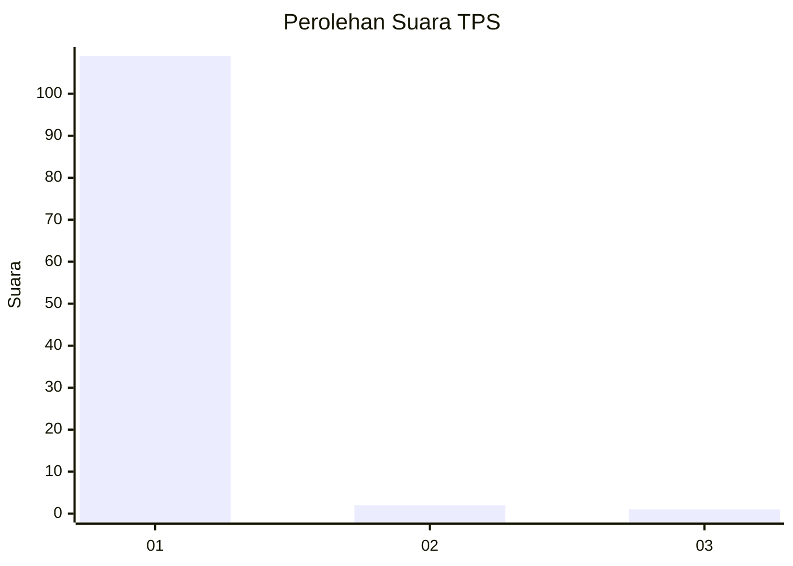
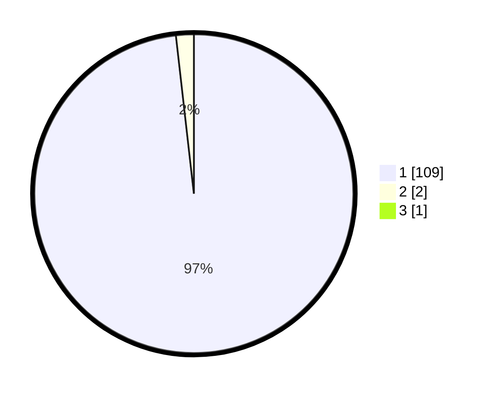

# Hasil

## Grafik

## Tabel

| No. | Nama Paslon    | Suara | Suara (raw) | Persentase |
|:--- |:-------------- | -----:| -----------:| ----------:|
| 1   | ANIES MUHAIMIN | 109   | [109][p-1]  | 97,32      |
| 2   | PRABOWO GIBRAN | 2     | [2][p-2]    | 1,79       |
| 3   | GANJAR MAHFUD  | 1     | [1][p-3]    | 0,89       |

[p-1]: https://github.com/gigit-pemilu/pemilu-2024-11-aceh/blob/main/pilpres/hitung-suara/sub/11-aceh/sub/07-pidie/sub/16-pidie/sub/2056-batee/sub/001-tps/sub/paslon-1.txt
[p-2]: https://github.com/gigit-pemilu/pemilu-2024-11-aceh/blob/main/pilpres/hitung-suara/sub/11-aceh/sub/07-pidie/sub/16-pidie/sub/2056-batee/sub/001-tps/sub/paslon-2.txt
[p-3]: https://github.com/gigit-pemilu/pemilu-2024-11-aceh/blob/main/pilpres/hitung-suara/sub/11-aceh/sub/07-pidie/sub/16-pidie/sub/2056-batee/sub/001-tps/sub/paslon-3.txt

## Foto C Plano

https://sirekap-obj-formc.kpu.go.id/ffd0/pemilu/ppwp/11/07/16/20/56/1107162056001-20240214-214347--afc3fb7a-af30-408d-a87f-050ae942cefc.jpg

https://sirekap-obj-formc.kpu.go.id/ffd0/pemilu/ppwp/11/07/16/20/56/1107162056001-20240214-214445--63ced253-0168-4c2b-a45c-fc3080b2a84f.jpg

https://sirekap-obj-formc.kpu.go.id/ffd0/pemilu/ppwp/11/07/16/20/56/1107162056001-20240214-214633--d585c986-8cc6-4ee7-bdd6-8942880ba7df.jpg

## Metadata

| Key        | Value               |
| ---------- | ------------------- |
| Time Stamp | 2024-02-19 06:16:00 |

