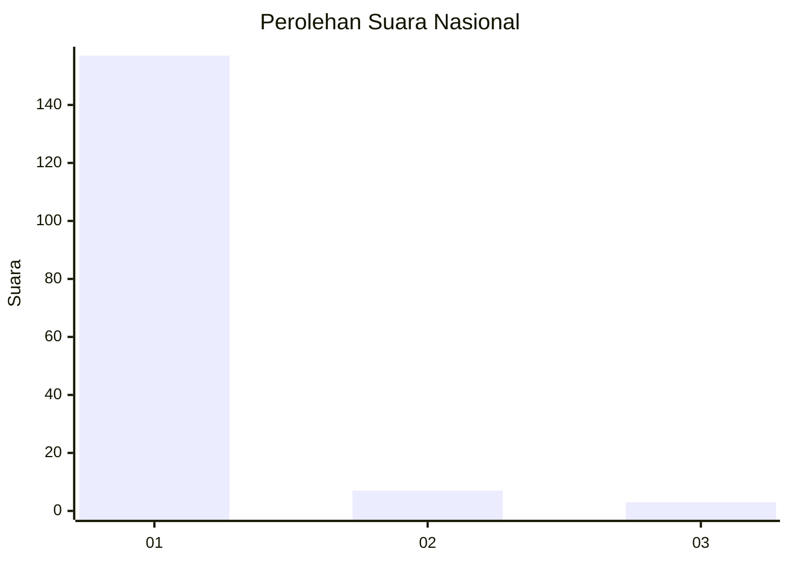
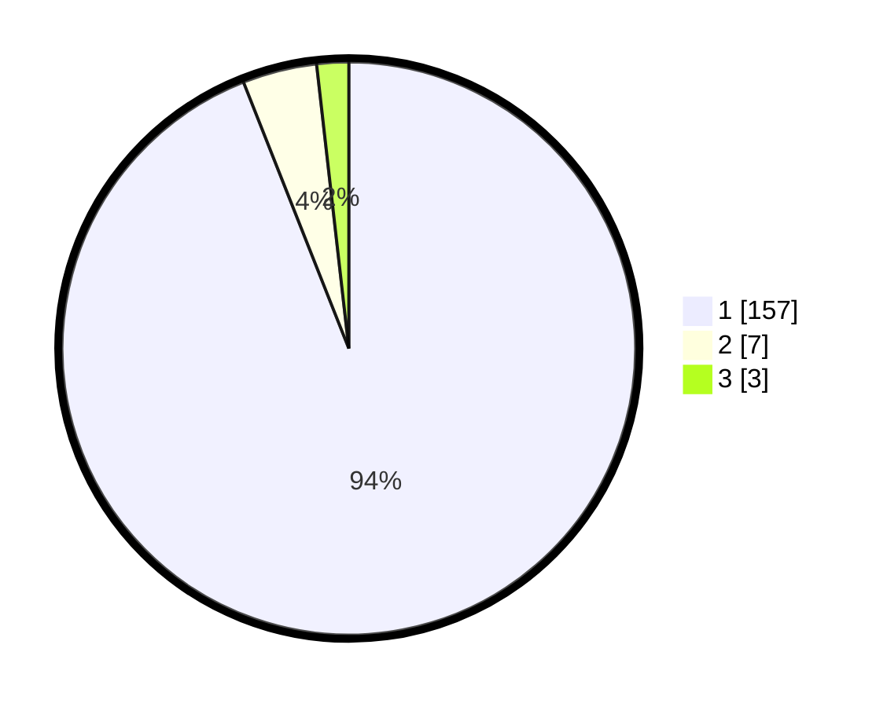

# Hasil

## Grafik

## Tabel

| No. | Nama Paslon    | Suara | Suara (raw) | Persentase |
|:--- |:-------------- | -----:| -----------:| ----------:|
| 1   | ANIES MUHAIMIN | 157   | [157][p-1]  | 94,01      |
| 2   | PRABOWO GIBRAN | 7     | [7][p-2]    | 4,19       |
| 3   | GANJAR MAHFUD  | 3     | [3][p-3]    | 1,80       |

[p-1]: https://github.com/gigit-pemilu/pemilu-2024/blob/main/pilpres/hitung-suara/sub/11-aceh/sub/07-pidie/sub/16-pidie/sub/2058-seukeumbrok/sub/002-tps/sub/paslon-1.txt
[p-2]: https://github.com/gigit-pemilu/pemilu-2024/blob/main/pilpres/hitung-suara/sub/11-aceh/sub/07-pidie/sub/16-pidie/sub/2058-seukeumbrok/sub/002-tps/sub/paslon-2.txt
[p-3]: https://github.com/gigit-pemilu/pemilu-2024/blob/main/pilpres/hitung-suara/sub/11-aceh/sub/07-pidie/sub/16-pidie/sub/2058-seukeumbrok/sub/002-tps/sub/paslon-3.txt

## Foto C Plano

https://sirekap-obj-formc.kpu.go.id/fa9c/pemilu/ppwp/11/07/16/20/58/1107162058002-20240215-082029--07f8bd78-4e5c-4f19-b0a8-04f79c01116b.jpg

https://sirekap-obj-formc.kpu.go.id/fa9c/pemilu/ppwp/11/07/16/20/58/1107162058002-20240215-232759--61fdd499-8dc2-49fd-a99b-e0781fe30dd0.jpg

https://sirekap-obj-formc.kpu.go.id/fa9c/pemilu/ppwp/11/07/16/20/58/1107162058002-20240215-081839--a793912c-bae5-471e-9b47-83b3f141a09d.jpg

## Metadata

| Key        | Value               |
| ---------- | ------------------- |
| Time Stamp | 2024-02-16 02:00:27 |

