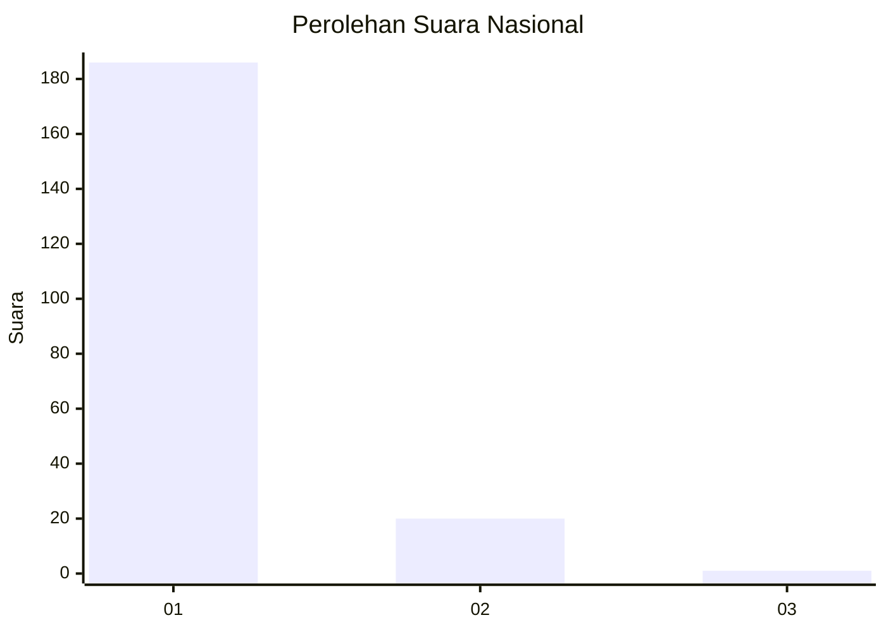
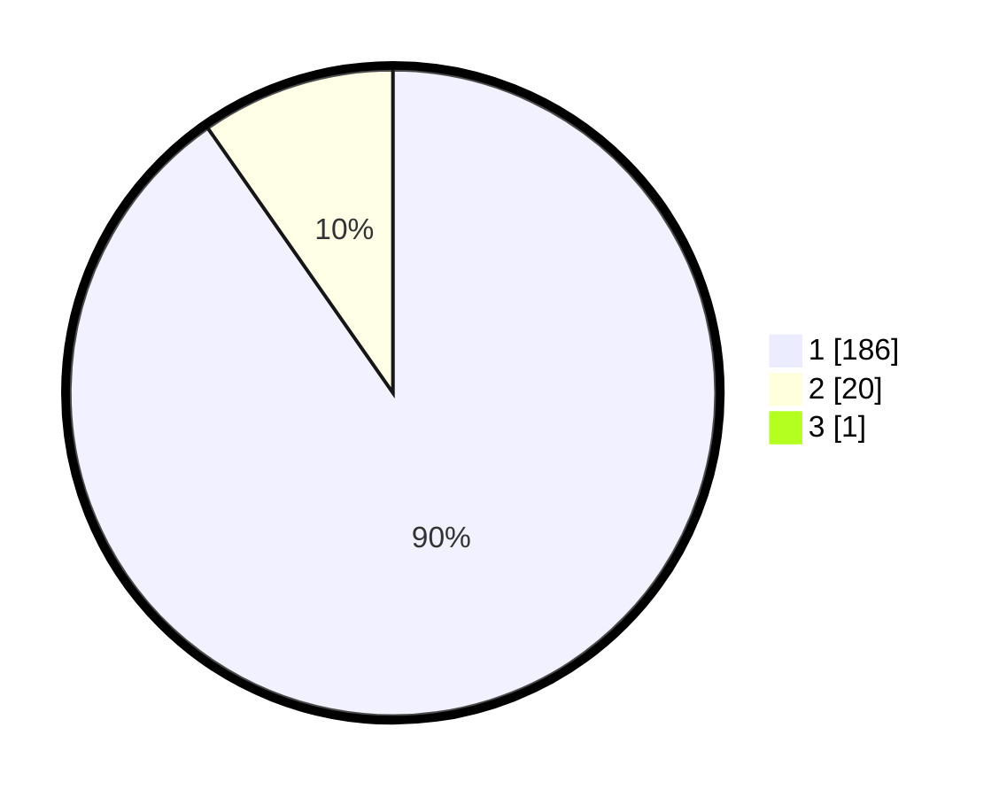

# Hasil

## Grafik

## Tabel

| No. | Nama Paslon    | Suara | Suara (raw) | Persentase |
|:--- |:-------------- | -----:| -----------:| ----------:|
| 1   | ANIES MUHAIMIN | 186   | [186][p-1]  | 89,86      |
| 2   | PRABOWO GIBRAN | 20    | [20][p-2]   | 9,66       |
| 3   | GANJAR MAHFUD  | 1     | [1][p-3]    | 0,48       |

[p-1]: https://github.com/gigit-pemilu/pemilu-2024/blob/main/pilpres/hitung-suara/sub/11-aceh/sub/07-pidie/sub/16-pidie/sub/2062-seukee/sub/001-tps/sub/paslon-1.txt
[p-2]: https://github.com/gigit-pemilu/pemilu-2024/blob/main/pilpres/hitung-suara/sub/11-aceh/sub/07-pidie/sub/16-pidie/sub/2062-seukee/sub/001-tps/sub/paslon-2.txt
[p-3]: https://github.com/gigit-pemilu/pemilu-2024/blob/main/pilpres/hitung-suara/sub/11-aceh/sub/07-pidie/sub/16-pidie/sub/2062-seukee/sub/001-tps/sub/paslon-3.txt

## Foto C Plano

https://sirekap-obj-formc.kpu.go.id/41ab/pemilu/ppwp/11/07/16/20/62/1107162062001-20240215-060227--1e80e1fe-f9e6-4e9a-a662-0ef39c5c3701.jpg

https://sirekap-obj-formc.kpu.go.id/41ab/pemilu/ppwp/11/07/16/20/62/1107162062001-20240215-060605--17137818-078d-42ad-af61-9bfcd9a78e69.jpg

https://sirekap-obj-formc.kpu.go.id/41ab/pemilu/ppwp/11/07/16/20/62/1107162062001-20240215-060422--66b829cc-2baa-45e0-916f-e1302fc0085a.jpg

## Metadata

| Key        | Value               |
| ---------- | ------------------- |
| Time Stamp | 2024-02-24 22:31:28 |

