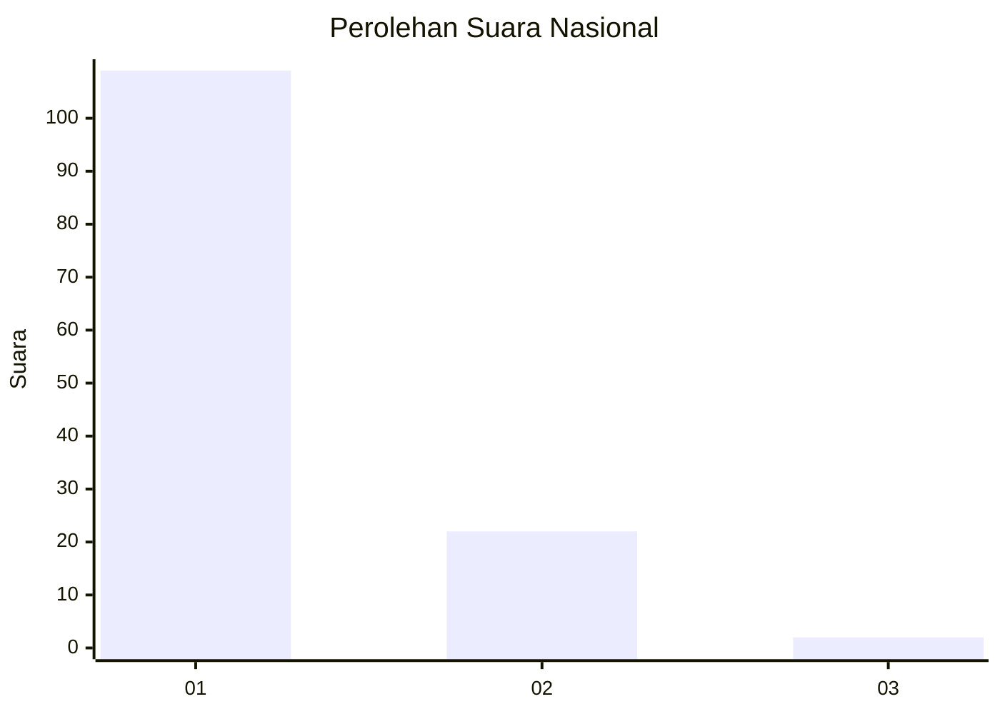
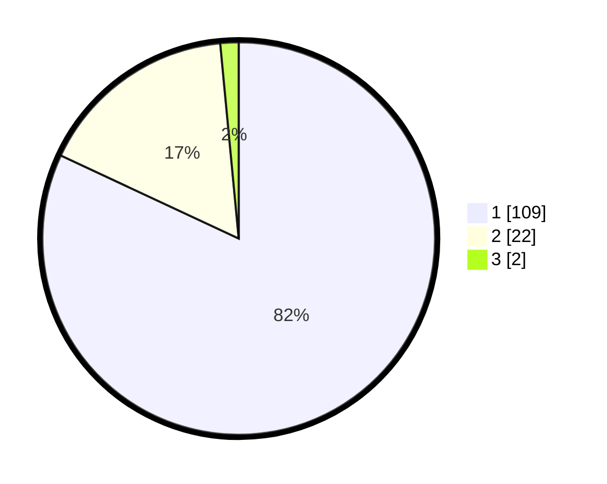

# Hasil

## Grafik

## Tabel

| No. | Nama Paslon    | Suara | Suara (raw) | Persentase |
|:--- |:-------------- | -----:| -----------:| ----------:|
| 1   | ANIES MUHAIMIN | 109   | [109][p-1]  | 81,95      |
| 2   | PRABOWO GIBRAN | 22    | [22][p-2]   | 16,54      |
| 3   | GANJAR MAHFUD  | 2     | [2][p-3]    | 1,50       |

[p-1]: https://github.com/gigit-pemilu/pemilu-2024/blob/main/pilpres/hitung-suara/sub/11-aceh/sub/07-pidie/sub/17-sakti/sub/2007-paloh-jeureula/sub/002-tps/sub/paslon-1.txt
[p-2]: https://github.com/gigit-pemilu/pemilu-2024/blob/main/pilpres/hitung-suara/sub/11-aceh/sub/07-pidie/sub/17-sakti/sub/2007-paloh-jeureula/sub/002-tps/sub/paslon-2.txt
[p-3]: https://github.com/gigit-pemilu/pemilu-2024/blob/main/pilpres/hitung-suara/sub/11-aceh/sub/07-pidie/sub/17-sakti/sub/2007-paloh-jeureula/sub/002-tps/sub/paslon-3.txt

## Foto C Plano

https://sirekap-obj-formc.kpu.go.id/56d6/pemilu/ppwp/11/07/17/20/07/1107172007002-20240214-155056--70769d62-96ac-47e2-9a9a-6a315e590760.jpg

https://sirekap-obj-formc.kpu.go.id/56d6/pemilu/ppwp/11/07/17/20/07/1107172007002-20240214-155114--e24af2ee-486c-4e8d-a9e5-14bf5226da35.jpg

https://sirekap-obj-formc.kpu.go.id/56d6/pemilu/ppwp/11/07/17/20/07/1107172007002-20240214-155130--b3e9557c-8ff6-4c63-a344-75aa91007120.jpg

## Metadata

| Key        | Value               |
| ---------- | ------------------- |
| Time Stamp | 2024-02-14 21:46:01 |

