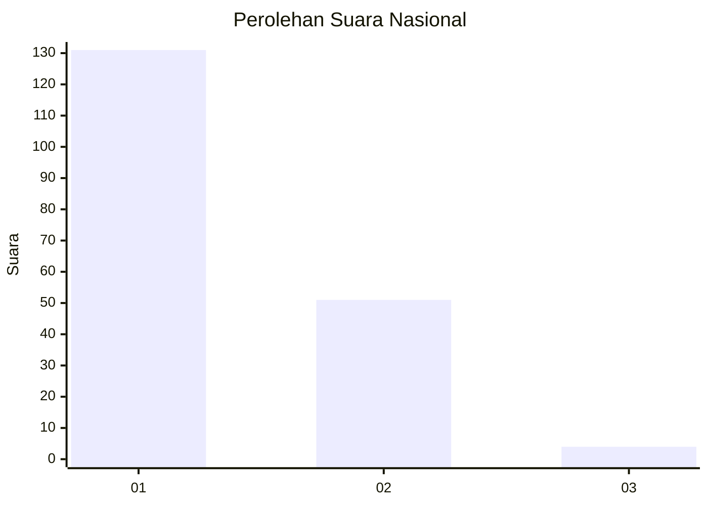
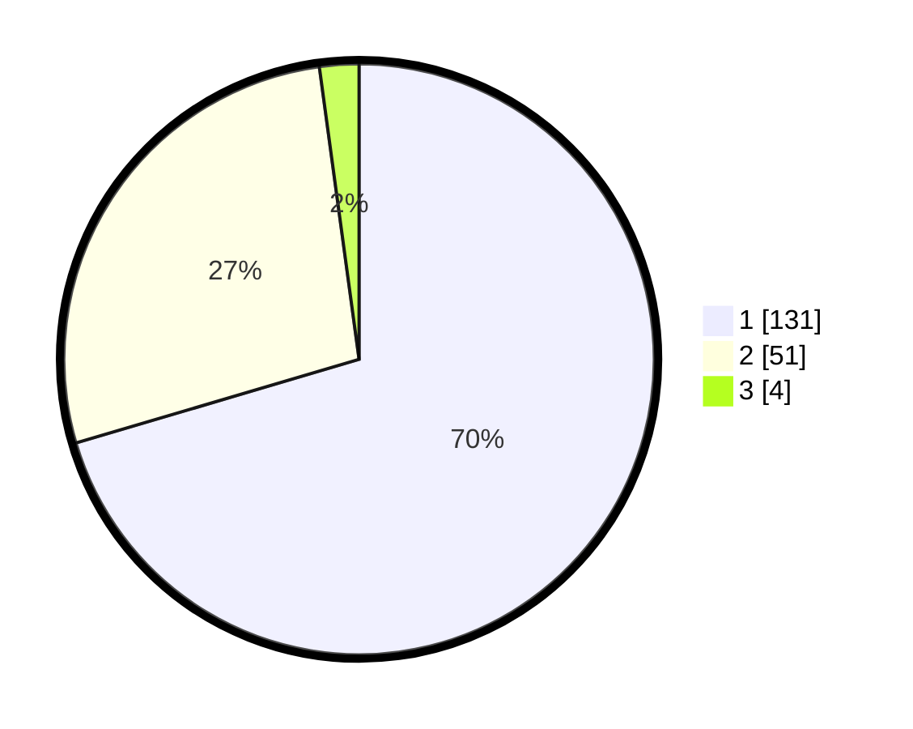

# Hasil

## Grafik

## Tabel

| No. | Nama Paslon    | Suara | Suara (raw) | Persentase |
|:--- |:-------------- | -----:| -----------:| ----------:|
| 1   | ANIES MUHAIMIN | 131   | [131][p-1]  | 70,43      |
| 2   | PRABOWO GIBRAN | 51    | [51][p-2]   | 27,42      |
| 3   | GANJAR MAHFUD  | 4     | [4][p-3]    | 2,15       |

[p-1]: https://github.com/gigit-pemilu/pemilu-2024/blob/main/pilpres/hitung-suara/sub/11-aceh/sub/07-pidie/sub/17-sakti/sub/2010-riweuek/sub/003-tps/sub/paslon-1.txt
[p-2]: https://github.com/gigit-pemilu/pemilu-2024/blob/main/pilpres/hitung-suara/sub/11-aceh/sub/07-pidie/sub/17-sakti/sub/2010-riweuek/sub/003-tps/sub/paslon-2.txt
[p-3]: https://github.com/gigit-pemilu/pemilu-2024/blob/main/pilpres/hitung-suara/sub/11-aceh/sub/07-pidie/sub/17-sakti/sub/2010-riweuek/sub/003-tps/sub/paslon-3.txt

## Foto C Plano

https://sirekap-obj-formc.kpu.go.id/bbd7/pemilu/ppwp/11/07/17/20/10/1107172010003-20240215-023718--dff0547d-d2dc-43c8-b4c5-49975fdf57cd.jpg

https://sirekap-obj-formc.kpu.go.id/bbd7/pemilu/ppwp/11/07/17/20/10/1107172010003-20240215-023821--ec547bd1-1c5e-43e3-a146-56e42ea0850c.jpg

https://sirekap-obj-formc.kpu.go.id/bbd7/pemilu/ppwp/11/07/17/20/10/1107172010003-20240215-023926--c11baf27-c061-45a9-87d1-fb9c9df5d6db.jpg

## Metadata

| Key        | Value               |
| ---------- | ------------------- |
| Time Stamp | 2024-02-19 06:16:00 |

